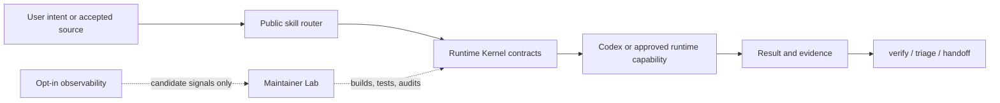
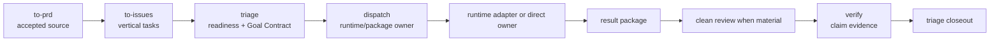

# Groundwork Plugin Architecture

Target Reader: Groundwork maintainers, reviewers, and contributors changing runtime contracts or package shape.
Reader Action Needed: Preserve the Runtime Kernel / Maintainer Lab boundary and update the owning contract instead of adding another representation.
Decision Supported: Where a behavior belongs, which component owns it, and which evidence can support a completion claim.
Artifact Type: canonical current architecture.
Source of Truth: `.codex-plugin/plugin.json`, `scripts/runtime_package_manifest.json`, the ten public `skills/*/SKILL.md` contracts, `scripts/codex-hooks/groundwork_route_registry.json`, and repo-local `AGENTS.md`.
Scope: Groundwork v0.5.6 source architecture, package boundary, route ownership, Dispatch contracts, optional observability, eval separation, and evidence boundaries.
Out of Scope: Historical design chronology, release approval, installed-cache equivalence, marketplace publication, UAT, or customer readiness.
Evidence Level: current source contract; stronger runtime and release claims require their own evidence.
Safe to Share / Redaction Notes: safe to share as-is.

Groundwork is a Codex-native evidence-first workflow plugin. It routes non-trivial R&D work while keeping small, obvious work direct. It is not an autonomous agent runtime, task database, tracker integration, deployment system, or source of product truth.



## Two-Layer Boundary

### Runtime Kernel

The generated installed package contains only:

- `.codex-plugin/`;
- `skills/`;
- `hooks/hooks.json`;
- `scripts/codex-hooks/`;
- `README.md`, generated from `README.runtime.md`;
- `LICENSE`.

Runtime-packaged files must be self-contained. A runtime Markdown command or local reference must resolve inside the generated package unless it is explicitly marked as a maintainer-only example. Package allowlists, exact files, hashes, counts, and ceilings are owned by `scripts/runtime_package_manifest.json` and validated by `scripts/check_runtime_package_boundary.py`.

### Maintainer Lab

The source checkout owns architecture docs, eval suites, schemas, artifacts, examples, research, historical baselines, build helpers, and source-only maintenance scripts. These are not installed runtime inputs and cannot prove installed-plugin behavior merely because they pass locally.

Repo-specific maintenance rules belong in `AGENTS.md`, not in public runtime skill entrypoints.

## Public Workflow Surface

The public surface remains ten action-named skills:

| Stage | Skill | Sole responsibility |
| --- | --- | --- |
| raw intent | `to-prd` | shape ambiguous intent into accepted product/engineering source |
| accepted source | `to-issues` | create vertical task slices with acceptance, blockers, and verification expectations |
| task state | `triage` | classify readiness, blockers, AFK/HITL, lifecycle need, and closeout state |
| accepted task | `write-plan` | prepare an implementation plan before edits |
| focused question | `prototype` | answer a logic/state/UI/business-rule question with throwaway work |
| implementation | `implement` | diagnose and make scoped source changes |
| evidence claim | `verify` | judge whether named evidence supports a bounded claim |
| continuation | `handoff` | preserve compact continuation state without copying source artifacts |
| ready package | `dispatch` | select package/runtime direction without executing it |
| project knowledge | `wiki` | maintain explicit source-cited project wiki material |

Direct fallback remains the default for small, bounded, low-risk answers or edits that do not benefit from a workflow.

## Ownership Chain



Ownership constraints:

- `to-issues` does not select runtime, model, worktree, isolation, or parallelization candidates.
- `triage` may create an executable Goal Contract only for `ready-for-agent + AFK`; its upstream `Preferred Runtime` value remains `dispatch_may_choose`.
- `dispatch` is the sole post-readiness runtime/package decision owner and remains package-only.
- Runtime adapters execute only with available capability, required approval, and their own runtime evidence.
- `verify` judges evidence; it does not perform implementation or own closeout state.

## Dispatch Contract

`skills/dispatch/DISPATCH-PACKAGE-DETAILS.md` and `skills/dispatch/RESULT-PACKAGE.md` are the generic base contracts. Host adapters may add an `adapter_extension`, but they must not redefine base task, source, route, policy, evidence, or outcome fields.

Result packages use one outcome vocabulary:

```text
ready_for_review
needs_remediation
blocked
human_decision
no_execution_needed
```

Runtime lifecycle, review, merge-back, archive, and branch cleanup are orthogonal axes. Archive is not merge evidence; branch cleanup is not thread lifecycle; a pending worktree request is not a created child thread or worktree.

The Codex App managed-worktree adapter is an internal lazy-loaded adapter contract, not a public skill and not an executor owned by `dispatch`. Its Markdown and bundled linters must remain package-resolvable.

## Routing Truth

`scripts/codex-hooks/groundwork_route_registry.json` owns the public route set, state contracts, prompt precedence identifiers, and default forbidden-route relationships.

Consumers must load or validate against that registry:

- runtime prompt classifier;
- eval routing schema;
- workflow-state documentation tests;
- public skill directory/description validation.

Public skill prose still owns nuanced human-facing trigger boundaries. Regex heuristics and response-shape markers are candidate signals, not authoritative skill-load or route-hit evidence.

## Observability Boundary

Router observability is dormant and project opt-in. All hook events use one fail-open event entrypoint. Disabled, missing, or invalid config exits before importing the telemetry classifier.

When enabled, runtime hooks may record minimized candidate metadata, hashes, redacted snippets, always-redacted optional raw capture, and captured-event diagnostics. They must not:

- inject prompt context or route hints;
- claim actual skill loading;
- generate runtime readiness, cache, release, UAT, or customer evidence;
- present captured records as the denominator for every host event;
- persist unredacted prompt or response text.

Offline scoring, comparison, regression promotion, and analysis belong to the Maintainer Lab.

## Eval Architecture

Maintainer eval responsibilities are separated as follows:

- `evals/suite_registry.py`: default suite selection;
- `evals/routing_schema.py`: shared eval vocabulary, loading public routes from the runtime registry;
- `evals/case_oracles/`: fixture-owned case-specific behavior checks;
- `evals/run_runtime.py`: orchestration, execution, result assembly, and CLI;
- `evals/routing_summary.py`: shared routing summaries;
- `evals/coverage-manifest.toml`: stdlib-readable coverage inventory.

Case-specific business logic must not be added directly to the generic runner. New fixture behavior belongs in a registered case oracle.

Tests should prefer schema, reference-graph, package-shape, and behavioral invariants over copying entire prose paragraphs into exact-string assertions.

## Evidence Model

Keep these claims separate:

1. current source diff;
2. source-validation checks;
3. generated runtime package;
4. installed plugin/cache equivalence;
5. real runtime behavior;
6. clean review;
7. release, UAT, marketplace, or customer readiness.

A stronger claim requires evidence from its own layer. Local docs, unit tests, package hashes, hook cards, route candidates, and same-thread self-checks must not be promoted into stronger evidence labels.

## Change Rules

- Keep the ten-skill surface stable unless an accepted product decision proves a distinct invocation moment.
- Add a shared contract only when one owner can replace duplicated rules; do not create circular sources of truth.
- Add host-specific behavior as an adapter delta, not a second full base schema.
- Keep public `SKILL.md` files as thin routers and lazy-load prompt-material references.
- Do not raise package ceilings to accommodate unexamined growth. Reduce duplication first and preserve headroom.
- Update this document as canonical current state. Historical PRDs and baselines remain evidence snapshots, not current architecture.
