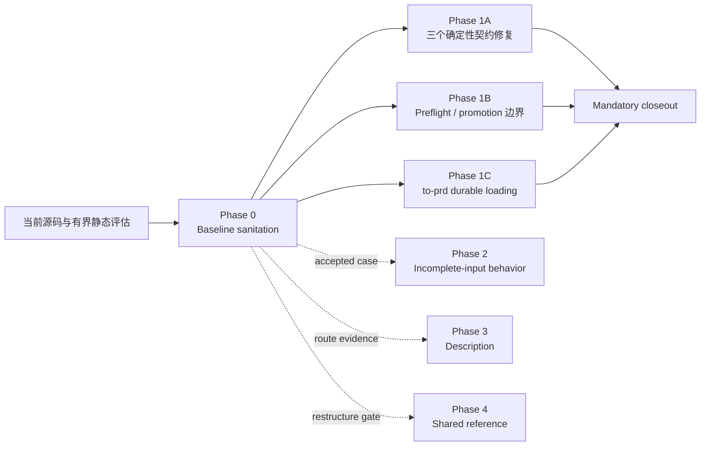

# PRD: GPT-5.6 Groundwork Skill 契约收敛

Target Reader: Groundwork maintainers、skill authors、implementers、reviewers 与 eval maintainers。
Reader Action Needed: 仅作为 2026-07-31 的历史优化范围阅读；不要执行其旧 Eval baseline、Phase 2–4 或 Candidate 路径。
Decision Supported: Groundwork 在保留当前 10 个 public skill 与渐进披露架构的前提下，如何先校正评测基线、再修确定性契约错误，并限制后续优化范围。
Artifact Type: PRD
Source of Truth: 历史仓库快照 `e070e1cdb75e649b651471ef53f2ade22bb7a8db` 与当时 maintainer 决策；当前架构由 `docs/plugin-architecture.md` 和 `docs/prd-plugin-candidate-trial-migration-v1.md` 定义。
Scope: active eval baseline sanitation；`handoff` schema authority；`dispatch` package-only/approval boundary；`to-issues` verification terminology、artifact-promotion 与 lifecycle-preflight trigger；`to-prd` durable reference-loading contract；对应的 source/deterministic validation；以及后续优化的 evidence gates。
Out of Scope: Phase 2–4 的真实 skill 修改、全局提示词压缩、10 个 skill 的批量重写、public skill 拆分/合并/新增、统一跨模型矩阵、新通用评测平台、无证据的 description 改写、默认拆分 shared references、installed-cache/runtime/release/UAT/customer readiness。
Evidence Level: 当前源码、直接 reference、十份有界静态评估、独立 GPT-5.6 Pro 评审和 OpenAI 官方文档共同支持的 planning/source-validation PRD；不证明隐式触发率、实际 reference read trace、runtime token、installed cache、release 或 UAT。
Safe to Share / Redaction Notes: 可公开分享；不包含 secrets、credentials、PII、private URLs、生产数据、raw logs 或敏感 payload。
Status: Historical / superseded by the accepted Plugin Candidate Trial subtractive migration. The legacy Eval baseline and authority described here are removed from the current tree.
Baseline: Groundwork `0.5.7`; `to-prd` baseline commit `e070e1c`; `skills/to-prd/SKILL.md` SHA-256 `f36c01865616069417f385d41b3ec4efe038023c4fa1516798899639d4f64745`
Last Updated: 2026-07-31

---

## 1. Executive Summary

本轮不应恢复已经撤销的“整体提示词精简”方案。

十份 skill 评估只能支持：

> 本轮有界静态评估没有发现足以支持拆分、合并或整体重构 public skill 的证据。

它不能支持“这些 skill 永远不需要重构”。当前没有测量 installed-plugin 实际触发、真实 reference 读取路径、多轮 token 放大或不同模型/profile 的行为，因此架构结论必须保持可证伪。

本 PRD 保留当前 10 个 public skill 和渐进披露结构。交付分为一条 mandatory lane 与三条互不依赖的 follow-up lane：



> [!IMPORTANT]
> 本 PRD 的 mandatory delivery 只有 Phase 0 与 Phase 1A–1C。Phase 2–4 只定义后续准入门槛，不属于本 PRD Done，也不形成顺序依赖。本 PRD 不授权批量修改 10 个 skill、不授权统一缩短 prompt、不授权新增通用 runner，也不授权改写 `to-prd` 核心 workflow。

## 2. Official Guidance Applied

本 PRD 采用以下 OpenAI 官方原则：

- 每个 skill 聚焦一个可识别的用户工作；description 说明工作和触发条件。
- `SKILL.md` 保持精炼，详细 policies、schemas、examples 放入 supporting resources，并明确何时加载。
- 只有确定性计算或文件处理真正需要时才增加 scripts。
- activation/output 测试应覆盖直接、间接、不完整、hard-negative 与 unsupported-action edge cases。
- 只有 skill 在错误时间激活时才优先调整 description；正确命中但输出不一致时应调整 workflow instructions。
- GPT-5.6 prompt 优化应从已工作的基线出发，一次删除或修改一个 instruction group，并在代表性任务上复测。
- Sol、Terra、Luna 服务不同质量、成本和吞吐目标；模型/profile 应按任务形状选择，不做无意义的同题统一排名。

External guidance:

- [OpenAI: Build skills](https://developers.openai.com/plugins/build/skills)
- [OpenAI: Skills concepts](https://developers.openai.com/plugins/concepts/skills)
- [OpenAI: Codex best practices](https://learn.chatgpt.com/guides/best-practices)
- [OpenAI: GPT-5.6 model guidance](https://developers.openai.com/api/docs/guides/latest-model)
- [OpenAI: Model catalog](https://developers.openai.com/api/docs/models)

## 3. Current Source Findings

### 3.1 Confirmed deterministic defects

| Finding | Current source evidence | Classification |
| --- | --- | --- |
| Handoff machine-schema owner 错误 | `skills/handoff/REVIEW-PACKAGE.md` 指向 `skills/handoff/SKILL.md` 中不存在的 `native_handoff_package` schema；实际 schema 位于 `skills/handoff/NATIVE-HANDOFF-PACKAGE.md` | confirmed source defect |
| Dispatch execution subject 歧义 | `skills/dispatch/SKILL.md` 要求 package-only 并在 approval gate 停止；`DISPATCH-ROUTER-BRANCHES.md` 却写无主语的 `Proceed only after...` | confirmed contract conflict |
| To-issues verification terminology 漂移 | issue draft 输出使用 `Verification Expectation` 字段，Stop Condition 却要求 `verification evidence needed` | confirmed terminology conflict |

### 3.2 Confirmed active-baseline conflicts

| Finding | Current source evidence | Required handling |
| --- | --- | --- |
| `to-issues` runtime-routing oracle 已过期 | `evals/prompts/to-issues.csv::to-issues-013`–`018` 仍要求 runtime/worktree/isolation/parallelization candidates；当前 `skills/to-issues/SKILL.md` 明确禁止这些字段并将 owner 交给 `dispatch` | 在任何 `to-issues` candidate change 前，从 active suite 移除这些 oracle；不复制到新 legacy suite |
| `to-issues` source 前提不清 | 多个 positive fixtures 只写 accepted PRD，却没有区分 canonical source 与 conversation-only source | 在 Phase 1B 前使 active fixtures 明确 source 与 downstream intent |
| `to-prd` progressive-disclosure test 已 stale | `evals/test_progressive_disclosure.py` 仍断言当前 `skills/to-prd/SKILL.md` 已不存在的精确字符串 `load PRD-TEMPLATE.md, apply audience-first artifact fields` | 在 G56-SKILL-004 前独立校正 test oracle，并在未应用 candidate 的基线上证明通过 |
| Dispatch approval oracle 有旧执行暗示 | `evals/prompts/dispatch.csv::dispatch-009` 使用 “unless explicit execution request and tools are available”，与当前 package-only/no-execution owner 冲突 | 在 dispatch contract candidate 前独立校正为 package-only baseline |

Baseline correction 只恢复当前已接受源码合同，不能提前写入 candidate 的新预期，也不能计为 candidate 收益。

### 3.3 Design conflict requiring an owner-aligned decision

`skills/to-issues/SKILL.md` 只在 issue split 将驱动其他 session、远程 issue、implementation、verification 或 handoff 时加载 `LIFECYCLE-PREFLIGHT.md`。

共享 `skills/_shared/LIFECYCLE-PREFLIGHT.md` 当前要求在任何 non-trivial issue/task splitting 前运行完整 preflight。

`skills/_shared/ARTIFACT-PROMOTION.md` 还规定：accepted-but-conversation-only PRD 在 issue splitting 前必须 promotion，或明确命名外部 canonical source。

三个合同的责任分别是：

| Contract | Canonical responsibility | 本轮处理 |
| --- | --- | --- |
| `skills/_shared/ARTIFACT-PROMOTION.md` | source 何时必须 promotion、谁拥有 durable truth | 保持不变，作为 read-only invariant |
| `skills/_shared/LIFECYCLE-PREFLIGHT.md` | 何时加载完整 transient preflight | 增加一个窄 should-not-load 分支 |
| `skills/to-issues/SKILL.md` | source gate、issue-draft 输出与 hard stop | 与两个 owner 对齐 |

### 3.4 Static-evaluation limits

- 十份报告使用同一套 rubric，因此是相关证据，不是十个统计独立观察者。
- 静态 plugin-eval 分数对跨目录/shared references 的可见性不同，不能横向排名。
- “9/10 建议修改 description”可能反映共同问题，也可能反映 rubric 偏好；没有 route evidence 时不能批量行动。
- 文件大、token 多、被多个 skill 引用，不足以单独证明 reference 应拆分。

## 4. Product Decisions

### D-01 — Preserve the current public surface

保留当前 10 个 public skill。本轮没有证据支持新增、删除、拆分或合并 public skill。

该决定只适用于本轮证据，不是永久架构承诺。未来只有行为、读取成本或 owner 冲突证明局部修正不足时，才重新评估 public surface。

### D-02 — Optimize contracts, not global length

本轮目标是修正：

- canonical owner；
- package/permission boundary；
- reference load condition；
- incomplete-input follow-up 的 evidence gate，不在本轮实施；
- 同一概念在 owner 与 consumer 之间的语义漂移。

不以减少字符数、文件数、reference 数或静态总分作为产品成功标准。

### D-03 — Freeze the `to-prd` core workflow

以 commit `e070e1c` 中的 `to-prd` 为本轮语义基线：

- 保留 Confirmed AC / Proposed AC / Open Question 三分类。
- 保留 Durable Write Gate。
- 保留 raw agent-slicing、evidence boundary 与 durable-write hard stops。
- 不把核心 workflow 改写成另一套“更短步骤”。

本轮只允许定义三种输出与其 reference-loading contract：

| Output mode | Entry condition | Required references |
| --- | --- | --- |
| Compact conversation PRD/spec | 默认；不写 durable artifact | 默认不加载 `GRILL-BEFORE-WRITE.md` 或 `PRD-TEMPLATE.md` |
| Compact durable PRD | 用户明确要求保存；需求已收敛为单一有界决定，不存在 material ambiguity、未解决的产品/业务决定或跨 domain/source-contract 冲突，且 Durable Write Gate 通过 | 加载 `PRD-TEMPLATE.md`，使用完整 audience-first header 与 compact body；默认不加载 `GRILL-BEFORE-WRITE.md` |
| Full durable PRD | 用户明确要求 full PRD，或文档本身需要收敛 material assumptions/questions、多 owner/domain 决定、source-contract 冲突、跨多个 owner/role 的协调或影响多个 downstream contracts 的决定，且 Durable Write Gate 通过 | 先加载并执行 `GRILL-BEFORE-WRITE.md` content gate，再加载 `PRD-TEMPLATE.md` 写入 |

Compact durable 的目的只是把已经收敛的决定持久化，不承担需求收敛。只要写文档仍需解决 material ambiguity、产品/业务选择、跨 owner/domain 合同、跨多个 owner/role 的协调或影响多个 downstream contracts 的决定，就必须进入 full durable；不能为了少加载一个 reference 把未收敛内容包装成 compact。

Gate 顺序固定为：

```text
choose output mode
  -> conversation: produce bounded conversation output
  -> durable: run Durable Write Gate
       -> fail: return to conversation output and name the unmet condition
       -> pass + compact: load/use PRD-TEMPLATE
       -> pass + full: load/run GRILL-BEFORE-WRITE, then load/use PRD-TEMPLATE
```

用户明确要求 interactive grilling，或 material blocker 需要 Spec Convergence Loop 时，可以在 conversation path 条件加载 `skills/_shared/GRILLING.md`；这不等于加载 durable-only `GRILL-BEFORE-WRITE.md`，也不自动触发文件写入。

任何 workflow、六个 pre-write buckets、evidence rule、AC 分类、Durable Write Gate 条件或 hard-stop 语义变更都必须停止并重新评审。

### D-04 — Description changes are evidence-gated

description 不是普遍文案清理任务。只有至少一个条件成立时才允许修改：

1. 现有 routing fixture 失败；
2. 真实用户表达无法命中；
3. hard negative 稳定误触发；
4. 宿主截断后丢失关键触发或负向边界。

初始候选只包括内部术语较密的 `implement` 和 `triage`。其他 skill 默认保持现状，尤其不能因为静态工具要求字面 `Use when` 就机械改写。

### D-05 — Missing information has one primary visible response

受影响 skill 在每个 targeted case 中选择一个 primary visible response，但可以附带一个兼容的 next action。这里描述用户可见响应，不要求把 `ask` 与状态词建模成同一类 machine state。规则写在各自入口，不新增 shared reference，也不强制所有 skill 输出相同 machine token。

| Missing-information type | Primary visible response |
| --- | --- |
| 只有用户能回答，且答案会改变 route 或产物 | `ask` |
| 当前 workflow 因不可访问的证据、环境、权限或执行结果无法继续 | `blocked` |
| 更强 claim 尚未被证据建立，但仍可输出有界判断 | `unverified` |
| 请求实质属于相邻 owner | `route_away` |
| 缺失内容不阻塞当前安全输出 | `continue_with_missing` |

例如 `unverified` 可以附带“提供 named execution record”的 next action；这不是第二个 primary response。`blocked` 表示 workflow 无法继续，`unverified` 表示某项 claim 尚未成立，两者不得混用。

### D-06 — Reference paths have one canonical declaration

每个受影响 skill 对每个 supporting reference 只保留一个 canonical load declaration：

- 跨目录/shared reference 使用 repo-relative 精确路径。
- 同目录 reference 可使用稳定文件名。
- 声明必须包含 load condition 与 owner/purpose。
- 正文其他位置使用稳定概念名，不重复完整路径。
- 表格或简洁列表均可，不强制统一格式。

这避免把“概念别名漂移”替换成“路径重复噪声”。

### D-07 — Shared-reference restructuring has a default two-consumer gate

默认只有同时满足以下条件，才允许拆分或重组 shared reference：

1. 两个以上真实 consumer 指向同一个已观察问题；
2. 局部 owner、load condition 或 consumer 修正仍不能解决。

“文件大”“deferred tokens 多”“多个 skill 引用”本身都不是拆分依据。

窄例外只能豁免“两个以上 consumer”，不能豁免“局部修正不足”。仅当以下任一项有直接证据时，才可提出独立 scope：

- 单个 consumer 存在确定性的 canonical-authority 或 correctness 缺陷，且不改变结构就无法修复；
- 已测量的 default-read-path 成本导致该 consumer 的 task-specific 行为或预算回归，且 load-condition 修正仍不足。

例外不是自动授权；必须单独接受 scope，列出 source evidence、local-fix-insufficient 理由、affected consumers、targeted validation，并经过独立 review。

### D-08 — Validation is change-specific and task-specific

- 不创建 10 skill × 3 model 的统一矩阵。
- 不计算跨 skill 总分。
- 不要求 Sol、Terra、Luna 对不同任务达到同一表现。
- 每个改动只运行受影响 consumer 的代表性场景。
- 模型/profile 按任务难度、质量、成本和吞吐目标选择。
- Required acceptance 仅包括 source-contract consistency、deterministic tests、CSV/schema checks、entry budget 与 runtime package boundary。
- Model/profile output、实际 reference read trace 与 installed-cache behavior 属于 optional characterization，不是本 PRD Done 的必要条件。
- 没有 authoritative read trace 时只能声明 load contract 已校验，不能声明模型实际读取或未读取 reference。
- source、generated package、installed cache、runtime、release/UAT evidence 必须分别报告。

若另行运行 live characterization，receipt 至少记录 model、profile/reasoning、exact fixture、candidate run count、transport retry 与 behavior-failure retry policy；不同模型仍按任务形状解释，不做统一总分。

### D-09 — Mandatory delivery stops after Phase 1

本 PRD 的 mandatory delivery 是：

1. Phase 0 baseline sanitation；
2. Phase 1A 三个确定性 contract fixes；
3. Phase 1B lifecycle-preflight / artifact-promotion alignment；
4. Phase 1C `to-prd` durable reference-loading contract。

Phase 2 incomplete-input behavior、Phase 3 description 与 Phase 4 shared-reference restructuring 都是后续独立 lane。它们只有在自己的 evidence gate 通过并被单独接受后才实施；零项启动不构成本 PRD 欠交付。

## 5. Delivery Scope

### Phase 0 — Baseline sanitation

> [!IMPORTANT]
> Phase 0 只校正与当前已接受 source contract 冲突的 active evaluator/fixture。每个 correction 必须是独立 diff 或独立 commit，不得修改 skill contract，不得提前写入 Phase 1 candidate oracle，也不得计为 candidate 收益。

#### G56-BASE-001 — `to-issues` active-suite sanitation

Required baseline correction targets 是以下精确 row 白名单；列出文件不授权清理同文件其他 rows：

- `evals/prompts/to-issues.csv::to-issues-001`–`003`、`006`–`008`、`013`–`018`
- `evals/prompts/routing-reliability.csv::rr-003`、`rr-planmode-accepted-001`
- `evals/prompts/smoke.csv::sx-002`
- `evals/prompts/lifecycle-preflight-regressions.csv::life-023`、`life-024`

Required corrections:

- 从 active `to-issues.csv` 删除 `to-issues-013`–`018`；Git history 已保留历史，不创建新的 legacy suite。
- 将 `to-issues-006` 的 issue-draft 字段固定为 `Verification Expectation`。
- 使 `to-issues-001`、`003`、`006`–`008` 明确输入 source 是否 canonical，以及输出是否有 downstream intent。
- 将 `to-issues-002` 保留为“只有已确认口头声明、没有可识别 PRD 内容或可引用 source”的 authority-stop case；不得把它补写成 canonical positive，也不得继续要求 issue slices。
- 使 `routing-reliability.csv::rr-003`、`rr-planmode-accepted-001` 明确使用 canonical local artifact 或有 authority 的 external accepted source，不再把 `accepted` 默认为 `canonical`。
- 使 `smoke.csv::sx-002` 明确使用 canonical local artifact 或有 authority 的 external accepted source，只补 source 前提，不改变 routing/output oracle。
- 只为 `lifecycle-preflight-regressions.csv::life-023`、`life-024` 补足可进入 issue slicing 的 accepted/canonical source 前提，不改变其 locale oracle。
- `life-018` raw-source stop 与 `life-022` conversation-only downstream-promotion oracle 是 read-only invariants，本 PRD 不修改。

除上面已经明确要求把 `to-issues-002` 校正为 authority stop 外，source metadata clarification 只允许补充输入前提或 metadata，不得改变现有 row 的 expected routing/output behavior。若实施发现另一个 behavior oracle 本身违反当前 source contract，停止该 correction 并把精确冲突带回评审；不得以“补 source metadata”为由顺手重写 behavior。

Validation targets:

- CSV 全量 parse；
- `evals/coverage-manifest.toml` 引用完整性检查；只有删除或改名被 manifest 直接引用的 row ID 时才修改 manifest；
- schema validation 仅针对上述 touched suites。

Forbidden targets:

- `skills/` 下任何文件；
- 新 runner、新 legacy suite 或 runtime routing schema。

#### G56-BASE-002 — `to-prd` progressive-disclosure oracle

Baseline correction target:

- `evals/test_progressive_disclosure.py::test_to_prd_has_prompt_provided_compact_fast_path`

Required correction:

- 删除当前源码已不存在的精确字符串断言；
- 只断言 `e070e1c` 当前 Durable Write Gate、compact conversation default 与 `PRD-TEMPLATE.md` post-gate load 合同；
- 不提前断言 Phase 1C 的 compact/full durable 新分支。

Acceptance:

- 在未应用 Phase 1C candidate 的 `e070e1c` 语义基线上，目标 unittest 通过；
- correction diff 不包含 `skills/to-prd/*`。

#### G56-BASE-003 — Dispatch package-only oracle

Baseline correction target:

- `evals/prompts/dispatch.csv::dispatch-009`

Required correction:

- 移除 “unless explicit execution request and tools are available” 这一执行暗示；
- 与当前 `skills/dispatch/SKILL.md` 对齐：无论是否请求执行，`dispatch` 都只生成 package/gate，并把执行交给 owning runtime/operator。

Phase 0 全部通过后，才允许把后续 targeted failure 归因给 Phase 1 candidate。

### Phase 1A — Deterministic contract fixes

Phase 1A 包含三个独立变更片，允许同一 narrow review 包，但不得混入 baseline correction、Phase 1B/1C 或 follow-up 优化。

#### G56-SKILL-001 — Handoff schema authority

Contract touch targets:

- `skills/handoff/NATIVE-HANDOFF-PACKAGE.md`
- `skills/handoff/REVIEW-PACKAGE.md`

Validation touch targets:

- `evals/scenarios/native-handoff-package.md`
- `evals/prompts/handoff.csv`，仅限受 owner/display-shape 决定影响的 rows
- active tests/fixtures 中仍声明 `skills/handoff/SKILL.md` owns machine schema 的位置

Required ownership:

- `skills/handoff/SKILL.md`: route selection 与 behavior boundary owner。
- `NATIVE-HANDOFF-PACKAGE.md`: `native_handoff_package` machine schema owner。
- `REVIEW-PACKAGE.md`: human-readable display shape owner，不是第二份 machine mapping schema。

Acceptance:

- `REVIEW-PACKAGE.md` 直接引用 machine-schema owner。
- `NATIVE-HANDOFF-PACKAGE.md` 的 Source of Truth 不再形成 route、machine schema 与 display shape 的循环权威。
- active runtime/test contract 不再指向 `SKILL.md` 内不存在的 schema。
- `REVIEW-PACKAGE.md` 明确 display labels 只供人类阅读；adapter/parser 直接使用 canonical machine schema，不要求复制一份完整 snake_case mapping。

Forbidden targets:

- historical PRDs、baselines、artifacts 中仅作为历史记录的 owner 文本；
- handoff workflow、route、native-operation 或 closeout behavior。

#### G56-SKILL-002 — Dispatch execution subject

Contract touch target:

- `skills/dispatch/DISPATCH-ROUTER-BRANCHES.md`

Validation touch targets:

- baseline-corrected `evals/prompts/dispatch.csv::dispatch-009`
- 新增 `evals/prompts/dispatch.csv::dispatch-022`，明确“approval 已满足且工具可用”

Required behavior:

```text
Dispatch stops after emitting the approval gate.
If explicit approval is already evidenced, record the gate as satisfied
and do not ask for the same approval again.
Only the owning executor or runtime may proceed after required approval
and tool availability are confirmed.
```

不得增加新的 approval ceremony，也不得重写整个 dispatch reference。

Forbidden targets:

- dispatch package schemas、runtime adapters、model/profile routing 或 approval policy owner。

#### G56-SKILL-003 — To-issues verification terminology

Contract touch target:

- `skills/to-issues/SKILL.md`

Validation touch targets:

- baseline-corrected `evals/prompts/to-issues.csv::to-issues-006`
- active issue-draft fixtures 中的字段名搜索

Required terminology:

- Canonical Markdown issue-draft field：`Verification Expectation`。
- verification expectation 概念可以描述未来应观察的 verification signal，但 `verification signal` 不是第二个字段名。
- 已运行且观察到的结果：`verification evidence`。
- 禁止编造实际 evidence 的 hard stop 保持不变。

Forbidden targets:

- runtime/model/worktree/isolation/parallelization fields；这些仍由 `dispatch` 在 readiness 后拥有。

### Phase 1B — Lifecycle-preflight canonical boundary

Source-level owner and consumer inventory in runtime-packaged files：

| File / contract | Current responsibility | Affected by issue-draft decision |
| --- | --- | --- |
| `to-issues` | source gate 与 downstream/durable issue split | yes |
| `to-prd` | durable/source-backed/accepted workflow truth | no |
| `implement/IMPLEMENT-BRANCHES.md` | file/artifact/git/remote mutation | no |
| `wiki` | durable create/update | no |
| `verify/VERIFY-ROUTER-BRANCHES.md` | lifecycle/source-truth/release/closeout claims | no |
| `ARTIFACT-PROMOTION.md` | accepted source promotion 与 durable truth owner | read-only invariant |

Canonical boundary for this PRD:

- 轻量路径不是 promotion 例外，只是完整 preflight 的 lazy-load 例外。
- 只有以下条件全部成立时，`to-issues` 才可不加载完整 `LIFECYCLE-PREFLIGHT.md`：
  1. 输入已经是 canonical local artifact，或带明确 owner/authority 的 external accepted source；
  2. acceptance criteria 足够清楚，且不存在 mixed/conflicting source truth；
  3. 输出只用于当前对话评审；
  4. 没有 durable save、remote issue creation、paste-ready tracker use、跨 session/agent、implementation、verification 或 handoff intent。
- downstream intent 必须能明确判定为 current-review-only；unknown、ambiguous 或“后面可能交给别人”不满足轻量路径，必须加载完整 preflight。
- 即使走轻量路径，也必须执行本地 source、acceptance、criteria、artifact 与 downstream-intent 检查，并用普通可见文本说明“仅供当前对话评审，不是 downstream-ready”；不新增 machine field。
- accepted 但仍为 conversation-only 的 PRD，在任何 issue split 前都必须 promotion，或命名现有外部 canonical source。
- paste-ready GitHub/tracker output 默认属于 downstream intent；只有用户明确说明“仅预览格式且不用于外部创建”时，才可作为当前对话评审。
- 一旦存在 remote、paste-ready、cross-session/agent、implementation、verification、handoff、durable artifact 或 git/remote mutation intent，就必须加载完整 preflight，并按 `ARTIFACT-PROMOTION.md` 计算 promotion。
- raw、draft、unaccepted、owner/authority 不明或 source truth 冲突的输入继续 stop/route away。

Contract touch targets:

- `skills/_shared/LIFECYCLE-PREFLIGHT.md`
- `skills/to-issues/SKILL.md`

仅在 consumer 侧对齐不足以解决问题：shared Trigger Policy 当前要求所有 non-trivial `issue/task splitting` 都运行 preflight；只修改 `to-issues` 会保留 owner 与 consumer 的直接冲突。因此，本轮只授权在 shared owner 中表达上面已经定义的精确 should-not-load 例外，不得收窄其他 trigger，也不得改变其他 consumer 的行为。

shared edit 前必须记录 direct consumer inventory；shared diff 只能增加绑定 `to-issues`、canonical accepted source、current-review-only 与 no-downstream-intent 的单一 trigger exception，不得重命名、重排或删除其他 trigger。修改后必须逐项确认 `to-prd`、`implement`、`wiki` 与 `verify` 的现有 load contract 和行为边界不变，且任何现有 non-`to-issues` lifecycle trigger 都不得弱化；该不变性是 Phase 1B acceptance，不是可选回归检查。

Validation inputs；列入此处不自动授权修改，只有上面已列出的 baseline correction target 才可编辑：

- baseline-corrected `evals/prompts/to-issues.csv`
- `evals/prompts/lifecycle-preflight-regressions.csv`
- `evals/prompts/routing-reliability.csv`
- `evals/prompts/smoke.csv`
- `evals/coverage-manifest.toml`，仅做引用完整性校验，除非直接引用的 row ID 变化

Focused cases:

1. canonical source + current-conversation review-only preview：should not load full preflight；
2. accepted-but-conversation-only source：stop for promotion/external source；
3. paste-ready、remote 或 cross-session intent：load full preflight；
4. raw source：route away。
5. 只有“已 accepted”的口头声明，但没有可识别的 PRD 内容、可引用的 canonical artifact、external source 或明确 authority：stop for identifiable source/authority；不得把 acceptance wording 本身当成 canonical evidence。由 baseline-corrected `to-issues-002` 承担该 active fixture。
6. canonical accepted source + unknown/ambiguous downstream intent：load full preflight；不得把 unknown 当成 no intent。

Forbidden touch targets:

- `skills/_shared/ARTIFACT-PROMOTION.md`；
- 其他 lifecycle consumers；
- 新 artifact schema、machine field 或 tracker integration。

### Phase 1C — `to-prd` durable reference-loading contract

Baseline prerequisite:

- G56-BASE-002 已在未应用 candidate 的基线上通过；
- baseline correction 与本 slice 使用独立 diff 或独立 commit。

#### G56-SKILL-004 — Frozen `to-prd` reference-loading alignment

Primary contract touch targets:

- `skills/to-prd/SKILL.md`
- `skills/to-prd/GRILL-BEFORE-WRITE.md`

Validation reference only:

- `skills/to-prd/PRD-TEMPLATE.md`

`PRD-TEMPLATE.md` 默认不得修改。只有 source/deterministic evidence 证明现有 template 无法表达 D-03 已冻结的 compact/full durable 产物时，才停止当前 slice 并申请把它提升为独立 accepted touch target；实现方便、格式偏好或顺手统一 header 不构成该证据。

Validation touch targets:

- `evals/test_progressive_disclosure.py`
- `evals/prompts/to-prd.csv`

Required behavior:

- 按 D-03 定义 compact conversation、compact durable 与 full durable 三种输出。
- compact durable 通过 Durable Write Gate 后加载 template，但不默认加载 full pre-write grill。
- full durable 先通过 Durable Write Gate，再运行 full pre-write content gate，最后使用 template 写入。
- explicit interactive grilling 的 conversation path 使用 shared `GRILLING.md`，不把 durable-only gate 反向加载到所有 conversation PRD。

Focused cases:

1. compact conversation default no-load；
2. compact durable artifact；
3. full durable artifact；
4. explicit-grilling conversation；
5. Durable Write Gate 未通过时回到 conversation output。

Forbidden touch targets:

- `skills/_shared/GRILLING.md` 内容；
- `skills/to-prd/PRD-TEMPLATE.md`，除非按上面的独立 exception 重新接受；
- Confirmed/Proposed/Open Question 分类；
- Durable Write Gate 四条件；
- raw agent-slicing、evidence boundary、workflow 或 hard stops。

## 5.1 Follow-up Lanes — Not Mandatory Delivery

以下三条 lane 不属于本 PRD Done。每个真实修改都需要新的 accepted slice；没有证据时保持现状。

### Phase 2 — Source-identified incomplete-input behavior

候选优先级只表示未来若有证据并另行接受 slice 时的排查顺序，不是实施承诺；五项全部不启动也是有效结果：

1. `handoff`: continuation 字段缺失时按影响选择 `ask`、`blocked` 或 `continue_with_missing`；`unknown` 只能是字段值或 availability marker，不是 primary visible response。
2. `to-issues`: accepted/criteria 不足时的 targeted question、source-gap result 或 route-away。
3. `verify`: claim 缺失且用户可回答时 `ask`；缺少证据但仍可给有界判断时 `unverified`；整个 workflow 无法继续时才 `blocked`。
4. `triage`: `needs-info`、`blocked`、`handoff` 的对称判别。
5. `write-plan`: 缺 accepted goal 时 ask/route；仅缺精确文件/API 时把 source inspection 作为第一步。

每个 slice 必须绑定当前源码中的明确歧义或已观察 targeted case，并为所触及 skill 定义允许的 primary-visible-response vocabulary。每项只允许修改 owning skill 或其明确本地 reference；跨 skill 语义变化必须单独提出。

### Phase 3 — Conditional description optimization

默认不进入。

只有 D-04 的 evidence gate 通过后，每次只修改一个 skill description，并只验证 routing：

- direct positive；
- indirect positive；
- incomplete input；
- 两个 hard negatives；
- 必要时一个 truncation case。

### Phase 4 — Shared-reference restructuring

默认不进入。

只有 D-07 默认双门槛通过，或 consumer-count 窄例外被单独接受后，才允许对 `GRILLING.md`、`RELEASE-EVIDENCE-CLAIM.md`、`REVIEW-LOOP.md`、`SUBAGENT-DELEGATION.md` 或 artifact/locale/audience policies 提出结构调整。

每个 shared-reference proposal 必须列出：

- consumer inventory；
- observed failure；
- why local fix is insufficient；
- 使用默认双门槛还是哪一种窄例外；
- canonical owner；
- should-load / should-not-load cases；
- affected-consumer-only validation。

## 6. Acceptance Criteria

以下均为 required source/deterministic acceptance；不把 live model characterization 当成 mandatory pass condition。

- **AC-01**: Phase 0 corrections 与所有 Phase 1 candidate 使用独立 diff 或独立 commit；baseline correction 不修改 `skills/`，不包含 candidate oracle，也不计为 candidate 收益。
- **AC-02**: Handoff route owner、machine schema owner 与 human-readable display-shape owner 唯一且可追踪；active scenario/fixture 不再指向 `SKILL.md` 内不存在的 schema。
- **AC-03**: Dispatch source contract 明确 package-only、owning executor 与 approval-satisfied 语义；已有 approval 不重复询问，`dispatch` 仍不执行。
- **AC-04**: Canonical Markdown issue-draft 字段固定为 `Verification Expectation`；verification expectation 概念表示未来预期，`verification evidence` 只表示已运行、已观察且可引用的结果。
- **AC-05**: `ARTIFACT-PROMOTION.md` 保持 canonical promotion owner；accepted-but-conversation-only source 在任何 issue split 前必须 promotion，或明确引用外部 canonical source。
- **AC-06**: 完整 preflight 的唯一 should-not-load 分支是 canonical accepted source + current-conversation review-only + explicitly no downstream intent；unknown downstream intent 必须加载完整 preflight。轻量路径仍执行本地 gates，shared diff 只表达这一例外；其他 direct consumer 的 load contract、行为边界和所有现有 non-`to-issues` lifecycle triggers 保持不变，不得弱化。
- **AC-07**: Active fixtures 至少覆盖 canonical preview、conversation-only promotion stop、paste-ready/remote/cross-session full preflight、raw route-away、accepted-word-only authority stop 与 unknown-downstream full preflight；不再要求 `to-issues` 已禁止的 runtime candidate 字段。
- **AC-08**: `to-prd` 三种输出和 gate/load 顺序与 D-03 一致；`PRD-TEMPLATE.md` 保持 validation-reference-only 且默认不变；AC 分类、Durable Write Gate 四条件、核心 workflow、evidence boundary 与 hard stops 保持语义不变。
- **AC-09**: Phase 2–4 没有 accepted slice 时保持未启动；没有 route evidence 的 description 保持不变。
- **AC-10**: 没有新增 public skill、通用 runner、统一模型矩阵、跨 skill 分数或无必要 script；shared reference 仍受 D-07 gate 约束。
- **AC-11**: 每个 runtime-packaged path 修改通过 `git diff --check`、runtime package boundary 与 skill entry budget；每个 CSV/test 修改通过对应 parse/schema/unit checks。
- **AC-12**: 最终报告分开说明 local source、deterministic tests、generated runtime package、installed cache、runtime、release 与 UAT evidence；未执行层级不得声称通过。

## 7. Validation Matrix

### 7.1 Required source and deterministic validation

| Slice | Minimum validation |
| --- | --- |
| G56-BASE-001 | CSV 全量 parse；touched-suite schema validation；coverage-manifest reference check；diff 只涉及精确 row 白名单；`life-018`/`life-022` 不变；`to-issues-002` 成为 authority stop；`to-issues-013`–`018` 不再位于 active suite；`Verification Evidence Needed` 不再作为 issue-draft field |
| G56-BASE-002 | 在未应用 Phase 1C candidate 的 baseline 上运行目标 `unittest` 并通过；diff 不含 `skills/to-prd/*` |
| G56-BASE-003 | `dispatch-009` 与当前 package-only owner 一致；diff 不含 `skills/dispatch/*` |
| G56-SKILL-001 | 目标文件存在；三个 owner 唯一；active owner misreference 搜索为零；display shape 不复制第二份 machine schema |
| G56-SKILL-002 | source-contract consistency；approval unknown 与 approval already satisfied 两类 gate；owning executor 明确；无重复 approval 或 execution authorization |
| G56-SKILL-003 | `Verification Expectation` Markdown 字段唯一；verification expectation 概念与 observed evidence 语义分开 |
| Phase 1B | 六个 focused source cases（第五个复用 baseline-corrected `to-issues-002`，第六个覆盖 unknown-downstream full preflight）；shared owner/consumer/invariant 一致；direct consumer inventory 前后可对照；所有 non-`to-issues` triggers 不变；artifact promotion policy 未变 |
| Phase 1C | 三种 output mode；固定 gate/load 顺序；explicit-grilling conversation；gate-fail fallback；`PRD-TEMPLATE.md` 默认不变；baseline test correction 与 candidate assertions 分开 |
| Runtime-packaged source | `git diff --check`; `python3 scripts/check_runtime_package_boundary.py`; `python3 scripts/check_skill_entry_budget.py` |
| Eval/test | CSV parse；`python3 -B evals/run_runtime.py --validate-schema --suite <touched-suite>`；相关 `unittest`；`evals/coverage-manifest.toml` reference check |

Lower token、fewer reads 或 fewer turns 只有在原有行为和 evidence boundary 继续通过时才算改进。

### 7.2 Optional live characterization

| Claim | Additional evidence required |
| --- | --- |
| 模型实际遵守 dispatch/no-repeat-approval behavior | supported installed-cache refresh 或 source/cache identity；model/profile；exact fixture；run count 与 retry policy；原始输出 |
| 模型实际读取或未读取 reference | authoritative read trace；只看 final output 不足以证明 read path |
| Description 改善 routing | D-04 route evidence；direct、indirect、incomplete 与两个 hard negatives；一次只改一个 skill |
| Shared reference 调整没有回归 consumers | 只运行受影响 consumers；D-07 gate 与独立 review；不默认回归全 10 skill |

Optional characterization 的随机失败不能自动授权追加 prompt 规则。先区分 transport/evaluator defect、model variance 与可重复 contract gap。

## 8. Risks and Mitigations

| Risk | Mitigation |
| --- | --- |
| 把旧 evaluator 失败归因给 candidate | Phase 0 独立校正并在 candidate 前通过 |
| 把统一 rubric 偏好当成真实 route 问题 | Description 必须通过 D-04 evidence gate |
| Preflight lazy-load 被误读为 promotion 例外 | 轻量路径要求 canonical source + current-review only；`ARTIFACT-PROMOTION.md` 保持不变 |
| accepted 被误当成 canonical | Active fixtures 明确 local artifact / external source / conversation-only |
| Handoff display mapping 变成第二份 schema | Machine keys 只由 `NATIVE-HANDOFF-PACKAGE.md` 拥有；display 文件只拥有人类可读 shape |
| 已批准请求形成重复 approval loop | Contract 明确 approval satisfied，不重复询问，但 dispatch 仍停止并 hand off |
| 精确路径变成正文路径噪声 | 每个 reference 只保留一个 canonical declaration |
| 修 owner 时扩大成 shared-reference 重构 | Phase 1A 只修确定性 owner/subject/terminology |
| 把 D-07 窄例外扩张成单 consumer 的通用捷径 | 例外只能豁免 consumer-count，且必须证明 local fix 不足并单独评审 |
| Compact durable 与 full durable 再次混淆 | Phase 1C 独立实施，三种 output mode 和 gate 顺序各有 focused case |
| Follow-up 候选变成隐性必交付 | Phase 2–4 明确不属于本 PRD Done，必须另有 accepted slice |
| 为验证局部改动扩建平台 | 优先复用现有 targeted CSV、source checks 和 runner |
| 不同模型被放在同一评分面 | 按任务/profile 验证，不设跨模型统一总分 |

## 9. Explicit Non-goals

本 PRD 明确不要求：

- 把所有 description 改成字面 `Use when`；
- 给每个 `SKILL.md` 强制同一表格格式；
- 删除或内联现有 references；
- 把所有 Stop 规则搬到一个新 shared reference；
- 为 mandatory Phase 0/1 delivery 跑 Sol/Terra/Luna 统一矩阵；
- 用静态 95/A、91/B 或 token 总量决定优先级；
- 用一次模型输出推翻明确正确的源码合同；
- 重新创建已经删除的全局 prompt-simplification requirement；
- 在没有独立 accepted slice 时实施 Phase 2–4。

## 10. Stop Conditions

停止当前实施片并重新评审，当任一条件成立：

- 对应 Phase 0 baseline 尚未校正并通过，就开始 Phase 1 candidate；
- baseline correction 与 candidate 混在同一不可区分 diff，或 correction 提前写入 candidate oracle；
- 修改范围扩张成多个未绑定 evidence 的 description 或 workflow rewrite；
- `to-prd` diff 超出 D-03 允许的 reference-loading contract；
- Phase 1C 在没有独立 accepted exception 时修改 `PRD-TEMPLATE.md`；
- Phase 1B 需要修改 `ARTIFACT-PROMOTION.md` 才能成立；
- Phase 1B 把 unknown/ambiguous downstream intent 当成轻量路径，或弱化任何现有 non-`to-issues` lifecycle trigger；
- dispatch 在 approval satisfied 时重复询问，或把 satisfied gate 当成自行执行授权；
- shared reference 既未满足默认双门槛，也没有符合 D-07 的已接受窄例外；
- preflight 修改无法维持 accepted-source、artifact、mutation 与 evidence safety；
- targeted case 失败原因来自 evaluator defect，而非 skill behavior；
- Phase 2–4 没有独立 accepted slice 却开始修改；
- 需要 installed-cache/runtime/release/UAT 结论，但没有对应 refresh、identity 或执行证据。

## 11. Done Definition

本 PRD 完成实施仅指：

1. Phase 0 三个 baseline corrections 分别独立完成，并在未应用对应 candidate 的当前语义基线上通过。
2. Phase 1A–1C validation 只在所有 applicable Phase 0 corrections 已作为可识别的 commit/diff 纳入 validation baseline 后运行；不得把 baseline 与 candidate 混在同一不可区分 working diff 中一起证明通过。
3. Phase 1A、Phase 1B 与 Phase 1C 的 source contract 和 deterministic validation 全部通过。
4. Phase 2–4 保持未启动；这不构成欠交付。
5. `to-prd` AC 分类、Durable Write Gate、core workflow、evidence boundary 与 hard stops 保持稳定。
6. 没有引入全局简化、统一模型矩阵、新评测平台或 public skill surface 变化。
7. 所有证据声明保持在实际验证层级内；optional characterization 未运行时明确写“未运行”。

## 12. Open Questions

当前没有阻塞本 PRD 评审的产品定义问题。以下原歧义已在正文中作出 canonical decision：

- Phase 1B 采用最窄方案：promotion policy 不变，只有 canonical source + 明确 current-review-only + 明确无 downstream intent 可以跳过完整 preflight；unknown intent 进入完整 preflight。
- Phase 1C 支持 compact conversation、compact durable 与 full durable 三种输出，并固定 gate/load 顺序。
- Mandatory delivery 只到 Phase 1C；Phase 2–4 是独立 follow-up。
- Missing-input follow-up 使用 primary visible response + compatible next action，不把 `ask` 强行建模为状态，也不合并 `blocked` 与 `unverified`。

未来实施可能发现新的 source/eval contract mismatch；这类发现属于 implementation evidence，不是当前未解决的产品决定。Implementation convenience、较少改动步骤、格式偏好或“顺手一起改”都不足以构成 scope expansion evidence。若新证据要求改变本 PRD 已冻结的产品边界，则按 Stop Conditions 重新评审，不由实现者自行扩展范围。

本 PRD 已被 maintainer 接受并冻结。下一步从 Phase 0 的独立 baseline corrections 开始；在对应 validation baseline 建立前，不进入 Phase 1 candidate。
