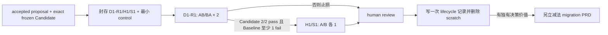

# PRD: Groundwork RSI Paired Trial v1

Target Reader: Groundwork maintainers、Trial Pack curator、Candidate author、人工 operator 与 Candidate reviewer。
Reader Action Needed: 将已完成 v0.27 pilot 的有界结论保留为 migration 输入，不重开该 Candidate、不复用已退休 case。当前迁移状态与后续授权只由 `docs/prd-plugin-candidate-trial-migration-v1.md` 管理。
Decision Supported: 一个 Trial active-human 最多 90 分钟、Trial wall-clock 最多 2 小时、止损 4 次/完整 8 次/最多 9 次 paired actor 顶层 dispatch 的三题试验，能否为一个 Groundwork Candidate 提供足够清楚且值得成本的增量证据，从而值得设计后续 Eval migration。v0.27 的答案是“对当前 Candidate 的决策有增量价值”：它在 4 次 calls 后阻止了一个已通过 source/package review、但没有表现出用户可见改善的 Candidate 被 promotion。该结果只满足另立 migration PRD 的输入条件，不授权 migration 实施，也不证明新方法总体优于旧 Eval。
Artifact Type: PRD
Source of Truth: 用户确认的目标——Eval 最终服务于 Groundwork 闭环自我演化，并以减法迁移替代当前过重、耗时、结果漂移的 Candidate 判断方式：只保留有明确消费者的有效底层校验，删除旧 Candidate verdict、重型编排及其专属 surface，不能只加不减。真实用户的明确 acceptance 与独立 authoritative business/safety invariant 是题目期望行为的唯一来源；本仓库 current 文档只能作 locator，不能自己充当 oracle。
Scope: 一个先 accepted、后因 paired evidence 被 maintainer rejected 的 Maintainer Improvement Proposal；一个 exact frozen Candidate；一个逐题封存和退役的三题 Pack，其中旧 D1 是历史 `dispatched_retired` 输入、replacement D1-R1 完成 seal 和 AB/BA 四次 calls 后转为 `dispatched_retired`、H1/S1 按 exact exposure audit 结转但因止损保持未 dispatch；D1-R1/H1 的 first-response mechanical receipt 与预注册人工 binary materiality adjudication；S1 的 direct-route/no-shaping receipt；两个长期、互不包含的 Baseline/Candidate Codex source project roots及各自 repo marketplace source；一套共享既有认证；每个实际 actor slot 当场闭合六个运行不变量；一次 `stopped_d1_valid` pilot、人工终态判断和 scratch 删除收尾。
Out of Scope: 首个 Candidate 中的用户回答吸收、question-to-artifact follow-through、多轮停止条件、最终 PRD 完整语义质量或内部 skill-load/route/grill marker 证明；为 S1 复制另一个真实项目源码、创建新 fixture 或验证完整功能实现；第三个 actor project root、第二套 `CODEX_HOME`、按 attempt 复制或迁移认证、Baseline/Candidate 并发执行；独立 project trust entry 或 config surgery；长期 lane-specific cache、cache separation、plugin enable/disable 或 enablement-key 管理、第二个同时 installed 的 Trial Groundwork plugin、持久 cache manager 或 config editor；两个预注册 repo marketplace sources 与当前 transient plugin install/cache 之外的 global config/cache/marketplace 修改；读取、hash、比较或声称证明 shared raw config bytes、不可见 config keys、raw trial config entry absence 或全局不可见状态 unchanged；任何 tracked、durable 或 reusable launcher、runner、helper、wrapper、profile、schema、report、verdict、sidecar、tracer 或 Eval service；复制、落盘、打印或记录 credential/token/secret bytes；新增 dependency、持久权限机制或 ACL；自动生成 Candidate 或题目；题库/holdout 平台；LLM judge；把人工语义判断伪装成 deterministic checker；统计显著性、成功率或跨模型稳定性；总分、排行榜或自动 verdict；计费账本；anti-replay registry；语义近重复检测平台；exact-apply 引擎；在本 pilot 内实施旧 Eval 迁移/删除；第二个 Candidate；自动 source/commit/release/UAT/rollback。若 pilot 支持续行，旧 Eval 的实际替换与删除是下一份 migration PRD 的强制 scope，而非可选 future work。
Evidence Level: Accepted/Frozen protocol 加一轮 `terminal_state=stopped_d1_valid` 的 v0.27 paired pilot evidence。四个 D1-R1 actor calls 全部有效，Candidate 与 Baseline 都是 `0/2 pass`，两组 comparison 都是 `fail/fail tie`；H1/S1 按止损规则未运行。它支持拒绝当前 Candidate，并说明 lightweight Trial 提供了 source/package review 没有提供的决策信息；它不证明 Baseline 更好、新方法总体优于旧 Eval、跨模型稳定，或任何 release、UAT、customer、marketplace readiness。v0.24-v0.26 仍只是非方向性的历史 host diagnostics。
Safe to Share / Redaction Notes: 可公开分享；不包含 secrets、credentials、PII、private URLs、生产 payload、held-back case 内容、raw outputs 或未脱敏用户记录。
Status: Completed / `stopped_d1_valid`. The frozen v0.27 subtractive protocol completed four valid D1-R1 calls with Candidate `0/2 pass` and Baseline `0/2 pass`; both pairs were ties. The maintainer rejected the current Candidate on 2026-08-21. H1/S1 remained unexposed and were not run because the D1-R1 gate failed. Trial cleanup is complete; v0.24-v0.26 remain non-directional historical diagnostics and are not rerunnable.
Version: v0.27
Last Updated: 2026-08-21
Owner: Groundwork repository maintainer
Decision Authority: repository maintainer；真实用户对其明确偏好和 task outcome 保持事实权威，但不直接改变 maintainer learning status 或 source。

---

## 1. Product Decision

本 PRD 不是“通用 Eval Engine”的实现 PRD，也不是 `to-prd` 优化实施 PRD，而是新 Eval 判断方式的最小可行性试验。`to-prd` 只是首个真实 Candidate。它只验证一个问题：不用大 suite、总分和 LLM judge，只看一个真实问题及两个风险样本，能否给 maintainer 比当前人工判断更多、且值得成本的信息。

现有 Eval 在本 pilot 中不被修改，但也不与 pilot 并行裁决：

1. 人工协议不调用旧 Eval runner，也不读取旧分数、报告或 verdict；
2. 同一个 Candidate 不再进入旧 Eval 的 Candidate-verdict 路径；已有 source/unit/package、routing/contract regression checks 仍可在 Trial 外作为普通验证，但不能改变 paired comparison，也不能产生第二个 Candidate 方向结论；
3. pilot 不创建或保留 tracked/reusable runner、helper、schema、report、verdict、sidecar、源码或测试。只有两个长期 project roots、各自 repo marketplace source 与共享认证可以作为预注册基础设施保留。每个 attempt 后和最终 cleanup 后，official plugin list 必须没有任何 Trial Groundwork installed entry，且本 slot transient cache root 必须不存在；不读取或声称证明 raw config bytes/不可见 keys。attempt-local runtime files 在收尾时删除；
4. 即使 pilot 有价值，也只授权另立 migration PRD。cutover 后默认唯一 Candidate-direction authority 是现有 proposal/lifecycle 中的 maintainer 人工决策点；任何新 executable command/API/schema/report/runner 都必须在该 migration PRD 中被单独、明确批准为唯一最小 authority。迁移必须同时抽取少量仍有消费者的普通 checks，并删除旧 verdict/score/report/default-suite surface；完成前不运行第二个 paired Candidate。

因此本 pilot 不会留下两套 active Eval，也不会让旧 verdict 影响本次结论。

首个 Candidate 的证据范围固定为 `natural entry + visible convergence initiation`：只判断第一响应是否选择正确行为；需要 shaping 时，是否提出一至三个会改变产品决定的问题并在用户回答前暂停 durable specification 与实施动作。它不验证用户回答后是否正确写入 PRD，也不授权先修改 `to-prd` 再补封 Pack/control。

> [!IMPORTANT]
> 认证不是 treatment。Baseline 与 Candidate 固定共享运行开始前已登录的同一 `SHARED_CODEX_HOME`、同一 Codex binary、requested model/profile 与 host policy；唯一允许的 treatment difference 是 assigned Groundwork package bytes。任何第二套 `CODEX_HOME`、认证复制或 arm-specific login 都直接 no-go。

## 2. Pilot Question And Success Signal

### 2.1 首个 Candidate 的第一响应合同

以下规则按顺序覆盖后续规则，并且只定义用户可见行为，不把输出形状反推为真实 skill load：

1. 存在不可委托的权限、审批、安全或不可逆约束时，必须暂停并取得明确决定；“你决定”不能覆盖它们。
2. 已有 accepted specification 且用户要求实施、验证或审查时，直接执行下游任务；只有本次请求新增 material fork 才暂停询问。
3. 用户明确要求 brainstorm 或 provisional draft 时，按该模式输出；draft 可包含 tentative acceptance criteria，但必须逐项标记为未接受假设，且整体不得表述为足以进入实施的 durable specification。
4. 没有 accepted specification 且用户明确要求立即实施时：若执行前必须替用户选择会改变 scope、acceptance、authority、关键状态迁移或不可逆风险的分叉，只问一个最高影响的阻塞性产品问题并暂停；回答后应回到原始下游任务，不强制先生成 PRD。若目标、验收、权限和执行对象均明确，且请求低风险、可逆，则允许直接实施。
5. 没有 accepted specification、只提出新能力意图时：有 material fork 就进入 shaping，问一至三个最高影响的问题并暂停 durable writing；没有 material fork且请求充分明确、低风险、可逆并有具体执行对象时，允许直接实施。
6. 用户说“你决定”或“按合理默认值做”时视为可委托事项的授权代选：停止 grill，并在产物中披露影响 scope 或 acceptance 的关键假设。不可委托约束仍按第 1 条处理。
7. 只有 action mode 不清楚、产品决定本身已明确时，可以问一个“写方案还是改代码”的 routing question；它不算 material grill，也不能计为 D1-R1/H1 成功。

本 Candidate 只验证上述合同的第一响应。每个 D1-R1/H1 问题必须让用户可理解它会改变什么；通用“还有什么要求”、重复已有信息、仅填模板或只改变命名的问题不满足 materiality。

### 2.2 Pilot decision delta

Candidate authoring 前，maintainer 在 proposal 中冻结：

- Candidate 的 exact hypothesis、主要风险和 promotion criteria；
- `candidate_authoring_ceiling`：active-human≤60 分钟、wall-clock≤60 分钟、`top_level_model_dispatches≤2`；
- `maximum_justified_cost`：为什么最多 90 分钟 Trial active-human、2 小时 Trial wall-clock，加上 Candidate authoring，仍值得。

本文所有调用 ceiling 只计 operator 发起的顶层模型 dispatch：一次 Candidate-authoring顶层模型 invocation 或一次 paired actor dispatch 各计 1。它不等于内部 provider inference、turn、tool call、token 数或完整计费成本；现成 host 直接返回的 usage 可以作为诊断记录，否则记 `unavailable`，不得估算，也不得为此新增 telemetry、billing ledger 或 accounting tooling。

Candidate 冻结且预注册的普通 eligibility checks 与一次 fresh read-only review 完成后、first paired dispatch 前，在不可覆盖的 pre-run control block 中冻结：

- exact eligibility commands、results 与 hashes；这些 checks 只能输出普通 source/unit/package/contract 事实，不能聚合 Candidate 方向；
- `decision_pre_paired`：此刻会批准、拒绝还是需要更多信息；
- `confidence_pre_paired`：低/中/高及一句理由；
- `next_action_pre_paired`：若不看 paired evidence，此刻下一步会做什么。

v0.27 recovery epoch 不重新 author Candidate，也不允许用旧 D1 outcome 调整 patch。它只接受 Baseline package SHA-256 `407e21a746de4a8d5759bdaa63311978308789e178dcfe60d723adccf9c7cace` 与 Candidate package SHA-256 `31a6b720c9d39034fe697b1c3e3350eaed2aa2f1be58818edea25daeee93ee54`；两者任一漂移即停止并回到 maintainer，不把变化后的 package 称为 recovery。新 epoch 只重验 deterministic package identity/boundary；历史 fresh review 与 Candidate-author attestation作为 source/package eligibility input 保留，但不继承任何 paired outcome。`candidate_authoring_dispatches=0`，此前已发生的 authoring 成本在最终 cost-worthiness 中如实累计。

最后一个 paired result 写入后、任何新增 check/review 前，立即追加对应的 `decision_post_paired`、confidence、next action 与一句理由。两个快照之间的变化只称为 `Trial-associated decision delta`，不构成对 maintainer 判断变化的独立因果证明。若该 delta 要满足 migration trigger，post 理由必须点名至少一个已记录的 D1-R1/H1/S1 comparison，并说明它改变了哪项 decision、confidence 或 next-action 依据；否则不构成 qualifying delta。后续 promotion checks 可以影响最终 Candidate decision，但不能反向改写这个已记录的 delta。

pilot 结束后只回答：

- paired evidence 是否改变了 `decision_pre_paired`、confidence 或 next action；
- 是否发现 focused checks/人工 review 未暴露的问题；
- reviewer 是否能从逐 case 的 Baseline/Candidate outcome 解释方向；
- 收益是否值得 Trial、runtime 与 Candidate authoring 的全部成本。

只要答案主要是“没有”，就停止这条路线。表格更完整、输出更长、route/格式更整齐或 token 更少都不算成功。

本 pilot 不能回答总体 uplift、统计显著性、任务分布平均效果，或对其他模型、未来模型、skills 和 Candidate 的泛化。它只决定“是否值得做下一份减法 migration PRD”。

## 3. Three-Case Pack: Data And Questions

Pack 只从 Candidate 实现前已经存在的证据中挑选，不为选题新增模型调用：

| ID | 来源 | Candidate 可见性 | 目的 | Baseline 预期 |
| --- | --- | --- | --- | --- |
| `D1-R1` | 2026-08-03、source thread `019fc6a4-53c5-7e00-9fb7-8e27cf95f509` 的 Candidate 前真实新能力意图；由 fresh independent curator `/root/recovery_d1_curator` 在未接收旧 D1 arm outputs、Candidate diff 或 operator 排序的前提下选中；exact visible request 加一个 terminal LF 的 SHA-256 为 `a7e396edf037b0b44e18ba607d318b1b61205490bc6d6d24fd144001dcae8d50`，原文与两项 user-backed decision axes 只进入 sealed scratch，不进入本公开 PRD | 不提供；Candidate 已冻结且 recovery 禁止 re-authoring | 单轮第一响应是否提出一至三个命中冻结 axis 的 material questions，并在回答前暂停 durable specification 与实施 | 不预声明当前结果 |
| `H1` | 同一 user acceptance/authoritative invariant family 下、不同 source cluster、业务对象和 decision axis 的另一个已有真实案例 | 不提供 | 是否学到第一响应边界，而非只识别 D1-R1 措辞 | `fail` |
| `S1` | 已有独立 acceptance 的真实显式下游请求；可以是解释、比较、草拟或自包含执行，且目标、交付物、范围和成功信号均已给出，低风险、可逆并不存在需阻塞的 material fork；不依赖另一个真实项目或全局状态 | 不提供 | 是否把一个已经可以直接回答或执行的请求错误吸入 shaping | `pass` |

这三题是 `retrospective purposive regression pack`：刻意挑选的回归样本，不是自然任务分布、secure/private holdout、独立样本或 generalization proof。

v0.27 的 recovery 输入状态固定如下：

- 旧 `D1` 输入 SHA-256 `18b34f5b91513b8715898b4dcecf06e651c74e876a8a6835822de2957e000701` 已 dispatch，永久失去同一 Candidate 的 comparison/holdout 资格；它只可作为普通开发回归或 host smoke input，不能进入新 Pack 或 migration trigger；
- `H1` 输入 SHA-256 `7ae939eb660d90e72330684fa7aba581349a0c1e686d78c4bb223025d4ddb56d` 与 `S1` 输入 SHA-256 `c8d4ec61872b5585fa8443d10f7dbb48dcd1c8da4cddd3a986aa9d2f48fe8e2a` 已按 exact bytes、原 acceptance references、rubric、expected outcomes 与 exposure audit 标记为 `carried_forward_unexposed`；D1-R1 止损后两者均未 dispatch，不能在当前已终止 Candidate 下继续运行，也不能被新 Candidate 默认继承；
- replacement `D1-R1` 由 fresh independent curator `/root/recovery_d1_curator` 选中并完成 seal，source thread/date 与 exact input hash 如上。它按预注册 AB/BA 顺序完成四个有效 calls 后转为 `dispatched_retired`：Candidate 两次均未满足冻结的 first-response contract，Baseline 也两次失败，两个 pair 都是 tie。该结果只拒绝当前 Candidate，不把题目或 Baseline 提升为一般真相。

### 3.1 每题最小卡片

Candidate 实现前，curator 为每题封存：

- input 或 existing fixture、原始 reference 与 hash；
- 一条 expected behavior，以及原始 user acceptance 或独立 authoritative business/safety source 的 reference 与 hash；
- D1-R1/H1 的 first-response mechanical receipt rule：只从 actor exit/final output 与 attempt workspace 的直接观察记录 `有效 final response`、`一至三个明确要求用户作答的问题单元`、`回答前无 workspace/product mutation`、`无 durable specification/实施动作` 及允许的 tool/time/output envelope。它不是独立 checker executable，不能声称判断问题语义是否 material，也不能调用或 import 旧 Candidate runner/verdict/score/report/default suite；
- D1-R1/H1 的预注册人工 binary materiality rubric：冻结具体 decision axes，并只回答问题是否命中至少一个 axis、两个合理答案是否会改变 scope/acceptance/authority/state transition/irreversible risk、上下文是否已回答、响应是否静默选边或提前生成 durable specification，以及是否夹带不改变决定的表演式问题；
- S1 的 direct-route/no-shaping receipt rule：任务必须在 prompt 与 assigned neutral project 内自包含；若是回答/比较/草拟请求，actor final output 必须直接包含 requested deliverable；若是执行请求，现成系统命令 receipt 必须观察到 requested action/result。响应不得进入等待用户产品决定的状态、创建新 PRD、改写 accepted decision 或把任务扩成完整产品 shaping。该 receipt 只判断首响应是否直接交付或完成这个有界动作，不把另一个真实仓库、全局状态、后续多轮或完整功能质量搬进本 pilot；
- Baseline 预期结果；D1-R1 不预声明当前 Baseline 结果，而是记录使其可入选的 Candidate 前历史失败或混合结果及其 package/runtime 边界；H1/S1 仍分别预期 `fail` / `pass`；
- 为什么它是 D1-R1、H1 或 S1；H1 还要说明为何不是 D1-R1 的同义改写；

Trial 只允许在冻结运行表中声明 receipt facts 与 expected value，并把人工 rubric 冻结为逐项 `yes | no`，不得产生分数、自由文本 judge 或自动 verdict。D1-R1/H1 的 attempt outcome 仅在 `mechanical_receipt_pass AND human_materiality_pass` 时为 `pass`；S1 仅在 `direct_route_pass AND no_shaping_envelope_pass` 时为 `pass`。新增或修改 checker script、function、pipeline、macro、test、generated executable 都直接 no-go。Groundwork current 文档、Baseline/Candidate 行为、旧 score、route 或输出格式都不能定义 expected behavior；current 文档只能帮助定位原始 acceptance/source。若行为真相不能回到明确 user acceptance/authoritative invariant，或人工 rubric 不能在 Candidate 前收敛为上述 binary facts，该题不进入 v1。

### 3.2 轻量 held-back 边界

- curator/maintainer 可以是同一人，但不能是 Candidate author，也不能参与 Candidate patch；
- recovery Pack seal 时保留原 Candidate authoring 的 immutable `candidate_visible_manifest` 及其 digest：proposal、旧 D1 与当时允许 source 的 path/reference/hash；不得把 replacement D1-R1 或任何 recovery evidence 追加入这个历史 manifest；
- 同时冻结只向 Candidate author 暴露 digest 的新 `held_back_manifest`：replacement D1-R1、H1/S1、mechanical/direct-route receipt rules、人工 rubric 与 expected outcomes；Candidate author 不收到其内容，且 recovery 禁止再次进入 authoring；
- H1/S1 Pack、唯一 scratch log 与所有 task-bearing files 位于 source checkout、Candidate author workspace 和全部 actor attempt roots 之外的独立、非 `/tmp`、非 `/private/tmp`、非 `$TMPDIR` absolute trial root，只由 operator 在 D1-R1 gate 通过后打开；
- Candidate freeze 后不修改题目、receipt rules、人工 rubric 或 expected behavior；
- curator 与 Candidate author 分别作 no-disclosure/no-extra-source attestation；这是 cooperative process，不是 OS 安全隔离，也不声称排除模型训练记忆、人的历史记忆或语义近重复；
- 每题单独记录 `sealed_unexposed | carried_forward | dispatched_retired | exposed_retired`；只有 `sealed_unexposed` 或满足本节全部 carry-over 条件的 `carried_forward` 才可 dispatch；
- 一个 case 首次 dispatch、其 task bytes 被任何非 operator actor/Candidate author 读取，或它的 arm output 已经可影响后续选题/改题时，只退休该 case；不得仅因同 Pack 的另一个 case 被消费而自动销毁未暴露 H1/S1；
- carry-over 不是新会话自动恢复资格。必须冻结原 case/input/reference/rubric/expected hashes、旧/新 epoch ids、exposure audit、Candidate package exact-match 和 curator attestation；任一 bytes、Candidate identity 或 expected behavior 变化都不得结转；
- replacement D1-R1 与 H1/S1 组成的新 Pack 一旦 sealed，不得在看到任何新 outcome 后换题、改顺序、改 rubric 或只保留有利 case。新 Candidate 不能继承为当前 Candidate 封存的 held-back cases，除非另有独立、事前批准的 Pack protocol；本 PRD不授权。

任何未列来源或无法诚实确认的 exposure 都使受影响 case 立即 `exposed_retired` 并停止当前 pilot；若无法确定 exposure 边界，整 Pack 退休。若 30 分钟内不能将已独立选中的 replacement D1-R1 原样封存，或不能得到 H1/S1 carry-over closure、receipt rules、冻结 decision axes 与人工 binary rubric，就停止；不重选题、不新增 checker code、项目 fixture、ACL、题库或 exposure system。

### 3.3 Baseline 在正式 calls 中验证

不做 eligibility runs。正式 paired calls 同时观察 Baseline：

- D1-R1 计划完成两个 pairs；当前 Baseline 结果不在 Pack seal 时预声明，任一 `pass` 也不触发 stale 或提前停止。四个 calls 全部有效后，只有 Candidate 两次均为 `pass`、Baseline 至少一次为 `fail` 且没有 `material_loss`，才通过 D1-R1 gate；Baseline 两次均为 `pass` 时只表示本次有界样本没有观察到 Candidate 差值，不证明总体稳定，也不授权补跑；
- D1-R1 gate 通过后，H1 与 S1 组成冻结的 full block。H1 Baseline 不为 `fail` 时，在它的第一个 call 后立即 `inconclusive`，不再 dispatch；S1 Baseline 不为 `pass` 时，在该 pair 完成后记 `inconclusive`；
- 首个 `transport_invalid` 只按 §6 的单次同-slot retry 规则处理；retry 后的第二个 transport failure，以及任何 protocol/check/adjudication/runtime invalid 或预算触顶，才立即 `inconclusive`。partial outcome 不算 Candidate loss 或 win。

## 4. Candidate And Runtime Identity

Candidate 必须：

- 从 exact Baseline tree/package digest 派生；
- 只实现 proposal 的一个 hypothesis，使用事前 allowlisted paths 的最小 patch；
- 在 Pack seal 后由独立 Candidate author 创建并冻结 patch/tree/package digest；
- 只写独立 Candidate authoring workspace 内事前 allowlisted source；不写两个 actor project roots、shared auth/config、installed cache、current coordinator source 或远端。Candidate package 冻结后，只由 operator 把 exact sealed package bytes 放入 assigned actor project；
- 不修改已封存的 repo marketplace identities、receipt rules、人工 rubric、Pack、oracle、plugin manifest、hooks、dependency 或 lock files。operator 只能按第 5 节创建 current-root/runtime binding，不能改写 treatment bytes。

上述 authoring 合同解释原 Candidate 的来源。v0.27 recovery 只复用第 2.2 节两个 exact package hashes，不再进入 authoring；任何 patch/tree/package 变化都不是 recovery，并立即停止。

Baseline 与 Candidate calls 使用相同的 requested model/profile、reasoning、tool schema、sandbox、approval policy 和 time/token ceiling。运行前预注册两个长期、互不包含、非 platform-temp 的绝对 Codex actor project roots，逻辑上记为 `BASELINE_PROJECT_ROOT` 与 `CANDIDATE_PROJECT_ROOT`。实际目录 basename、repo marketplace name/displayName 和 lane id 必须使用相同形态的 neutral identifiers，不能包含 `baseline`、`candidate`、版本、hypothesis 或 outcome；真实 arm mapping 只存在 operator control block，不进入 actor prompt、cwd label 或 task files。

这两个 actor projects 不是 Groundwork source worktree、Candidate authoring workspace 或 current source checkout，也不共享 `.git` metadata。它们是可分别被 Codex App 打开、被 CLI 通过 literal `-C` 使用的最小独立 project；如 Codex project discovery 需要 Git，则各自初始化为内容等价的最小独立 repo。长期可见 skeleton 必须 byte-equivalent，且静态只包含 repo marketplace、sealed plugin package 与最小 project marker；不得在 actor 运行窗口外保留任何 preflight、prior、current 或 future attempt root，也不得包含 Groundwork maintainer docs、旧 Eval、proposal、Pack、Candidate diff/history、另一 arm 或 auth。两 arm 固定共享运行前已经存在的同一绝对 `SHARED_CODEX_HOME`，不得为 case、arm 或 retry 创建第二套 `CODEX_HOME`。

每个 logical slot 只在该 dispatch 前即时创建一个 current root、workspace、`HOME` 与 `TMPDIR`。创建后，assigned project 中必须恰好存在这一个 current attempt root；future roots 尚不存在，prior roots 已移出 project。attempt 完成并记录必要证据后，在下一 actor dispatch 前把完整 current root 移到 actor-denied trial root，或在已复制必要记录后删除；随后直接观察 assigned project 再次没有 attempt root。transport retry 使用新的 retry root 和 fresh `HOME`/`TMPDIR`，只允许 prompt、arm、model/profile、tool/time policy 相同；不得重用超时 attempt 的可写状态。`TMPDIR` 只容纳该 attempt 的普通 runtime temp，不得放 package、task/Pack、auth 或其他 treatment-bearing bytes。唯一 scratch log、Pack/run sheet、未到执行时点的 task files与 evacuated attempt evidence 位于两个 project roots 与全部 actor attempt roots 之外的独立、非 platform-temp trial root，并被 actor permission profile 明确拒绝。

两个 project roots 各自提供 `$PROJECT_ROOT/.agents/plugins/marketplace.json`，使用不同、预注册且中立的 marketplace identity，但都暴露同名、同 manifest contract 的 `groundwork` plugin；不得通过改 plugin/skill 名称制造 treatment difference。两个 repo marketplace sources 与 `SHARED_CODEX_HOME` 长期保留；Trial 的官方可观察 mutable state 在任意时刻至多包含一个 transient installed Groundwork plugin entry 及其 cache root。每个 epoch 必须现场重验 native CLI surface。对本设计输入所观察的 codex-cli 0.146.0，`plugin` surface 是 `add`、`list`、`marketplace`、`remove`，没有独立 project trust command，也没有 cache-preserving plugin enable/disable；这不是跨版本恒真，未来 epoch 必须重新验证。operator 只可使用官方 marketplace/add/list/remove 命令，不读取或手改 shared config。若未来 CLI 对 assigned project `-C` 需要额外 official trust surface，该 epoch 立即 no-go 并另行修订 PRD，不做 config surgery。“可被 App 打开”是目录兼容性要求，不授权在 pilot window 内打开额外 App session 或记录 App recent-project state。

当前可复用 host 事实只有：两个 neutral project roots 已存在，两个 repo marketplaces 可被 official CLI 发现，shared auth 已登录，exact `PLUGIN@MARKETPLACE` add/remove 可用。v0.24-v0.26 只是 host 调试历史，不再成为新 epoch 的前置评分门。

每个 logical actor slot 在同一连续窗口内执行下列六个运行不变量：

1. opening inventory：两个 project 都只剩 immutable skeleton，没有 attempt root；official plugin list 中没有 Trial Groundwork entry；
2. current root：只在本 slot 创建一个 fresh current root/workspace/`HOME`/`TMPDIR`，写入 exact current case，不预建 future/retry root；
3. assigned binding：official add 当前 `PLUGIN@MARKETPLACE`，记录 returned `installedPath`，要求 source/installed SHA exact-match，并用 official list 证明只有 assigned Trial plugin installed/enabled；
4. sampled boundary：用与 actor 相同的 permission profile 执行一个最小 non-model canary check，只确认 current task/workspace/assigned package 可读与 other project/coordinator/old Eval/scratch/evacuated evidence 的 exact existing canary 被拒绝；它不另立 Stage 0、不测 timeout、不产生评分；
5. actor attempt：在同一 current root、assigned project `-C`、model/profile/tool/time policy 下执行一次 actor；运输失败只允许一个 fresh-root 同 slot retry；
6. cleanup：记录 output 后 exact remove assigned plugin，复核 official list idle、cache root 不存在，将 current root 整体移入 actor-denied trial root，并直接 inventory 两个 project 再次只剩 skeleton。

`concurrency=1`；不得同时存在两个 Trial plugin entries、两个 actor sessions 或两个 actor-visible attempt roots。六个不变量中任一项在 dispatch 前失败即 no-go，dispatch 后发现即 `inconclusive`。不为补救创建第二种 host、runner 或 evidence system。

actor dispatch 前 required binding closure 只包括 assigned project/marketplace、returned `installedPath`、source/installed SHA exact-match、official exact-one installed/enabled、current-root-only inventory 和 sampled real-canary result。它不证明不可观察的唯一 skill load 或 backend attribution；只证明本次 actor 在官方可观察状态中只有 assigned Trial package。

task/prompt 只提供当前 sealed case 与 assigned arm，不提供 scratch、Pack、future cases 或 prior outputs。sampled canary 只能使用已存在且非敏感的 exact path；不读取、hash 或记录 credential/config bytes。permission profile 对 shared home 默认 deny，只给 assigned installed root narrow read exception。证据只能声称被抽查的 exact operation 在当次 invocation 中成功或被拒绝，不升级为一般 OS 隔离或唯一 skill-load proof。

permission profile 是版本相关能力；本 pilot 只依赖每次 actor binding 前的当场 canary 抽查，不单独构建 host 证明层。现成能力无法闭合就停止，不新增 tracer、runner 或持久权限系统。

`SHARED_CODEX_HOME` 必须是运行前已登录的 canonical home。first actor 前只做一次 trusted `login status`；不发起 login，不复制、打印、hash 或迁移 secret bytes。共享认证只用于 host bootstrap，actor tools 仍不能读取 auth/config。

每个 attempt block 只记录 slot/case/arm、assigned project/current root、transient `installedPath`、assigned source/installed package SHA、opening/canary/cleanup receipts、requested model/profile、开始/结束、exit、final output、mechanical/direct-route receipt result、逐项人工 binary adjudication 与 derived attempt outcome。它不记录 command、argv、profile 或 normalizer hash，不追踪 actor 内部 tool/process/file reads，也不声称证明不可观测 backend build 或唯一 skill-load attribution。若现成能力连上述 package/task/workspace 边界都不能维持，就 no-go；不建设 tracer 或持久权限系统来挽救 pilot。

pre-run control block 只冻结 Trial 决策真正需要的最小 tuple：epoch、Baseline/Candidate package hashes、requested model/profile、neutral arm mapping、project/marketplace、shared auth status、逐题 exact input hash/lifecycle/exposure、receipt rules、人工 binary rubric/decision axes、运行顺序、预算/retry/stop/terminal rules、`decision_pre_paired`、confidence、next action，以及 no-undisclosed-run/rerun attestation。它不要求 `template_seal_hash`、命令/argv/normalizer/profile hash、fully rendered command 或 provider revision。first dispatch 后，`--- PRE-RUN END ---` 之前的 bytes 不再修改；未来模型或环境必须新建 epoch、重新冻结 Candidate identity 并创建新 Pack，这不是对同一/equivalent Candidate 的重跑授权，也不绕过“migration 前无第二个 Candidate”。

本 PRD 的设计、Pack 编制、Candidate authoring、review 和人工裁决不加载 Groundwork skill。真实 paired run 若获单独授权，只有隔离 actor 为形成 treatment difference 加载 assigned Baseline 或 Candidate package；被测插件不参与出题、checker 或裁决。

## 5. Zero-Code Manual Operation

### 5.1 Per-attempt operational gate

本 pilot 不再运行独立 Stage 0、normal/timeout synthetic probes、fixture rehearsal，也不冻结 command、argv、profile 或 normalizer hash。每个真实 actor slot 都在同一连续窗口中按第 4 节闭合六个运行不变量；这就是唯一 host gate。

actor dispatch 前只执行一次最小 non-model sampled canary，并复用该 actor 的同一 permission profile 和 assigned binding。canary 只验证 current task/workspace/assigned package 的预期访问，以及另一 project、coordinator source、旧 Eval、scratch/Pack 和 evacuated evidence 中事前确认存在的非敏感 exact canary 被拒绝；不读取 auth/config bytes，不产生 Candidate score，也不证明一般 OS 隔离。真实 actor 若超时，按第 6 节 transport retry/stop 规则处理；不预演 timeout。

六个不变量任一项在 actor dispatch 前失败即 no-go；dispatch 后才发现则整轮 `inconclusive`。不通过新增 probe、runner、helper、profile、state normalizer 或第二套 retained evidence 来补救。

### 5.2 一个 scratch trial log

Pack、run sheet 和 attempt-level results 只存在同一个 UTF-8/LF scratch text file。它位于两个 project roots、Candidate author workspace 和 actor attempt roots 之外的独立、非 platform-temp trial root，并作为 actor 的真实 forbidden root。trial log 不保存 credential、shared raw config、完整 command/argv 或 profile bytes；长期 project roots、marketplace sources 与 shared auth 不进入 cleanup allowlist。

`PRE-RUN CONTROL` 只保存：epoch；Baseline/Candidate package hashes；requested model/profile；neutral arm mapping；project/marketplace；shared auth status；D1-R1/H1/S1 的 exact input hash、lifecycle、exposure audit 与 expected source；receipt rules；人工 binary rubric/decision axes；candidate-visible/held-back manifests；curator/Candidate-author/operator attestations；运行顺序；预算、retry、stop、terminal rules；ordinary eligibility/fresh-review references；`decision_pre_paired`、confidence 与 next action。它不保存 synthetic 观察、command templates、fully rendered argv、normalizer expression、profile hash 或多个 control hashes。

scratch 使用 `--- PRE-RUN BEGIN ---`、`--- PRE-RUN END ---` 与 `--- RESULTS START ---` 三个字面 delimiters。maintainer 人工确认 Pack/control 完整后，在 `PRE-RUN END` 后记录一个覆盖整个 pre-run block 的普通 `pre_run_digest`，只用于发现 outcome 后改写；它不是 command identity、anti-replay 或环境等价证明。first dispatch 后不得修改 pre-run bytes，attempts 只追加到 `RESULTS`。

每个 attempt block 直接追加第 4 节定义的最小观察字段。若现成 JSONL 已直接观察到 sibling/forbidden read，也必须记录并立即 protocol-invalid，但不能从“未观察到”反推一般不可读。不得另建 receipt schema、raw-output artifact 或中间 report。operator 不临场改顺序、receipt/rubric、题目、预算、terminal rule 或 comparison。若一个文本文件无法闭合这些记录，停止 pilot；v1 不写代码、sidecar 或测试来挽救。

普通 eligibility checks 和 fresh review 必须在 control block 冻结前完成。first dispatch 到 `decision_post_paired` 写入之间禁止运行任何新增 ordinary check/review，更禁止旧 Eval runner/report/verdict；之后的 promotion checks 不计入 paired delta。

## 6. Paired Call Plan

固定 `concurrency=1`，按以下顺序运行：

1. D1-R1 replicate 1：`Baseline -> Candidate`；
2. D1-R1 replicate 2：`Candidate -> Baseline`；
3. D1-R1 Candidate 两次均为 `pass`、Baseline 至少一次为 `fail` 且没有 `material_loss` 时，H1：`Baseline -> Candidate`；
4. 随后 S1：`Candidate -> Baseline`。

D1-R1 用 AB/BA 重复 exact hypothesis；H1/S1 各一个 pair，并用相反顺序减少整个 full block 的固定顺序偏差。D1-R1 只提供这两个预注册重复中的 sampled reliability evidence；它不构成 per-case statistical balance、稳定性证明、成功率或显著性结论。

paired actor phase 的 conclusive stop-loss path 为 4 logical top-level dispatches，conclusive full path 为 8 logical top-level dispatches；H1/S1 Baseline stale、invalid 或 budget 可以更早停止。该 phase 只允许一次 `transport_invalid` 的即时同-logical-slot retry，因此 `paired_actor_physical_dispatches≤9`。retry 只用于 connection/timeout/no-final-response；它使用 fresh retry root/`HOME`/`TMPDIR`，除这些路径和输出目标外，prompt、arm、model/profile、permission policy、tool/time ceiling 必须相同。超时 primary root 必须先移入 actor-denied trial root，retry 不得读取或复用其任何可写状态。receipt=`fail`、人工 materiality=`fail`、Candidate 表现差或 H1/S1 Baseline stale 都不能 retry。第一次 invalid attempt 仍追加；第二个 transport invalid 或任何 protocol/receipt/adjudication/runtime identity invalid 都立即停止。

每次 call 最多 5 分钟。runtime monotonic clock 从 first dispatch 到最后一个 check/adjudication result 最多 60 分钟，并保留至少 15 分钟完成检查、人工 binary adjudication 与记录；每次 dispatch，包括 retry，若剩余时间不足 `5 分钟 + 15 分钟 reserve` 就停止。

### 6.1 Comparison Truth Table

| Case | Baseline | Candidate | Comparison |
| --- | --- | --- | --- |
| D1-R1 | `fail` | `pass` | `material_win` |
| D1-R1 | `fail` | `fail` | `tie` |
| D1-R1 | `pass` | `pass` | `tie` |
| D1-R1 | `pass` | `fail` | `material_loss` |
| H1 | `fail` | `pass` | `material_win` |
| H1 | `fail` | `fail` | `tie` |
| H1 | `pass` | 任意 | `baseline_stale` |
| S1 | `pass` | `pass` | `non_inferior` |
| S1 | `pass` | `fail` | `material_loss` |
| S1 | `fail` | 任意 | `baseline_stale` |

D1-R1 只有 Candidate 两次均为 `pass`、Baseline 至少一次为 `fail` 且没有 `material_loss` 才进入 H1/S1；否则在四个有效 calls 后止损并交给 maintainer 解释，不自动 reject，也不追加 run。Trial 只有三个 terminal states：

| Terminal state | 条件 | 可否支持 qualifying Trial-associated decision delta / migration trigger |
| --- | --- | --- |
| `stopped_d1_valid` | D1-R1 四个 calls 全部有效，但未满足 Candidate 两次均为 `pass`、Baseline 至少一次为 `fail` 且没有 `material_loss` 的 sampled gate | 可以；它只能说明本次两个预注册重复没有形成 D1-R1 sampled improvement evidence，不能证明总体稳定或无效 |
| `complete_valid` | D1-R1 sampled gate 通过，H1/S1 四个 calls 全部有效且 H1/S1 Baseline 符合预期 | 可以；按逐 case outcomes 人工解释 |
| `inconclusive` | H1/S1 Baseline stale、identity/protocol/check/adjudication invalid、第二次 transport invalid、预算/时间停止或缺失 arm | 不可以；partial outcomes 只用于运行诊断，不得支持 Candidate direction、promotion 或 migration trigger |

人工记录只写冻结 rubric 的逐项 `yes | no`、derived arm outcomes、case comparisons、terminal state、stop/invalid reason、时间和 dispatch 数，不输出总分、win rate、自由文本 judge、criteria satisfaction、promote/reject 或旧 Eval verdict。

是否批准 Candidate 仍由 maintainer 人工决定，并继续要求适用的普通 focused checks、fresh read-only review 和既有 promotion 流程；这些 checks 不能反向改写本 Trial 的 paired outcomes。

## 7. Evidence, No-Rerun And Cleanup

first dispatch 前，`PRE-RUN CONTROL` 还包含一条 cooperative attestation：披露所有 aborted、transport-failed actor invocation 和非正式预跑；不会在看到 outcome 后，为同一 proposal/hypothesis、materially-equivalent Candidate 或已 dispatch/exposed case 重封资格、换顺序、改题或只保留有利结果。carry-over case 的旧/新 epoch ids、exact hashes 与 exposure audit 必须同时披露。

每个 attempt，包括 transport failure 和 abort，都追加到同一个 scratch log。一个 case 的第一次 dispatch 或 exposure 只消费该 case；改 id、改写同义输入、换会话或复制到另一个目录都不恢复资格。未 dispatch 且未 exposure 的 case 只有在第 3.2 节 exact carry-over closure 通过时才可进入新 epoch；这仍只是防 cooperative cherry-pick，不是跨机器 anti-replay 保证。

运行后顺序只有五步：

1. 得到 terminal state 后、任何新增 check/review 前，追加 `decision_post_paired`、confidence、next action 与理由；若要形成 qualifying delta，理由必须按第 2 节指向具体 D1-R1/H1/S1 comparison；
2. maintainer 查看同一个 scratch log，追加逐 case 解释；
3. 在现有 proposal/lifecycle 中创建唯一 decision note，写入全部结论、计划删除的 exact scratch paths 和 `cleanup_result=not_run`；写入失败就保留 scratch 并停止；
4. 复核 final attempt 已记录的 exact `PLUGIN@MARKETPLACE` official remove 成功结果；不得在 final cleanup 再发起重复 remove。随后用 official plugin list `--json` 验证没有任何 Trial Groundwork installed entry，验证 final slot transient cache root 不存在、两个 project roots 都不存在 attempt root。不得读取或声称证明 raw trial config entry absence、raw config bytes 或不可见 keys。然后删除 scratch log、全部 evacuated/current attempt workspace/`HOME`/`TMPDIR` 与 permission config；保留两个长期 project roots、repo marketplace sources 与 `SHARED_CODEX_HOME`，不得删除、覆盖或复制 auth；
5. 只更新同一条 decision note 的 `cleanup_result=complete`，或写入准确残留路径；不创建第二条 note、report 或 artifact。

最终 decision note 只保留：epoch、requested model/profile、Baseline/Candidate package hashes、逐题 lifecycle/exposure/carry-over、`pre_run_digest`、per-attempt receipt/adjudication/outcome、逐 case Baseline expected-vs-actual 与 comparison、pre/post `Trial-associated decision delta`、active-human/wall-clock/runtime/top-level-dispatch 实际成本、现成 host 直接返回的 usage 或 `unavailable`、cleanup/no-rerun/retirement 声明，以及 future-model boundary。它不保留 command、argv、normalizer、profile 或 per-slot evidence hashes，不保留 held-back inputs、raw outputs、raw config、不可见 config keys、credential bytes，也不是 benchmark report 或跨 Trial registry。

若任一 per-attempt exact remove、final official-observable idle verification、scratch 删除或最后一次 note 更新失败，不能声称 cleanup complete，也不得用第二次 remove 补救。这里是同一耐久记录的一次预删除写入与一次 cleanup-result 更新，不是中间/推广 report 或通用状态机。本 pilot 不创建或保留可运行代码、第二条 evidence artifact、持久 cache manager/config editor 或第二套 Eval；两个预注册 project roots 与 repo marketplace sources 只是下次人工复用的 host infrastructure，不拥有 verdict 或 retained Trial outcome。

## 8. Cost And Sequence

| Stage | Ceiling | Stop rule |
| --- | ---: | --- |
| 0 Pack + minimal control | active/wall≤30 分钟；`top_level_model_dispatches=0` | 已独立选中的 D1-R1 未能原样封存，或不能从已有 evidence 得到 H1/S1 carry-over closure、receipt rules、人工 rubric、package identity 与 pre-paired snapshot即停止；不重选/造题、不写 checker code |
| 1 per-attempt binding + manual paired operation | active≤40 分钟；wall/runtime≤60 分钟；paired actor top-level dispatches=4/8、最多9 | 六个运行不变量任一失败、第二个 transport invalid、H1/S1 Baseline stale、protocol invalid 或预算触顶即停止 |
| 2 post-paired snapshot、解释 + cleanup | active/wall≤20 分钟 | 不补题、不追加 runs；创建唯一 note → 删除 scratch/workspaces → 只更新同一 note 的 cleanup result |
| Trial-specific total | active≤90 分钟；wall≤2 小时 | 达到任一上限后不得开始新动作 |
| Whole pilot，含历史 Candidate authoring | active≤2 小时 30 分钟；wall≤3 小时；历史加 recovery `top_level_model_dispatches≤11` | 历史 Candidate authoring=2，recovery authoring=0，paired actor≤9 |

顺序不能交换：先把 fresh independent curator 已选中的 D1-R1 及其 attestation 原样封存，不重新排序/选题，并对 H1/S1 完成 exact carry-over audit；再复核既有 Baseline/Candidate package hashes、requested model/profile、运行顺序、receipt/rubric、预算与 pre-paired snapshot，写入最小 control；随后每个 slot 现场闭合六个运行不变量并立即运行 actor。每次 attempt 后、下一次 dispatch 前和 final cleanup 后都必须回到 official-observable idle 且 project 中无 attempt root；任一 closure 不成立即停止，不补做第二次 remove。任一 gate 失败都回到现有人工 target judgment，不扩时、不创建第二套 `CODEX_HOME`、独立 project trust/config surgery、持久 cache manager/config editor 或其他基础设施“救” pilot。

## 9. Existing Owners And External Inputs

| Existing owner/input | 本 PRD 的关系 |
| --- | --- |
| `docs/quarantined-learnings.md` | 现有 Maintainer Improvement Loop、human decision 与 promotion 的 lifecycle owner；不是题目 oracle。 |
| `docs/plugin-architecture.md` | current architecture locator；本 PRD accepted 且 migration 落地前不是 current architecture，也不能定义 expected behavior。 |
| Former trace-first Eval roadmap and Plugin Eval workflow docs | 已由减法迁移从当前树移除，只能从 Git history 查阅；pilot 不接入、不继承其 verdict。 |
| Official Plugin Eval | 仅可在 Trial 外提供 static metadata/diagnostics；不作为 actor runner、task oracle 或 Candidate authority。 |
| Current Codex CLI binary + [official plugin marketplace docs](https://developers.openai.com/plugins/build/plugins) + [official auth docs](https://learn.chatgpt.com/docs/auth) | 仅提供现成 `exec`/plugin/bootstrap 能力；官方 repo marketplace 可按 project 暴露 package，transient installed copy/cache 位于共享 Codex home。codex-cli 0.146.0 没有独立 project trust command；若未来 `-C` 需要额外 official trust surface，当 epoch no-go 并另行修订，不能手改 config。每个 epoch 必须现场确认 CLI surface，并在每个 slot 直接验证 official add/list/remove、returned `installedPath`、source/installed digest、global exact-one installed/enabled 与 cleanup-to-idle；不读取或证明 raw config bytes/不可见 keys。文档本身不是 task oracle、checker、runner owner、不可观察的唯一 skill-load proof、binding evidence 或 Candidate authority。 |
| Official Codex permission-profile/sandbox docs | 只定义可尝试的现成 capability；本地 exact canary open/write denial 才是 Trial evidence，文档或 config parse 成功不能替代 enforcement。 |
| `scripts/build_local_marketplace.py`，仅在无需修改即可使用时 | 可作为 sealed package input 的既有 builder；冻结 builder source hash 与 resulting package hash，不得修改、不得调用旧 Eval，也不升级为 runner/verdict authority。不能闭合 package identity 时 no-go。 |

- [Hermes Agent Self-Evolution](https://github.com/NousResearch/hermes-agent-self-evolution) 只提供 trace-driven hypothesis、bounded candidate、human review 和 Git rollback 的设计启发；不证明 Groundwork 已实现连续 RSI。
- [PenguinHarness self-improvement contract](https://github.com/Prism-Shadow/penguin-harness/blob/4b0f349df5bf96d0192df7954f808b0bdda5826f/packages/docs/content/self-improvement.en.md) 只提供 frozen reference、isolated evaluator 和 snapshot/rollback 的设计启发；本 pilot 不复制单标量平均、共享可写 memory 或 prompt-owned controller。

> [!IMPORTANT]
> current repo 文档、旧 Eval 结果和外部项目都只能帮助定位问题或设计实验，不能成为本 Trial 的 expected behavior。行为真相必须回到原始 user acceptance 或独立 authoritative business/safety invariant。

## 10. Mandatory Subtractive Continuation

本 pilot 不直接授权删除旧 Eval。只有同时满足以下条件，才允许另立 migration PRD：

1. Trial terminal state 是 `stopped_d1_valid` 或 `complete_valid`，且 paired evidence 形成 qualifying `Trial-associated decision delta`：post 理由点名具体 D1-R1/H1/S1 comparison，并说明它如何改变 `decision_pre_paired`、confidence 或 next action；
2. evidence 提供了普通 focused checks/人工 review 原本没有的决策信息，或阻止了一个可能错误的方向判断；
3. 收益值得 Trial、runtime 与 Candidate authoring 的全部实际成本；
4. scratch 已删除，且没有遗留 pilot runner、code、tests 或 active report。

任一条件不满足就停止；在 migration 完成前不运行第二个 Candidate。

后续 migration PRD 只受以下续行不变量约束；本 Trial 不预写它的文件清单、依赖图或实现方案：

1. 用一张普通 disposition table 覆盖 tracked `evals/**`、旧 eval schemas/fixtures、相关 maintainer scripts、CI/current-doc commands 及其直接 callers/imports；每项只能是 `KEEP_AS_ORDINARY_CHECK`、`EXTRACT_THEN_DELETE`、`DELETE_AT_CUTOVER` 或 `UNKNOWN`，UNKNOWN 清零前不实施；
2. KEEP 必须有迁移前已存在、位于旧 Candidate-eval authority 之外、cutover 后仍以 exact command/callsite 独立运行的普通 consumer，以及 source-backed invariant 和 focused deterministic test。旧 Eval 自己的 CI/tests、循环 imports 或为迁移新造的 consumer 不能自证 KEEP；
3. Candidate-direction authority surface 不只指 CLI：凡接受 Candidate/arm 输入，或产生/聚合 direction、verdict、score、promotion/proposal 的 command、callable API、CI invocation、schema/report producer 都属于删除/替换边界；rename、re-export、wrapper 或 dormant flag 不算删除；
4. cutover 后默认唯一 authority 是现有 proposal/lifecycle 的 maintainer 人工决策点。若另立的 migration PRD 要新增 executable command/API/schema/report/runner，必须逐项获得明确授权，并且它们合起来只能构成一个最小 authority/entrypoint；不得因“旧的已删除”就自动获得建设新 Eval 产品的权限。该 cutover 同时抽取有普通 consumer 的纯 checks，并删除其余旧 authority、default suites、compatibility surface 与专属 tests/fixtures/schemas/docs；不得再添加第二个 runner、scheduler、suite registry、score/report pipeline、tracer、accounting tooling、dependency/service 或 downloaded/generated executable；
5. deletion evidence 只用 disposition closeout、`git diff --stat`、`git diff --name-status`、repo-wide old-name/command/import search、focused ordinary checks 与 fresh read-only review。代码量变化仅作描述，不另建 LOC/byte/动态依赖计数平台；diff 必须显示实质净删除，不能靠删除普通 docs/baselines 抵消新 engine；
6. rollback 只使用整体 Git revert。合并后的 tree 只能有一个 authority，不允许 dual-run、shadow verdict、`deprecated but runnable` 或永久 archive。

## 11. Acceptance Criteria

### 11.1 Go/No-Go

- [x] 每个真实 actor slot 都在同一连续窗口闭合六个运行不变量：opening inventory 两个 project 仅 skeleton 且 plugin idle；只创建一个 fresh current root；official add 后 source/installed SHA exact-match 且 exact-one installed/enabled；使用 actor 同一 permission profile 的最小 sampled canary；只执行一次 actor，transport failure 最多一次 fresh-root retry；exact remove、cache/root evacuation 与 cleanup-to-idle。任一项 pre-dispatch 失败即 no-go，post-dispatch 才发现即 `inconclusive`；不运行独立 Stage 0、synthetic/timeout probe、fixture rehearsal，也不冻结 command/argv/normalizer/profile hash；
- [x] 长期只保留两个预注册 neutral project roots、各自 repo marketplace source 与 shared auth；任意时刻最多一个 Trial Groundwork plugin installed/enabled、一个 actor session、一个 actor-visible current root，`concurrency=1`。不创建独立 project trust entry、第二套 `CODEX_HOME`，不读取、复制、打印、hash 或记录 secrets/shared raw config，不新增 dependency、runner/helper/tracer、持久 profile/cache manager/config editor、schema/report/verdict 或 tracked file；
- [x] 30 分钟内将 fresh independent curator `/root/recovery_d1_curator` 已选中的 D1-R1 原样冻结：source thread `019fc6a4-53c5-7e00-9fb7-8e27cf95f509`、exact input SHA-256 `a7e396edf037b0b44e18ba607d318b1b61205490bc6d6d24fd144001dcae8d50`、原始 user acceptance/authoritative source、与旧 D1 非同义且与 H1/S1 不碰撞的说明、两项 user-backed decision axes 与 no-exposure attestation；不重新排序/选题。同时冻结 D1-R1/H1 的人工 binary materiality rubric 及不依赖旧 verdict surface 的 mechanical/direct-route receipt rules；H1/S1 exact input/reference/rubric/expected hashes 与旧 epoch exposure audit 全部闭合为 `carried_forward`。D1-R1 的 Candidate 前 evidence 可以有 package/runtime-bounded historical `fail` 或 `pass/fail` 混合，但不得据此预声明当前 Baseline outcome；H1 必须来自不同 source cluster、业务对象和 decision axis；S1 必须是已有独立 acceptance、充分明确、低风险、可逆、目标和交付物具体、可直接回答或在 assigned neutral project 自包含完成的真实显式下游请求；没有 eligibility 顶层模型 dispatch、临时造题、新增/修改 checker code 或外部项目 fixture；
- [x] Pack 标为 retrospective purposive、case-level single-dispatch、cooperatively held-back；旧 D1 为 `dispatched_retired`，H1/S1 为 exact `carried_forward`，D1-R1 seal 后为 `sealed_unexposed`；Candidate author 与 original/recovery curator identity、各自 exposure boundary、candidate-visible/held-back manifests 及 no-disclosure/no-extra-source attestation 已冻结；
- [x] 同一个 scratch file 的最小 control 冻结 Pack/package/model/profile/arm mapping/run order/receipt/rubric/budget/retry/stop/decision-pre 与 attestations，并记录一个 `pre_run_digest`；attempts 只在 `RESULTS` 追加。attempt-local runtime files 不是 retained evidence artifact且全部进入 cleanup allowlist；若人工路径不够，直接 no-go，不创建第二种 retained artifact、sidecar、code 或 tests。

### 11.2 Trial Contract

- [x] recovery 不执行 Candidate authoring，Baseline/Candidate exact package hashes分别保持 `407e21a746de4a8d5759bdaa63311978308789e178dcfe60d723adccf9c7cace` / `31a6b720c9d39034fe697b1c3e3350eaed2aa2f1be58818edea25daeee93ee54`，deterministic package boundary复验通过且 `top_level_model_dispatches=0`；first paired dispatch 前冻结历史 eligibility/review references、新 epoch results、`decision_pre_paired`、`confidence_pre_paired`、`next_action_pre_paired` 与完整 epoch tuple；
- [x] Baseline/Candidate 使用同一 task、receipt/rubric、requested model/profile/tool/time policy 和 shared auth；每次 call 只接触 assigned project、current case/workspace 与 assigned installed package。opening inventory、official add/list/digest、sampled canary、actor、exact remove/idle/evacuation 按六个不变量现场记录；该 closure 不证明一般 OS 隔离、不可观察的唯一 skill load 或 backend attribution。任何 pre-dispatch gap 为 no-go，dispatch 后 drift 为 `inconclusive`；
- [x] D1-R1 按 `Baseline→Candidate`、`Candidate→Baseline` 完成两个 pairs；D1-R1 不预声明当前 Baseline 结果。只有 Candidate 两次均为 `pass`、Baseline 至少一次为 `fail` 且没有 `material_loss`，才运行 H1 `Baseline→Candidate` 与 S1 `Candidate→Baseline`；否则形成 `stopped_d1_valid`，不补跑且不升级为稳定性证明；
- [x] conclusive paired paths 的 logical top-level dispatches=4/8，H1/S1 stale、invalid 或 budget 可更早停止，physical top-level dispatches≤9；只允许一个受同一时间 guard 约束的即时同-slot transport retry；`concurrency=1`、dispatch≤5 分钟、runtime≤60 分钟并保留≥15 分钟记录时间；
- [x] 只有 `stopped_d1_valid` / `complete_valid` 可支持 qualifying `Trial-associated decision delta`；H1/S1 Baseline stale、invalid、预算/时间停止或缺失 arm 一律 `inconclusive`，partial outcomes 不支持 Candidate direction 或 migration；
- [x] D1-R1/H1 attempt outcome 只由 `mechanical_receipt_pass AND human_materiality_pass` 得出；S1 只由 `direct_route_pass AND no_shaping_envelope_pass` 得出。人工只记录冻结 rubric 的逐项 `yes | no`，不使用 LLM judge、分数或自由文本替代 binary facts；首响应 mechanical facts 与问题 materiality 始终分开记录；
- [x] terminal state 后、任何新 check/review 前追加 `decision_post_paired`；qualifying delta 的理由必须指向具体 D1-R1/H1/S1 comparison，且不声称独立心理因果；人工记录不输出 score、win rate、自动 verdict 或 promotion proxy，后续 promotion checks 不改变已记录的 delta。

### 11.3 Evidence And Exit

- [x] first dispatch 前冻结最小 control 与 `pre_run_digest`，包括 package/model/profile/arm mapping、逐题 lifecycle/exposure、receipt/rubric、run order、预算/retry/stop、decision-pre 与 no-undisclosed-run/rerun attestation；opening inventory 同时证明两个 actor projects 都只有 immutable skeleton、没有 prior/current/future attempt root；每个 attempt 直接追加到同一 scratch log；
- [x] maintainer 删除前查看同一 scratch log，并先成功创建唯一 decision note、写 `cleanup_result=not_run`；随后复核 final attempt 的 exact remove 成功结果，不发起重复 remove；用 official plugin list 验证无 Trial Groundwork installed entry、final slot cache root 不存在，直接 inventory 证明两个 project roots 都只剩 immutable skeleton、没有 attempt root，再删除 scratch、evacuated/current attempt workspace 与其他 allowlisted runtime roots，并只更新同一 note 的 cleanup result。两个长期 project roots/repo marketplace sources与 shared auth 被保留且不作为 Trial outcome evidence；不读取或声称证明 raw config bytes/不可见 keys；任一步失败均不声称 complete，也不以第二次 remove 补救；
- [x] 唯一 decision note 只包含 terminal/case 结果、pre/post `Trial-associated decision delta`、实际成本、可得 usage 或 `unavailable`、package hashes、逐题 lifecycle/exposure、`pre_run_digest`、per-attempt receipt/adjudication/outcome、cleanup、retirement/no-rerun 与 future-model boundary；不记录 command/argv/normalizer/profile/per-slot evidence hashes、raw config、不可见 keys、held-back inputs 或 raw outputs，且不创建第二条 evidence note/report/registry；
- [x] 除在现有 proposal/lifecycle 中创建并更新唯一 decision note、两个预注册长期 project roots/repo marketplace sources、每 slot 待删除的 transient plugin/cache root 与 attempt-local runtime roots 外，pilot 不修改旧 Eval、runtime source/public skills、current coordinator source、其他 global config/cache/marketplace 或远端，不创建独立 project trust/config surgery，不留下 runner、helper、profile、cache manager、config editor、code、tests、schema、report、verdict 或第二套 Eval；所有 secret material 始终不进入 scratch；
- [x] 有价值只授权另立 migration PRD；无价值则停止，不运行第二个 Candidate。

### 11.4 Subtractive Continuation

- [x] migration trigger 同时满足 conclusive terminal state、理由关联具体 case 的 qualifying `Trial-associated decision delta`、独有信息、包含 Candidate authoring 的 cost worthiness 与 scratch cleanup；
- [ ] 另立 migration PRD；默认沿用现有 maintainer 人工决策点，任何新 executable authority surface 都逐项获得明确批准；同一 cutover 只保留一个最小 Candidate-direction authority，抽取有 surviving ordinary consumer 的 checks，并删除所有 runnable/importable/CI/report/schema 形式的旧 authority 与 compatibility surface；
- [ ] disposition closeout、普通 diff/search/checks 与 fresh review 证明实质净删除；不为此新建 inventory、trace、LOC/byte accounting 平台；rollback 是整体 Git revert。
