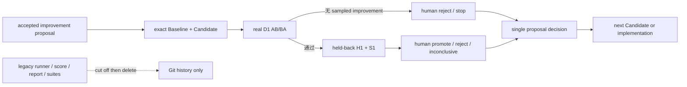

# PRD: Plugin Candidate Trial Subtractive Migration v1

Target Reader: Groundwork repository maintainer、migration implementer、fresh reviewer，以及后续为任意本地 Codex plugin 运行 Candidate trial 的 operator。
Reader Action Needed: 将 M1–M4、已完成的 Groundwork 真实 D1、最终 source/package/authority/cleanup 收口和 fresh review 视为已关闭的 v1 core。非 Groundwork plugin trial 是 availability-dependent 非阻塞验证；只有未来出现 maintainer-owned source、权威 expected behavior 和 Candidate 前真实失败时才重新启动。
Decision Supported: 如何把已经证明有决策价值的 v0.27 manual paired trial 迁移为一套更轻、更通用、不会与旧 Eval 并存裁决的 Plugin Candidate Trial，并以实质净删除结束迁移。
Artifact Type: migration PRD
Source of Truth: 用户确认的 RSI 目标与“旧 Eval 太重、耗时、漂移，真正有效的部分保留，过度复杂部分删除”的决定；`docs/prd-groundwork-rsi-trial-v1.md` 的 v0.27 terminal evidence；当前仓库源码、CI、runtime shared contract 与 canonical maintainer docs。旧 Eval 分数、历史 baseline、当前 skill prose 和模型输出都不能单独定义 Candidate 的期望行为。
Scope: Candidate-direction authority cutover；一个 stdlib-only、plugin-agnostic、transport-only runner 的 necessity gate；两个长期中立项目内的 per-slot sealed fresh workspace；Baseline/Candidate package content binding；D1 两个 AB/BA pairs 与 H1/S1 stop-loss；task-specific 人工 binary rubric；single proposal decision；旧 Eval runnable/importable/CI/report/schema/default-suite surface 原子删除；仍有普通消费者的 package/source/lint/hook checks 迁出 Eval 命名空间；Candidate Trial 与 release runtime evidence 完全分离；current docs 与 CI 收口；一次 Groundwork 真实闭环验证；只在出现合格对象时才执行的非阻塞跨插件运行验证。
Out of Scope: 自动生成 Candidate；自动改 skill/plugin；LLM judge；总分、排行榜、胜率、统计显著性或跨模型稳定性承诺；题库平台、数据库、dashboard、web service、daemon、scheduler、nightly model runs、远端状态修改；发布/UAT/customer readiness 自动判定；把静态 source/package check 冒充行为证据；为兼容旧 Eval 保留 wrapper、alias、dual-write、dual-report 或 shadow verdict；在 M3 运行真实模型 trial、开始 M4-M5 或提交/推送。
Evidence Level: Complete/Frozen migration contract，加 M1 source/fake-CLI deterministic necessity-gate、M2 exact callsite/source-owner extraction、已获 fresh read-only review 接受的 M3 atomic source/package evidence，基于 SHA-bound source-complete package `c542c335ceb2d2748596b33d7eae802a7841fb3cc7a660d8d5889ac0c7e72580` 接受的 M4 residue-cleanup evidence，以及 M5 首个 Groundwork D1 的四份有效 `candidate_direction` receipts。最终 fresh closeout review 在核对原始 8-record `results.jsonl`、冻结 rubric、四个可重算 receipt hash 和 canonical human proposal decision 后返回 `accept_v1_closeout`，无 P0/P1/P2。该证据证明 dormant runner 的 fail-closed 边界、ordinary guards 的独立 owner、旧 authority 归零，以及实际 CLI/plugin/model transport 能对一个 Groundwork Candidate 做出“无 sampled improvement，D1 止损”的有界判断；不证明 Candidate uplift、第二插件验证、generic/future-model stability，或任何 runtime/release/UAT readiness。
Safe to Share / Redaction Notes: 可公开分享；不包含 held-back case 原文、raw actor output、credentials、PII、生产 payload 或 private URL。真实 case bytes 继续位于 repo 外的 operator-controlled Trial root；仓库最多保存脱敏说明、hash 与人工作出的终态决定。
Status: Complete/Frozen. M1–M4, the Groundwork v1 core operation proof, final source/package/authority/cleanup checks, and fresh closeout review are complete. Epoch `gw-verify-reviewer-access-20260825-e1` stopped at D1 and its exact Candidate was explicitly rejected. The independent non-Groundwork proof remains the non-blocking state `deferred_no_eligible_plugin`; it does not reopen v1 and does block any cross-plugin claim.
Version: v0.5
Last Updated: 2026-08-26
Owner: Groundwork repository maintainer

---

## 1. Product Decision

本迁移不再建设“更完整的 Eval 平台”。目标是把 Candidate 判断缩成一个闭环：



唯一 Candidate-direction authority 是现有 Maintainer Improvement Proposal 中的 `Human Decision`。Runner 只负责复现实验条件、顺序运行 actor、保存直接 receipts 和清理；它不得输出 `promote`、`reject`、`pass rate`、总分或自动 patch 建议。

真正提供方向信息的是 Candidate 前冻结的 case、arm 顺序、expected source 与人工二元事实，不是 runner。Runner 只有在 focused tests 证明它能机械消除人工命令表无法稳定消除的四类错误——错装 package、复用脏 workspace、actor dispatch 前漏记 attempt、清理不完整——时才有独立保留价值。若 necessity gate 不通过，本 PRD 的 implementation no-go，返回 maintainer 决策；不得留下小型 harness，也不得悄悄切换到未定义的手工 fallback。

这解决三个问题：

1. 模型升级只改变一个 epoch 的运行条件，不改变期望行为的来源；
2. Candidate 只与同一 epoch 的 Baseline 做 paired comparison，不与历史绝对分数横比；
3. 新方法切换时删除旧裁决面，不留下两套 Eval 相互影响。

## 2. Verified Current Baseline

截至 2026-08-21，当前 active Eval surface 的直接盘点为：

| Surface | Current size / binding | Migration implication |
| --- | --- | --- |
| `evals/` Python | 46 files / 44,939 lines | 不能继续增量堆叠；必须按消费者抽取后删除 |
| `evals/test_*.py` | 22 files / 24,871 lines | 大量测试只证明旧 runner/schema/report；普通 source guards 需迁出 |
| Prompt suites | 37 CSV / 517 rows | 不再作为 default Candidate authority；只允许少量真实 case 经人工重新授权进入新 Pack |
| Fixtures | 65 files | Eval-only fixtures 删除；普通 lint/package fixtures 移到普通 tests |
| Historical baselines | 27 Markdown files | 不是 current truth；迁移所需事实提升到 canonical docs 后从 active tree 删除或明确历史化 |
| `evals/run_runtime.py` | 8,658 lines | 旧 runtime-eval orchestration/verdict authority，目标删除 |
| `evals/routing_schema.py` | 3,710 lines | 与 517-row vocabulary/default suite 耦合，目标删除；不复制到新 runner |
| `scripts/run_plugin_eval_clean.py` | 1,418 lines | Plugin Eval benchmark wrapper，不保留为 Candidate authority |
| CI | `.github/workflows/evals.yml` 编译、测试并调用 runner/schema/report/patch suggestions | cutover 必须同步改为普通 source/package gates |
| Runtime contract | `skills/_shared/RELEASE-EVIDENCE-CLAIM.md` 直接要求 canonical `evals/run_runtime.py` | 删除前必须先解除 runtime package 对旧 runner 的硬依赖 |

v0.27 pilot 的决策证据：

- exact frozen Candidate 通过了 source/package eligibility 和 fresh review；
- D1-R1 四个有效 calls 后，Candidate `0/2 pass`、Baseline `0/2 pass`，两个 pair 都是 `fail/fail tie`；
- Trial 阻止了一个 source-reviewed 但没有用户可见改善的 Candidate 被 promotion；
- H1/S1 因 primary gate 失败而未 dispatch；
- 4 次 actor dispatch、无 transport retry、actor runtime 341 秒、Trial wall 1,543 秒；
- 这证明 pairwise stop-loss 有独有决策价值，同时也说明手工 host ceremony 和大上下文仍需继续减重。

## 3. Target Authority And Boundaries

### 3.1 One Authority

Candidate 的最终状态只写入一个现有 proposal：

- `accepted`：人批准构造 Candidate，但不代表 Candidate 已通过；
- `rejected`：人根据 eligible paired evidence 或其他反证终止该 Candidate；
- `promoted`：人确认 Candidate 满足预注册 gate，并完成普通 implementation/review target；
- `needs-info` / `defer`：证据不足或暂缓；
- runner receipt、CI、source review、package hash、Plugin Eval、router observability card 都不是第二个 `Human Decision`。

新 runner 不读取或更新 `docs/quarantined-learnings.md`。Operator 在看完结果后手工更新唯一 proposal，避免 executable 自动修改 source truth。

### 3.2 Expected Behavior Authority

每个 case 的期望行为只能直接来自：

1. Candidate 之前真实用户对结果、范围或安全边界的明确决定；
2. 独立 authoritative business/safety invariant；

已接受的产品合同只有在每一项 expected fact 都能逐项追溯到以上第 1 或第 2 类来源时才可引用；合同文档本身始终只是 locator，不是第三类 oracle。

以下内容只能用于定位，不得自己成为 oracle：

- 当前 Groundwork skill 文档；
- current/accepted product contract 本身；
- Candidate diff；
- 旧 CSV 的 `expected_behavior`；
- 历史 Eval verdict/score/baseline；
- LLM judge 或另一个模型的偏好；
- 输出是否“看起来像”目标 skill。

### 3.3 Evidence Layers

必须继续分开：

- source diff；
- deterministic source/unit check；
- generated package；
- installed package/source equivalence；
- paired actor behavior；
- human Candidate decision；
- release、UAT、customer readiness。

Candidate Trial 只覆盖前六项中的有界部分，绝不自动升级成后三类 readiness。

## 4. Minimal Target Surface

### 4.1 One Transport Runner

推荐只授权一个新 executable：

```text
scripts/run_plugin_candidate_trial.py
```

它使用 Python 3.11 stdlib，面向本地 Codex plugin，而不是硬编码 Groundwork 或 `to-prd`。只允许两个 phase：

```text
python3 scripts/run_plugin_candidate_trial.py --config /abs/trial.toml --phase d1
python3 scripts/run_plugin_candidate_trial.py --config /abs/trial.toml --phase heldback
```

`heldback` 只有在 operator 已在 repo 外 decision receipt 中明确记录 D1 gate 通过时才可运行。Runner 不提供 `--all`、默认 suite、nightly、parallel、rerun-failures、score、report、patch-suggestions 或 compatibility mode。

该 decision receipt 使用一个 operator-created TOML 文件，不新增 JSON Schema。Runner 必须在打开 H1/S1 前核对：`epoch_id`、D1 case/rubric hash、Baseline/Candidate package hash、四个 valid attempt receipt hash、全部预注册 binary facts、显式 `d1_gate = "pass"`、operator label、created-at，以及 `heldback_unopened = true` 的 operator attestation。任一缺失或与当前 config 不匹配都拒绝 `heldback`；旧 epoch receipt 或只写一个 `pass` 的空壳文件不能解锁。

### 4.2 Minimal Config And Scratch

每个 epoch 在 repo 外创建一个 operator-owned Trial root：

```text
<trial-root>/
  trial.toml
  cases/
    D1/prompt.txt
    D1/rubric.md
    H1/prompt.txt
    H1/rubric.md
    S1/prompt.txt
    S1/rubric.md
  results.jsonl
```

不新增 JSON Schema。`trial.toml` 只保存 runner 真正消费的字段：

- epoch id；
- plugin id 与两个 marketplace names；
- Baseline/Candidate source roots 与冻结的 content digests；
- 两个中立 project roots、各自 actor-visible skeleton hash，以及冻结的 pair-to-project-root mapping；
- requested model/profile；
- case file paths 与 exact hashes；
- 每个 case 的 sealed task-state root 与冻结的 content digest；
- D1/H1/S1 run order；
- per-call timeout；
- operator-created D1 gate receipt path 与事前冻结的 D1 binary fact names；
- Trial root，以及每个中立项目中唯一的一层 workspace parent。

每个 phase 的 schedule 固定为四个 slot，因此 D1 最多四次、heldback 最多四次 actor dispatch。Runner 不自动 retry，不提供可配置 dispatch/wall budget，也不接受任意 `mutable_paths` 或 `cleanup_allowlist`。任一 slot invalid、进程崩溃或 transport failure 都使该 phase fail closed；不得在同一 epoch 重跑来挑结果。

Rubric 是给人看的 frozen Markdown，不进入 actor prompt，也不由 runner 解释。真实 prompt/rubric 默认不进 Git。

两个长期中立 project root 只承担 Codex App/CLI 可共用的稳定项目与认证宿主，不是可跨 call 复用的任务 workspace。每个 root 的 actor-visible project files/config 必须在 epoch 前冻结 skeleton hash；认证 secret 不复制、不落 receipt，但两 root 必须使用同一 launcher/auth identity。每个 slot 必须在被分配的中立 project root 内，从该 case 的 sealed task state 创建新的唯一 workspace；actor 只在该 workspace 内运行。前一个 slot 的 workspace、conversation 或 writable state 不得作为后一个 slot 的输入。

同一个 A/B pair 的 Baseline 与 Candidate 必须绑定同一个 project root、分别使用 fresh workspace；AB 与 BA 两个 pair 分配到两个不同 root，并在 `trial.toml` 事前冻结 mapping。Runner 在每个 slot 前后都验证对应 root skeleton 未漂移。这样 project-root effect 留在 pair 内常量，不能随 arm 改变。

### 4.3 Trusted Computing Boundary

v1 明确信任 operator、OS/filesystem enforcement、冻结 config/inputs、被 config 点名的 Codex launcher，以及该 launcher 的 official `plugin list/add/remove` 合同；不信任 Candidate package、actor 输出、project workspace 残留或可替换的 results path。因为 official CLI 在 TCB 内，binding 由“idle inventory → official add returned path 的 content digest → exact-one id/marketplace inventory”组成，不再构造第二套 cache-path discovery。Cleanup 同理使用 official remove、idle inventory、已知 returned path absent 与 attempt root evacuation，不扫描未知全局 cache。

当前 content digest 覆盖相对文件路径、文件 bytes 与 symlink target；不把空目录或完整 mode bits 解释为行为证据。真实 Candidate 前仍需单独授权一次不调用模型的 official CLI transport smoke，确认当前 launcher 的 JSON 字段与上述 TCB 合同相符；fake CLI tests 不能替代这项 host 事实。

### 4.4 Runner Responsibilities

每个 slot 只做：

1. 核对两个 project 的 actor-visible skeleton hash、同一 launcher/auth identity、冻结的 pair-to-root mapping 与 Trial plugin idle；
2. 创建一个 fresh attempt root，并从 sealed task-state hash 构造该 slot 独立 workspace；
3. official `plugin add`，记录 returned installed path，验证 source/installed content digest，并用 official inventory 核对 exact-one installed/enabled id 与 marketplace；
4. 在 actor dispatch 前同步写入并 `fsync` 一条 `attempt_started`，其中绑定 slot、package、case、launcher version、requested model/profile 与 permission/approval policy；该记录存在后，同一 epoch/phase 不可重跑；
5. 用冻结 task、model/profile、permission/time policy 运行一次 fresh actor；requested model/profile 由 argv 绑定，launcher version 写入 receipt；host 不公开 observed model/profile 时只记录 limitation，不把它升级为 hard veto；
6. 保存 final response、exit、timing、usage 或 `unavailable`；
7. official exact remove，验证 plugin idle、已知 returned path absent、attempt root evacuated，并终止 actor process group 中残留的子进程；
8. 出错时 fail closed，不 retry，也不自动改变 case、arm、rubric、model 或 Candidate。

第 4 步只证明 actor 启动前存在 exact-one installed/enabled treatment inventory，不证明某个 skill 实际 load、内部 route 或隐藏 trace。若现成 supported host 无法以零模型 probe 建立这一最小 binding，真实 actor path no-go；不得用额外模型 canary、prompt marker 或输出形状补证。

Runner 不做：

- route/skill-load 猜测；
- regex 语义评分；
- rubric adjudication；
- Candidate verdict；
- 自动更新 proposal；
- 自动生成 case/Candidate；
- 读取旧 Eval output 或 source checkout 中的 Eval docs；
- 把 raw output 提升为 durable repo artifact。

### 4.5 Focused Tests

只新增一个普通测试文件：

```text
tests/test_plugin_candidate_trial.py
```

测试 fake CLI receipts、AB/BA 顺序、single-attempt stop-loss、dispatch 前落盘、phase gate、content hash mismatch、cleanup failure 和“runner 不产生 Candidate verdict”。测试不调用模型、网络或真实 plugin install。

测试还必须覆盖同 pair 两 arm 使用同一 root、恰好两个 project roots、AB/BA pair-to-root mapping 不可漂移、root skeleton 前后 hash 不变、workspace/results symlink 拒绝、per-slot workspace 不复用、sealed task-state hash mismatch、零模型 preflight、danger-full-access 与旧 retry/budget/mutable config 拒绝、required launcher identity 缺失时 fail closed、process-group cleanup、binary fact names 冻结，以及即便重算 receipt hash，错误 epoch/package/case/actor binding 仍无法解锁 heldback。

新增第二个 executable、schema、report generator、database、service 或 persistent state manager 必须回到 maintainer 决策，不得在实现中顺手加入。

## 5. Case Pack And Data Sourcing

### 5.1 Three Roles, Not A Large Suite

| Case | Purpose | Dispatch rule |
| --- | --- | --- |
| D1 | 当前 Candidate 的 primary hypothesis；来自 Candidate 前真实任务 | AB/BA 两个 pairs，共四 calls |
| H1 | 不同 source cluster/business object/decision axis 的 held-back generalization case | 仅 D1 sampled gate 通过后运行一个 pair |
| S1 | 明确、低风险、应直接处理的 regression guard | 仅 D1 sampled gate 通过后运行一个 pair |

没有“默认 517 题”。一个 Candidate 默认最多 8 个 logical calls；D1 失败时 4 calls 止损。任何增加 case 或 replicate 的请求必须先说明它会改变哪个具体决策，不能为了置信感无限加题。

### 5.2 Source Priority

Case 来源优先级：

1. Candidate 之前的真实用户任务及后续明确决定；
2. 已发生且有 authoritative resolution 的真实 failure/regression；
3. 独立业务/安全合同构造的最小 adversarial case；
4. synthetic case 只用于 transport/safety control，不支持 Candidate direction。

旧 CSV 可作为检索线索，但任何进入新 Pack 的题必须重新回到原始 acceptance/source。不能批量迁移 517 行，也不能保留旧 `expected_behavior` 作为兼容 oracle。

### 5.3 Exposure And Reuse

- Candidate author 只能看到 proposal、可见 source 与 ordinary deterministic checks；
- D1/H1/S1 prompt、rubric、expected source 对 Candidate author held back；
- case 首次被该 Candidate 的 actor 读取后即对该 Candidate `dispatched_retired`；
- 未 dispatch 的 case 可以保持 `unexposed`，但不能被新 Candidate 自动继承；复用必须有新的事前 Pack decision；
- model/profile/environment 变化创建新 epoch。旧 outcome 只能是历史证据，不能变成跨模型稳定性结论。

## 6. Adjudication Contract

### 6.1 Mechanical Receipt

每个 case 在 Candidate 前冻结与该任务类型匹配的少量机械事实。通用合同不预设 shaping 语义；允许的例子包括：

- 有效 final response；
- workspace/product mutation 是否符合请求；
- task-specific deterministic outcome 是否出现；
- timeout、tool、output envelope 是否满足。

首个 Groundwork shaping Pack 还可以预注册“允许的问题单元数量”“是否在关键回答前生成 durable spec 或实施”“direct task 是否直接交付”等机械事实，但这些不是长期 Trial schema。机械 receipt 可以由 operator 从 runner output 记录；v1 不新增语义 checker DSL。

### 6.2 Human Binary Rubric

通用合同只要求每个 Pack 提供少量、source-independent、Candidate 前冻结的 task-specific `yes | no` facts。Runner 不读取、解释或汇总这些 facts；不存在一套跨插件语义 rubric。

首个 Groundwork shaping Pack 的人工实例只回答：

- 是否命中至少一个真实 decision axis；
- 两个合理答案是否会实质改变 scope、acceptance、authority、state transition 或 irreversible risk；
- 上下文是否已经回答；
- 是否静默选边；
- 是否在回答前提前生成 durable spec/implementation；
- 是否只是表演式问题或格式拟合。

Rubric 不给分，不允许自由文本 judge 替代 binary facts。解释可以附在 proposal decision reason 中，但不能产生第二个 score authority。

### 6.3 Pair Interpretation

D1 只有在以下条件全部满足时才进入 H1/S1：

- Candidate 两次均满足 frozen contract；
- Baseline 至少一次不满足；
- 没有 Candidate 相对 Baseline 的 material loss；
- 四个 calls 全部 valid；任何 transport failure、crash 或 invalid slot 都停止该 epoch 的 D1。

否则得到 `stopped_d1_valid` 或 `inconclusive` 并停止。H1/S1 不补跑，不追加更有利题目。

最终 proposal decision 仍由 maintainer 作出：

- `promote_candidate`；
- `reject_candidate`；
- `inconclusive`；
- `new_candidate_authorized`。

Runner 不生成这些值。

## 7. Subtractive Disposition

### 7.1 Delete As Candidate-Direction Surface

以下路径默认删除；只有在实施前找到并记录一个与 Candidate direction 无关的现存普通消费者时，才允许抽取最小逻辑后删除原路径：

| Surface | Default disposition |
| --- | --- |
| `evals/run_runtime.py`、`evals/run_runtime_parallel.py`、`evals/suite_registry.py` | 删除 orchestration/default-suite/runtime verdict authority |
| `evals/routing_schema.py`、`evals/routing_summary.py`、source-only `evals/route_detection.py` | 删除旧 row vocabulary、summary 和 output-shape route authority；runtime hook 自己的 bundled detection 不受此路径删除影响 |
| `evals/scoring.py`、`evals/verdict_model.py`、`evals/report.py`、`evals/patch_suggestions.py` | 删除 score、verdict、report、automatic suggestion surface |
| `evals/check_coverage_manifest.py`、`evals/coverage-manifest.toml`、`evals/case_oracles/` | 删除 suite completeness/case-oracle platform |
| `evals/checks/` | 删除 Eval checker framework；有 runtime/security/CI 普通消费者的能力移到实际 owner module，其 tests 才移到普通 source tests，不能把生产 guard 降格成 test helper，也不能保留 checker-result schema |
| `evals/prompts/*.csv` | 不再 active；只把经重新授权的真实 case bytes 放入 repo 外 Pack，其余从 active tree 删除 |
| `evals/fixtures/` | 删除 Eval-only fixtures；ordinary linter/package/hook fixtures 移到 `tests/fixtures/` |
| Candidate-direction `evals/test_*.py` | 随 owner 删除，不保留测试来证明已删除系统 |
| `scripts/run_plugin_eval_clean.py`、`scripts/check_plugin_eval_clean_regression.py` | 删除 repo-owned Plugin Eval benchmark authority；官方 Plugin Eval 可作为临时诊断工具，但不进入 CI/decision |
| `schemas/groundwork-eval-score.schema.json`、`groundwork-router-score.schema.json`、`groundwork-routing.schema.json`、`groundwork-review.schema.json`、`groundwork-verify.schema.json`、`groundwork-closeout.schema.json` 及仅为它们服务的 common definitions | 当前标题/required fields 表明它们属于 score/report family；仅在 exact caller review 证明无 runtime/public artifact consumer 后删除。若发现普通 consumer，只迁移其直接需要的 artifact contract 到实际 owner，不保留 `overall_verdict`、`checker_results` 或旧 common score definitions；不建立 v1 replacement schema |
| `docs/eval-deterministic-checks.md`、`docs/eval-trace-artifacts.md`、`docs/nightly-harness.md`、`docs/optional-runtime-eval-gate.md`、`docs/plugin-eval-clean-workflow.md` | 将仍有效的 evidence boundary 提升到现有 canonical owner 后删除这些旧平台文档 |

Git 历史承担归档责任。不要为了“以后也许有用”把旧 runner 改名到 `legacy/`、`archive/` 或 `compat/`。

### 7.2 Keep Or Move Because They Have Ordinary Consumers

| Surface | Disposition |
| --- | --- |
| `scripts/build_local_marketplace.py` | 保留；普通 package build |
| `scripts/check_runtime_package_boundary.py` | 保留；普通 runtime package/source gate，不是 Candidate behavior authority |
| `scripts/check_skill_entry_budget.py` | 保留；普通 source complexity guard |
| `scripts/lint_goal_contract.py`、`scripts/lint_child_goal_prompt.py` | 保留；确定性 lint，与模型 verdict 无关 |
| `hooks/`、`scripts/codex-hooks/`、runtime route registry | 保留；dormant opt-in observability。删除 offline score/promotion coupling |
| 与上述普通 owner 直接对应的 tests/fixtures | 移到 `tests/`，使用 owner 名称，不继续放在 `evals/` |
| `docs/quarantined-learnings.md` | 保留；唯一 human proposal/decision owner |
| `docs/release-evidence-claim-boundary.md` | 保留并改写；解除 canonical old runner 依赖，继续区分 source/package/runtime/release/UAT |
| `skills/_shared/RELEASE-EVIDENCE-CLAIM.md` | 保留并最小改写；runtime claim 改为独立授权、直接、命名、可审计的 `release_runtime_verification` receipt；Candidate Trial receipt 永远不能满足 release claim |
| `docs/plugin-architecture.md`、`AGENTS.md` | cutover 时更新为新的 current truth，不保留旧 Eval 入口 |

### 7.3 Release-Evidence Decoupling

删除旧 runner 前，runtime shared contract 必须先停止要求 `evals/run_runtime.py`。目标合同是：

- installed package/source equivalence 仍由 supported plugin inventory/add receipt 加完整 tree comparison 证明；
- Candidate Trial receipt 固定标记 `evidence_class = "candidate_direction"`，服务版本取舍，永远不能满足 runtime release claim；human promotion、A/B material win 或“scope 相同”声明也不能替代 release evidence；
- release runtime behavior 必须来自另一次明确授权、直接执行的 `evidence_class = "release_runtime_verification"` receipt，至少绑定 released package digest、task/fixture hash、expected behavior 的原始 acceptance/invariant source hash、installed/source equivalence、runtime/environment identity、direct outcome、validity、scope 与 limitations；
- 两类 run 可以复用同一低层安装、hash、执行和清理技术，但不能复用同一次方向实验、rubric 结论或 proposal decision；
- 本 PRD 不授权第二个 release runner 或 Candidate runner 的 release phase。若现有 direct execution 无法形成上述 receipt，release claim 保持 `unverified`，不保留旧 runner 兜底，也不在本迁移内新增平台。

### 7.4 M2 Exact Callsite Inventory

2026-08-25 的 exact caller review 使用现有 imports、CI commands、schema filename references 和 current docs references；不新增 inventory executable。结论如下：

| Surface | Observed current callers | M2 disposition |
| --- | --- | --- |
| `evals/checks/` | `evals/run_runtime.py`、Eval report/score/schema owners、对应 `evals/test_*.py`，以及 `.github/workflows/evals.yml` 的旧路径语法编译；`skills/_shared/SKILL-QUALITY.md` 另有泛指 eval checks 的文字约束；`scripts/codex-hooks/`、runtime skills、package scripts 均无 Python import | `DELETE in M3`；CI 与 current docs 引用随 atomic cutover 同步更新；没有可独立抽取的 production guard，不整包复制 checker framework |
| review/verify/closeout/routing/eval-score schemas 与仅服务它们的 common definitions | Eval schema/scoring/router-observability tests，以及 `docs/skill-success-metrics.md` 和历史 roadmap；无 runtime/public artifact loader | `DELETE in M3`；current docs 在同一 cutover 更新，不建立 replacement schema |
| source-only `evals/route_detection.py` | old runner/scheduler 与 Eval route tests；模块本身只加载 `scripts/codex-hooks/groundwork_route_detection.py` | `DELETE in M3`；ordinary registry test 已直接绑定 runtime hook owner，不保留 source-only wrapper |
| `scripts/run_plugin_eval_clean.py`、`scripts/check_plugin_eval_clean_regression.py` | `evals/test_plugin_eval_clean.py`、`docs/plugin-eval-clean-workflow.md`、AGENTS locator 与 wrapper 自身的递归防护 | `DELETE in M3`；无 runtime/package/lint/hook/CI ordinary consumer |
| package build/boundary | `scripts/build_local_marketplace.py`、`scripts/check_runtime_package_boundary.py` 与 runtime manifest contract | `KEEP`；tests 已迁到 `tests/test_runtime_package_manifest.py` |
| Goal/child-prompt lint | `skills/_shared/tools/` canonical linters 与 `scripts/lint_*.py` source wrappers | `KEEP`；tests 已迁到 `tests/test_child_goal_prompt_linter.py` |
| hooks、runtime registry、runtime route classifier | `hooks/hooks.json` 与 `scripts/codex-hooks/` 自包含 runtime owner；无 `evals` import | `KEEP`；registry tests 直接绑定 runtime owner，compact security/observe-only tests 位于 `tests/test_route_registry.py` 与 `tests/test_router_hooks.py` |
| pure skill/source contract guards | pipeline ownership、review-loop contract、wiki templates | `KEEP`；tests 已迁到 `tests/test_pipeline_ownership.py`、`tests/test_review_contract.py`、`tests/test_wiki_templates.py` |
| `native-handoff-package.md` | ordinary pipeline-ownership guard 与 old `handoff.csv` prompt source | `MOVE` 到 `tests/fixtures/native-handoff-package.md`；old CSV 同步指向 ordinary owner，避免 M2 破坏 current Eval path |

`.github/workflows/evals.yml` 在 M2 同时运行新的 `tests.*` ordinary guards 与仍属 old current path 的 Eval tests。它没有切换 Candidate authority、删除 legacy callable surface、调用模型，或使 dormant Candidate runner 进入 current decision/release path。

## 8. Migration Stages

### Stage M0 — Freeze The Cutover

预计 0.5–1 天。

- maintainer 接受并冻结本 PRD；
- 确认 runner necessity gate：只保留一个 transport-only runner，且它必须用 deterministic tests 消除错装 package、脏 workspace、actor dispatch 前漏记 attempt 与清理遗漏；否则本 PRD implementation no-go；
- 确认无 LLM judge、无 score/report/schema、human proposal 是唯一 Candidate authority；
- 在当前 diff 上记录最终 delete/move/keep 集合，不创建 inventory 工具；
- 任何无法找到普通消费者的 legacy surface 进入 delete 集合。

Stop：如果 maintainer 希望旧 Eval 与新 Trial 长期并存裁决，或 runner necessity gate 不成立，则本迁移 no-go；不得实现第二套，也不得切到未定义的手工 fallback。

### Stage M1 — Build The Minimal Transport

预计 1.5–2.5 天。

- 新增一个 runner 和一个 focused test file；
- 使用 fake CLI/fixture 测试 transport、同 pair 同 root、AB/BA pair-to-root mapping、project skeleton drift、per-slot sealed workspace、zero-model binding probe、identity receipt、hash、order、single-attempt phase gate、dispatch 前落盘、symlink boundary 与 cleanup；
- runner 保持 dormant：不运行真实 Candidate，不进入 current docs、release contract、default/nightly model CI，也不产生任何 Candidate decision；
- M1 不切换 release-evidence semantics，避免仅靠新增 transport 就建立新的 current authority。

Stop：如果 runner 需要第二个 executable、独立 schema、数据库、service 或语义 judge 才能工作，回到 maintainer 决策。

### Stage M2 — Extract Ordinary Survivors Before Cutover

预计 1.5–3 天。

- 对 §7.1/§7.2 做 exact callsite inventory；先迁移仍有普通 runtime/security/package/lint/hook/CI consumer 的最小能力、tests 与 fixtures；
- `evals/checks/` 的生产 guard 移到实际 owner module，不只搬进 `tests/`；
- review/verify/closeout schemas、source-only route detection、Plugin Eval clean wrapper 都必须以 exact caller/disposition 证明 DELETE 或最小 MOVE；
- 本阶段可以合并 ordinary-owner extraction，但 old Eval 仍是旧 current path，dormant runner 仍不得用于 Candidate direction。

Stop：任一 caller/disposition 未知，或 survivor 只能通过整包复制 legacy module 才能保留，则不得进入 cutover。

### Stage M3 — Atomic Authority Cutover And Deletion

预计 1–2 天。

- 在同一个 atomic cutover merge 中更新 CI、current docs、release-evidence docs/runtime shared contract，并删除全部旧 runnable、importable、score/verdict/report/schema/default-suite authority；
- `.github/workflows/evals.yml` 改名或替换为普通 source/package gates，删除 old runner/schema/score/report/patch-suggestion/default-suite 调用；
- `AGENTS.md`、`docs/plugin-architecture.md` 与 current maintainer commands 指向新边界；release contract 同时切换为独立 `release_runtime_verification`，不接受 Candidate receipt；
- 删除旧 executable entrypoints、Python callable authority、schemas、active CSV suites 与 compatibility/shadow path；M3 merge 后 §9.1 的 runnable/importable/CI/docs/runtime reference 必须同时为零。

2026-08-25 accepted outcome：CI 已切为 ordinary source/package gates；旧 Eval Python/import surface、37 个 active CSV、7 个 verdict schemas、clean wrappers 与 current platform docs 已删除；Candidate/release firewall 已切到独立 `release_runtime_verification` receipt。82 个 ordinary tests 与 source/generated-package checks 通过，fresh read-only review 接受 M3；未运行真实 trial，未提交或推送。

Stop：如果 runtime package 仍引用将删除的 source-only Eval path、任何旧 callable authority 仍可 import，或 release contract 仍接受 Candidate Trial，则不得合并。M2 与 M3 可以在同一 PR 的连续 commits 中完成，但只能以完成 M3 的整体 diff 合并；不能单独合并“已切 current path、旧 authority 仍 importable”的状态。

### Stage M4 — Remove Non-Authority Residue

预计 0.5–1.5 天。

- 清理 M3 后仅剩的 dated historical docs、Eval-only fixtures、dead tests 与非 current references；
- 历史 PRD 可保留其历史事实，但不得出现在 current architecture/command path；
- 不允许把任何 runnable/importable/report/schema/default-suite authority留到本阶段；
- 使用普通 `git diff --numstat`、`rg` 和 focused tests 证明实质净删除，不新增度量平台。

2026-08-25 accepted outcome：当前树中的剩余 `evals/`、`examples/`、五份过时 Eval platform/routing docs 与四组只服务旧 Eval 的 artifact tree 已移除，共 136 个文件、11,667 行；删除前副本暂存于 repo 外的 `/private/tmp/groundwork-m4-recovery-2026-08-25`。current architecture/runtime/shared contracts 已移除旧 Eval 命令、suite、score/report 与 default-suite authority；历史 PRD/CHANGELOG 中的旧路径仅保留为历史事实，并已明确不得作为当前架构或命令。focused tests、source/package gates 与断链检查通过；fresh read-only review 的结论为 `accept_m4`、无 P0/P1/P2、`ordinary_consumer_risk = none`、`authority_residue = none`、`subtraction_verdict = true_subtraction`、`runtime_package_boundary = covered`。未运行真实 trial，未提交或推送。

Stop：发现真实普通消费者时回到实际 owner 做最小抽取；不得整包保留、改名到 `legacy/`，或以 M4 为理由延后 authority deletion。

### Stage M5 — Prove The Core Boundary And Preserve The Claim Limit

预计 1–2 天，真实模型调用需另行逐 epoch 授权。

- 用一个新 Groundwork Candidate 证明 migration 后的 closed loop；不得复用已退休 D1-R1；
- 只在出现合格对象时，再用一个 maintainer 拥有 source/expected behavior 且已发生真实失败的非 Groundwork 本地 plugin 补充运行验证；对象不存在时记录 deferred state，不人造 Candidate；
- 如未来运行第二 plugin trial，必须独立记录模型/profile/package/Pack/decision，不能汇总成跨模型或跨插件成功率；
- 在第二 plugin trial 真实完成前，v1 只声明 Groundwork 有界运行，不声明已跨两个 plugin，也不能称 `generic proven`、跨插件 uplift 或 future-model stable。

2026-08-26 Groundwork outcome：epoch `gw-verify-reviewer-access-20260825-e1` 按冻结顺序完成四个 D1 single-attempt calls，四个 slot 全部 valid 且 cleanup 完整。人工对冻结 rubric 判定 Candidate `2/2 pass`、Baseline `2/2 pass`，两个 pair 均为 `pass/pass tie`。因 `baseline_missed_material_d1_axis = no`，D1 improvement gate 失败；未创建 pass gate，H1/S1 未打开、未 dispatch。Maintainer 随后明确将该 exact Candidate 标记为 `rejected`。这证明 transport 和 stop-loss 在 Groundwork 实际运行，但不证明该 Candidate 比 Baseline 更好。

2026-08-26 non-Groundwork disposition：实时盘点了 Codex installed plugins、configured marketplaces 和本地 `.codex-plugin/plugin.json`。已安装对象属于官方或 curated source；`codex-flow-kit` 是第三方快照；`audience-artifact-suite` 是未安装、未纳入 Git、无真实使用失败的本地模板。它们均不同时满足 maintainer-owned source、权威 expected behavior 和 Candidate 前真实 failure 三个条件。Maintainer 因此接受 `deferred_no_eligible_plugin`：不为关闭 M5 人造问题、不把裸 skill 临时包成 plugin，也不修改第三方/官方包来凑 trial。

2026-08-26 final closeout：完整 source/package/authority/cleanup checks 通过。Fresh reviewer 首轮只因缺少 M5 原始运行记录返回 `revise_v1_closeout`；补充 SHA-bound 的 8-record `results.jsonl`、冻结 D1 rubric、canonical proposal decision 和 receipt 重算算法后，窄回验返回 `accept_v1_closeout`、P0/P1/P2 均为 `none`、`groundwork_operation = sufficient_evidence`、`next_action = none`。该接受只关闭 v1 core，不提升为 cross-plugin、generic、future-model-stable、release/runtime、UAT、deployment 或 customer readiness 证据。

## 9. Acceptance Criteria

### 9.1 Single Authority

- [x] Candidate direction 只由一个 proposal 的 human decision 表达；runner、CI、Plugin Eval、router telemetry、source review 和 package checks 不产生第二个 promotion verdict；
- [x] 新 runner 没有 score、rank、win-rate、LLM judge、patch suggestion、automatic proposal mutation 或 default suite；
- [x] M3 同一个 atomic cutover merge 后，old runner/score/report/schema/default suite 不再 runnable、importable、CI-invoked 或被 current docs/runtime contract 引用；不存在 compatibility/shadow path，也不存在已切 current path 但旧 callable authority 留待后删的中间态。

### 9.2 Minimal Runner

- [x] 只有 `scripts/run_plugin_candidate_trial.py` 一个新 executable 和 `tests/test_plugin_candidate_trial.py` 一个 focused test owner；
- [x] necessity gate 的 focused tests 证明 runner 能 fail closed 地消除错装 package、per-slot workspace 污染、actor dispatch 前 attempt 漏记和 cleanup 遗漏；不存在自动 retry 或手工 fallback branch；
- [x] Runner 对 plugin id、marketplace/source/project roots、model/profile 和 case files 使用 config，不含 `groundwork`、`to-prd` 或某个 case 的分支；
- [x] D1 AB/BA、同 pair 同 project root、恰好两个 project roots、冻结的 pair-to-root mapping、root skeleton drift、current-epoch heldback receipt、single attempt、package content binding、per-slot sealed workspace、zero-model preflight、launcher/requested model/profile/permission binding、dispatch 前 fsync、symlink rejection、process-group cleanup 与 cleanup-to-idle 有 deterministic tests；
- [x] Runner 只写 repo 外 scratch，不修改 proposal、runtime source、Candidate source 或 held-back rubric。

### 9.3 Subtraction

- [x] §7.1 中没有普通消费者的 surface 全部删除；ordinary survivor 已按 owner 移到 `tests/` 或 owner module；
- [x] 只使用 `git diff --numstat`/file list 分项证明：非 test executable Python 文件数与非空行数独立下降；test Python 行数独立下降；schema、CSV/default-suite rows、专属 fixtures/tests 与 report artifact types 分别不增加；docs/CSV 删除不能抵消 executable 增长；不新增 LOC/byte accounting script；
- [x] 37 个 CSV/517 行旧 suite 不批量复制到新格式；新真实 Pack 默认 repo 外、每个 Candidate 仅 D1/H1/S1；
- [x] Git tree 中没有 `legacy_eval`、`archive_eval`、compat wrapper、dual report 或旧结果转换器。

### 9.4 Evidence And Verification

- [x] Surviving source/package/lint/hook focused tests 通过；CI 不运行真实模型；
- [x] runtime package build/boundary 通过，且 packaged runtime 不包含 maintainer Trial runner；
- [x] Candidate receipt 固定为 `evidence_class = "candidate_direction"` 且不能满足 runtime/release claim；release-evidence public/shared contract 不再硬编码 source-only old runner，只接受独立授权的 `release_runtime_verification` receipt，缺失时 fail closed 为 `unverified`；
- [x] M3 fresh read-only review 将每个 removed owner 的 callers/docs/CI references 核对为零或明确历史引用；M4 fresh read-only review 接受 non-authority residue cleanup，未发现 ordinary consumer 或 authority residue；
- [x] 新 Groundwork trial 在单独授权 epoch 中完成，runner 根据 frozen D1 证据正确 stop-loss，唯一 proposal 保存明确 human decision；没有将 Candidate result 升级为 release/runtime evidence。
- [x] Final fresh closeout review 直接核对 M5 原始 `results.jsonl`、冻结 rubric、可重算 receipt hash 和 canonical human decision 后接受 v1 core，无 P0/P1/P2；
- [x] 当前不存在合格非 Groundwork 对象时，跨插件运行验证记录为 `deferred_no_eligible_plugin` 且不阻塞 v1 core completion；同时不允许作出 cross-plugin、generic proven、跨插件 uplift 或 future-model stable 声明。

### 9.5 Deferred Non-blocking Validation

- [ ] 未来出现合格对象后，在独立授权 epoch 中完成一次非 Groundwork plugin trial。该项不是 v1 completion gate；完成前唯一允许的当前事实是 `deferred_no_eligible_plugin`。

## 10. Verification Plan

实现阶段按风险从快到慢：

1. `git status --short --branch` 和 scoped diff；
2. new runner focused unittest；
3. surviving ordinary lint/package/hook tests；
4. `python3 scripts/check_runtime_package_boundary.py`；
5. `python3 scripts/build_local_marketplace.py --output <temp-root>` 加 package boundary；
6. exact callsite review：review/verify/closeout schemas、`evals/checks/`、source-only route detection 与 Plugin Eval clean wrapper 均有 DELETE/MOVE 证据；
7. `rg` 检查 current docs、CI、runtime skills 和 Python imports 中没有 old authority reference；
8. `git diff --check` 与按 executable/tests/schema/CSV/fixtures/docs 分项解读的 `git diff --numstat`；
9. fresh read-only deletion/caller review；
10. 获得单独授权后才运行真实 Groundwork/non-Groundwork trials。

不以“旧 tests 全绿”作为迁移成功，因为大部分旧 tests 的 owner 本身应该被删除。验证目标是 surviving ordinary contracts 和新 single-authority boundary。

## 11. Effort And Delivery Shape

当前估算为 6–12 个 focused engineer-days（包含 M0 冻结），建议分五个可审阅 implementation checkpoints，但只做一次 authority cutover：

| Checkpoint | Estimated effort | Merge meaning |
| --- | --- | --- |
| M1 dormant minimal transport | 1.5–2.5 days | necessity gate 通过后 replacement transport exists，但不进入 current authority/release semantics |
| M2 ordinary survivor extraction | 1.5–3 days | 普通 owner 已迁出；旧 current path 尚未切换 |
| M3 atomic cutover + authority deletion | 1–2 days | 同一 merge 将 current CI/docs/release boundary 切走并把旧 runnable/importable authority 归零 |
| M4 non-authority residue cleanup | 0.5–1.5 days | dated docs、dead fixtures/tests 收口，不能包含延后的 authority 删除 |
| M5 Groundwork core proof + claim boundary | 1–2 days plus model latency | 完成一次 Groundwork 真实闭环；无合格非 Groundwork 对象时记录非阻塞 deferred state，不作跨插件声明 |

M1/M2 可以先合并，因为 runner dormant 且 current authority 未切换。M3 必须以一个完整 atomic merge 切换 current path并同步删除全部旧 runnable/importable authority；不能把“切换”和“删除”拆成可独立合并的 PR。M4 只允许清理非 authority 残余。

## 12. Risks And Rollback

| Risk | Mitigation |
| --- | --- |
| 删除旧 runner 同时丢掉有效 package/safety guards | 先按真实 caller 抽取 ordinary owner tests，再删除原 module；保留 build/package/lint/hook gates |
| 新 runner 再次长成平台 | one executable、one test owner、no schema/report/service；任何新增 surface 回到 maintainer 决策 |
| runner 只是把人工 ceremony 固化成 mini-platform | necessity gate 必须证明它机械消除四类真实操作错误；否则本 PRD implementation no-go，不建立 runner 或手工 fallback 分支 |
| 人工 rubric 漂移 | Candidate 前冻结 binary axes；同一 Pack/epoch 不改题、不改 rubric、不补有利 run |
| 模型升级导致结果变化 | 新 epoch 重新 pair；不复用历史绝对分数或宣称跨模型稳定 |
| Candidate decision 被反向升级为 release evidence | 两类 receipt 使用不同 `evidence_class`；release 必须另行授权和直接执行，没有独立 receipt 就 `unverified` |
| 删除范围太大难审 | 按 owner 分 checkpoint，最终 fresh caller/reference review；不把删除拆成长期双 authority |

### 12.1 Exactly Three Execution Vetoes

1. **Treatment-isolation veto**：现成 host 无法用零模型 supported probe 建立 exact-one active package binding，runner 不能冻结/验证两 project root 的 actor-visible skeleton 与 pair-to-root 对称分配，或不能为每个 slot 创建独立 sealed-task workspace并记录 launcher/runtime、model/profile、permission/approval identity，则禁止真实 actor path；不得用模型 canary 或输出形状补证。
2. **Atomic-cutover veto**：ordinary survivors 未抽取完、任一 caller/disposition 未知，或旧 runnable/importable/report/schema/default-suite authority 不能在 M3 同一个 merge 中归零，则禁止切换 current path。
3. **Release-boundary veto**：`RELEASE-EVIDENCE-CLAIM` 仍接受 Candidate Trial receipt、human promotion 或模糊的“scope 相同”声明作为 runtime release evidence，则禁止切换 canonical release contract。

Rollback 是整体 revert 尚未 promotion 的 migration commits。若已经完成 authority cutover，不能只恢复旧 runner 而不同时恢复其 CI/docs/runtime contract；部分恢复会重新制造双重真相源。

## 13. Relationship To Existing Documents

| Document | Relationship after acceptance |
| --- | --- |
| `docs/prd-groundwork-rsi-trial-v1.md` | 保留为 v0.27 pilot protocol/evidence owner；不成为 current engine architecture |
| `docs/quarantined-learnings.md` | 保留为唯一 proposal/human decision owner |
| `docs/plugin-architecture.md` | M3 atomic cutover 后更新为 current target architecture |
| `docs/release-evidence-claim-boundary.md` | 保留并解除 old runner 依赖 |
| Former trace-first Eval roadmap and platform docs | 已在 M3/M4 从当前树删除；只可从 Git history 查阅，不再承担 current architecture、command 或 Candidate authority |
| `docs/prd-gpt-5.6-skill-contract-hardening.md` | 已冻结的历史 scope；本迁移不把旧 Candidate 工作改写为已通过 |
| Former Plugin Eval workflow, score/metric, deterministic-check, trace-artifact, nightly and optional-runtime-gate docs | 通用边界已迁入实际 owner，原文在 M3 删除；Git history 仅作历史查阅 |

README、README.zh-CN 与 README.runtime 只更新了受 cutover 影响的当前包边界与证据表述；maintainer 细节仍由本 PRD 和 current architecture docs 承担。

## 14. Frozen Maintainer Decisions

Maintainer 于 2026-08-25 冻结以下三项，不增加第四个设计分叉：

1. **在 necessity gate 下授权一个 transport-only runner**：允许自动化 package binding、actor order、receipt 和 cleanup，但禁止自动 Candidate verdict；necessity gate 失败则本 PRD implementation no-go，不切手工 fallback；
2. **授权原子切断并删除旧 authority**：不保留 old runner/score/report/schema/suite compatibility surface；
3. **限制跨插件声明**：Groundwork pilot 证明本次方向判断有价值；独立非 Groundwork plugin trial 通过后，也只允许声明同一 transport 已在两个不同 plugin 上有界运行，不称 generic proven、跨插件 uplift 或 future-model stable。

M1 dormant transport 已由 27 项 deterministic tests 收口并获 maintainer 接受。M2 已把 ordinary package/lint/hook/source guards 及其最小 tests/fixture 迁出 Eval owner，记录 §7.4 的 exact caller/disposition，并在 Pro 窄验收指出的单一 ordinary-hook-test P1 修复及完整本地 gate 通过后获 maintainer 接受。M3 已作为一个 atomic working diff 完成并通过 fresh read-only review：current CI/docs/release boundary 已切换，旧 runnable/importable/score/report/schema/default-suite authority 已归零，82 个 ordinary tests 与 source/generated-package checks 通过。M4 已删除剩余非权威 residue、修正 current references，并基于 source-complete package 通过 fresh read-only review。M5 的首个 Groundwork D1 已完成：`verify` reviewer-access Candidate 和 Baseline 均为 `2/2 pass`，因没有 sampled improvement 而触发 stop-loss，H1/S1 保持未暴露；maintainer 已将该 exact Candidate 终态标记为 `rejected`。四份 receipt 证明该 transport 在 Groundwork 的有界运行和 cleanup，不证明 Candidate uplift。最终 fresh closeout review 在收到原始运行记录与 canonical decision 后返回 `accept_v1_closeout`，无 P0/P1/P2，因此 v1 core 已关闭。独立非 Groundwork plugin trial 当前为 `deferred_no_eligible_plugin`；该状态不影响 v1 core 完成，但仍不允许作出跨插件声明。未提交或推送。
