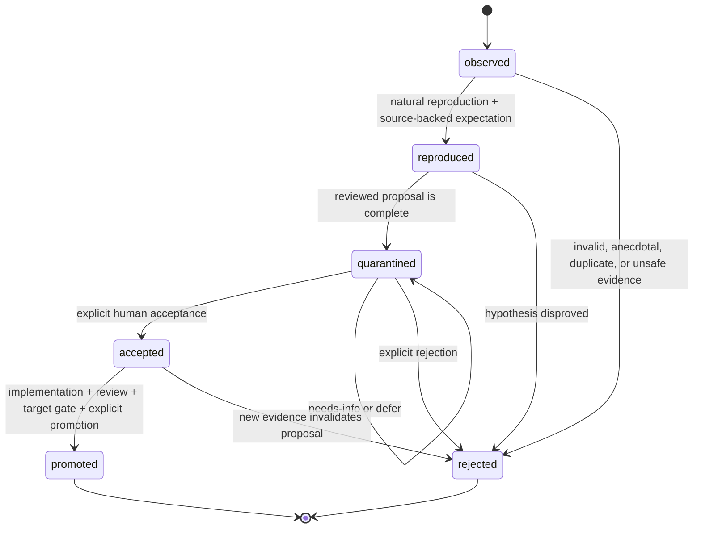

# Maintainer Improvement Loop

Target Reader: Groundwork maintainer reviewing observed, reproduced, or repeated behavior/source failures.
Reader Action Needed: Decide whether the signal should be reproduced, rejected, quarantined, accepted for ordinary implementation, or explicitly promoted after its target gate.
Decision Supported: Controlled self-evolution without automatic repository mutation.
Artifact Type: canonical Maintainer Lab improvement protocol.
Source of Truth: this document, `docs/router-observability-harness.md`, target-specific source/package gates, and each proposal's accepted source, evidence, and human decision.
Scope: Proposal format, status lifecycle, promotion criteria, rollback requirements, human decision recording, and durable accepted proposal records.
Out of Scope: Auto-applying patches, committing `.groundwork/harness` runtime content, mutating `main`, opening PRs, or changing production systems.
Evidence Level: Current maintainer policy; each accepted proposal record names its own reproduction evidence and human decision boundary.
Safe to Share / Redaction Notes: Safe to share as policy; candidate evidence remains private until reviewed and redacted.

## Purpose

A maintainer improvement record turns an observe-only signal into a controlled learning decision. It is evidence for a human decision, not a runtime instruction to mutate skills or docs.

The loop is:

```text
observe-only signal
-> reproduce with source-backed expectation
-> quarantine a complete proposal
-> human decision
-> ordinary scoped implementation
-> clean review and target-specific validation
-> explicit promotion
-> observe again through a new record if regression recurs
```

Telemetry or a separately authorized Candidate Trial may create observed signals only. They must not automatically reproduce, quarantine, accept, patch, promote, revert, mutate a tracker, or change `main`. Candidate direction remains the proposal's explicit human decision.

## Orthogonal Axes

Keep these axes separate:

- `learning_status`: progress of one maintainer hypothesis.
- `human_decision`: explicit disposition by a maintainer; `needs-info` and `defer` do not advance status.
- `promotion_target`: the artifact or source surface being considered.
- evidence artifact promotion: moving reviewed/redacted scratch into a durable review artifact. This never advances `learning_status` by itself.
- requirement state and public route state: user-task workflow state; never reuse it for maintainer learning.

Allowed values:

```text
learning_status = observed | reproduced | quarantined | accepted | rejected | promoted
human_decision = none | accepted | rejected | needs-info | defer
promotion_target = none | scoped_issue | source_patch
```



Status meanings:

| Learning Status | Meaning |
| --- | --- |
| `observed` | A telemetry or separately authorized Candidate Trial signal exists. A single classified non-pass is enough for an advisory scratch suggestion, not for a patch claim. |
| `reproduced` | A natural prompt or fixture reproduces the behavior and the expected behavior is backed by source, accepted contract, or explicit maintainer decision. |
| `quarantined` | Owner/fix locus, risk, rollback, target, criteria, and reviewed/redacted evidence are complete, but no change is authorized. |
| `accepted` | A human accepted the scoped remediation and target. This authorizes the ordinary implementation workflow only; it does not authorize automatic mutation. |
| `rejected` | A human rejected the proposal or evidence disproved it. Terminal for this proposal. |
| `promoted` | The named target passed ordinary implementation, clean review when material, target-specific validation, and explicit human promotion. It is not release/UAT/customer readiness. |

## Proposal Format

```text
Maintainer Improvement Proposal
- Proposal ID:
- Observation Key:
- Occurrence Count:
- Learning Status: observed / reproduced / quarantined / accepted / rejected / promoted
- Promotion Target: none / scoped_issue / source_patch
- Observed Failure:
- Evidence Delta:
- Regression Evidence:
- Expected Behavior Source:
- Affected Owner / Fix Locus:
- Proposed Patch:
- Risk:
- Rollback:
- Promotion Criteria:
- Human Decision: none / accepted / rejected / needs-info / defer
- Decision Reason:
- Validation Evidence:
- Clean Review Evidence:
- Runtime / Cache Evidence:
- Next Action:
- Stop Reason:
- Auto Apply: false
```

## Field Rules

- `Proposal ID`: stable identifier for one hypothesis and bounded target.
- `Observation Key`: stable deduplication key for equivalent failure, owner, and fix locus.
- `Occurrence Count`: number of equivalent observations grouped under the key; generated artifacts start at artifact-local `1`, and only reviewed deduplication may increment the cross-run count. Count alone is not evidence delta.
- `Observed Failure`: name the task/case, runtime prompt, command, or historical record where the failure occurred.
- `Evidence Delta`: name the new observation since the previous occurrence; `none` stops another attempt.
- `Regression Evidence`: cite the case identity, expected behavior source, forbidden behavior, actual behavior, and relevant command or runtime observation.
- `Expected Behavior Source`: cite the accepted contract, source, fixture oracle, or maintainer decision that makes the reproduction judgeable.
- `Affected Owner / Fix Locus`: name one primary route, shared contract, checker, or maintainer layer.
- `Proposed Patch`: describe the smallest skill/doc/source change. Do not include an unreviewed broad rewrite.
- `Risk`: state how the patch could make skill selection, artifact writing, safety gates, or output shape worse.
- `Rollback`: state the file-level revert or removal path.
- `Promotion Criteria`: define what must pass before the proposal can become a normal issue or patch.
- `Human Decision`: use only `none`, `accepted`, `rejected`, `needs-info`, or `defer`; `quarantined` is a learning status, not a decision.
- `Validation Evidence`: name source/unit/package checks appropriate to the target.
- `Clean Review Evidence`: material public/shared/runtime/source patches require a fresh read-only reviewer of the latest diff.
- `Runtime / Cache Evidence`: required only for runtime/cache claims and must name the installed root and refresh/equivalence boundary.
- `Auto Apply`: always `false` for harness/generated proposals.

## Transition And Iteration Rules

- `observed -> reproduced` requires a natural reproduction and source-backed expectation; output resemblance or a single anecdote is insufficient.
- `reproduced -> quarantined` requires complete owner, scope, risk, rollback, target, criteria, and redaction review.
- `quarantined -> accepted/rejected` requires an explicit human decision. `needs-info` or `defer` leaves status `quarantined` and updates next action/stop reason only.
- `accepted -> promoted` requires ordinary implementation, focused self-check, fresh clean review when material, the promotion-target gate, and explicit promotion.
- A material change to hypothesis, owner, source truth, or patch scope starts a new `proposal_id`; link it with `supersedes` or `regression_of` instead of silently broadening the old record.
- Repeated equivalent failure with no evidence delta increments occurrence count only. Do not create duplicate proposals or rerun the same remediation.
- `promoted` and `rejected` are terminal for that proposal. A post-promotion recurrence starts a new `observed` record.
- Rollback uses an ordinary explicitly authorized implementation/Git path; the harness never auto-reverts.

## Proposal Records

### MIP-GW-TO-PRD-CONVERGENCE-01

- Proposal ID: `MIP-GW-TO-PRD-CONVERGENCE-01`
- Observation Key: `to-prd:natural-raw-intent:visible-convergence:local-owner`
- Occurrence Count: `2`
- Learning Status: `rejected`
- Promotion Target: `none`
- Observed Failure: the same natural raw workflow prompt, `routing-reliability.csv::rr-005`, entered `using-superpowers` and timed out on 2026-06-09, then entered `implement` and produced an implementation-readiness stop on 2026-06-10. Neither run produced stable, user-visible `to-prd` convergence before implementation handling.
- Evidence Delta: on 2026-08-20, the maintainer selected unstable natural `to-prd` activation and barely perceptible grill/convergence behavior as the first Eval-refactor Candidate case, bounded to the first-response `natural entry + visible convergence initiation` contract. Replacement Candidate epoch 2 passed the source/package boundary and fresh review, but its first paired phase terminated `inconclusive` after slot 03 read slot 02's prior output from the same neutral project. Old D1 is permanently `dispatched_retired`. A fresh independent curator then selected Candidate-preexisting D1-R1 from source thread `019fc6a4-53c5-7e00-9fb7-8e27cf95f509`; exact visible request plus one terminal LF hashes to `a7e396edf037b0b44e18ba607d318b1b61205490bc6d6d24fd144001dcae8d50`. The curator excluded collision, brainstorm and already-direct candidates and attested no old D1 outputs, Candidate diff, operator ranking, historical model outputs, old Eval or Groundwork skill exposure. v0.25/v0.26 stopped pre-dispatch on receipt/argv ceremony even though their sampled host behaviors and cleanup were as intended. The maintainer therefore accepted v0.27 as a subtractive correction: retain only six per-actor operational invariants with direct consumers, delete standalone synthetic Stage 0 and command/argv/normalizer hash ceremony, and stop treating host-debug evidence as Candidate-direction authority. v0.27 then completed four valid D1-R1 calls: Candidate `0/2 pass`, Baseline `0/2 pass`, both comparisons `fail/fail tie`, no material win or loss. Both Candidate calls violated the frozen no-durable-spec-before-answer condition, and one missed both frozen decision axes; one Baseline call presented no actual question. H1/S1 remained unexposed and were not dispatched because the D1-R1 gate failed. This changed the current-Candidate decision from `needs_more_information` to `do_not_promote_current_candidate`: the lightweight Trial prevented promotion of a source-reviewed Candidate that did not show the required user-visible behavior, without consuming the held-back cases.
- Regression Evidence: Git-history records for legacy case `rr-005` show a timeout on 2026-06-09, a different route on 2026-06-10, and a passing focused run on 2026-06-12. The removed legacy suite and dated reports establish historical instability only, not a deterministic current-Baseline failure or current Candidate authority.
- Expected Behavior Source: explicit maintainer decision on 2026-08-20. This first Candidate covers only `natural entry + visible convergence initiation`. For a standalone new capability intent with no accepted specification and at least one unresolved choice that would change scope, acceptance, authority, state transition, or irreversible risk, the first response must ask one to three impact-linked questions and pause durable specification/implementation. A raw-looking request that is already fully specified, low-risk, reversible, and has a concrete execution target must proceed without forced shaping. An explicit implementation request with a non-delegable safety/approval/irreversible fork must ask one blocking decision question, then return to the original downstream task after the answer; that follow-through is outside this Candidate. Delegated defaults require key assumption disclosure; brainstorm and clearly provisional drafts must not be represented as accepted durable specifications. Existing Groundwork docs and legacy Eval expectations, scores, and verdicts are locators only, not the authority for this expectation.
- Affected Owner / Fix Locus: the local `to-prd` contract only. Exact source edits remain subject to ordinary source inspection; this proposal does not authorize changes to other public skills, shared references, or a batch description rewrite.
- Proposed Patch: none active. The frozen Candidate package SHA-256 `31a6b720c9d39034fe697b1c3e3350eaed2aa2f1be58818edea25daeee93ee54` is rejected and must not be promoted, copied into the runtime source, or used as the starting point for another Candidate. Its historical hypothesis remains evidence for this closed proposal only.
- Risk: over-routing vague language, turning bounded PRD requests into questionnaires, false-positive activation on non-PRD work, or treating superficial question markers as real convergence.
- Rollback: no runtime/source rollback is required because this Candidate was never promoted into the repository runtime source. Keep it uninstalled and do not retain dual routing or convergence implementations.
- Promotion Criteria: failed and closed. The frozen gate required Candidate to pass both D1-R1 pairs, Baseline to fail at least once, and no material loss before H1/S1 could run. Candidate passed `0/2`; therefore no later check can promote this proposal.
- Human Decision: `rejected`
- Decision Reason: the maintainer accepted the v0.27 Trial method but, after seeing both D1-R1 comparisons, rejected this bounded `to-prd` Candidate for promotion or implementation. The result does not select Baseline as the better implementation: both arms failed twice. The useful result is the decision delta supplied by the smaller Trial after source/package eligibility had passed. The subsequently accepted subtractive migration does not reopen this Candidate.
- Validation Evidence: replacement Candidate epoch 2 changed only `skills/to-prd/SKILL.md` plus the supported generated runtime manifest, passed the supported marketplace build/runtime boundary, and froze package SHA-256 `31a6b720c9d39034fe697b1c3e3350eaed2aa2f1be58818edea25daeee93ee54`. Historical scratch remains immutable diagnostic evidence: v0.24 `/Users/daxiong/Documents/Codex/groundwork-rsi-v024-epoch-20260820T110006Z/stage0-v024.txt` SHA-256 `9dd8ce7428eb0c754e6b38b506982e66cf17e1392ad137167a161d64ee25d2f2`; v0.25 `/Users/daxiong/Documents/Codex/groundwork-rsi-v025-recovery-20260821T030505Z/stage0-v025.txt` SHA-256 `4e106f04db62232e61612e411176b4b78e2bbce8116631f0445fe0366075f9a2`; v0.26 `/Users/daxiong/Documents/Codex/groundwork-rsi-v026-recovery-20260821T031921Z/stage0-v026.txt` SHA-256 `6131f56714fc3b57c59ab9e6d2eb6046a5e974c454652562962c0a5548e75d08`. They support old D1 retirement, H1/S1 carry-over eligibility, D1-R1 selection context and cleanup facts only, not Candidate direction. The frozen v0.27 protocol SHA-256 before terminal-status edits was `fd0be3654b1252b988012dc3e4c652c80989dadcb5bb882e0df36ec15dd29096`. Its single scratch recorded `pre_run_digest=471f0f6f334cb00ae0526b2abd90a97df1971ac9124d69172dfae121a821e9ef` and final SHA-256 `c292229701e426bde6f9615c08a765023eface3df9bcfa5cd388979bf57a4e15` before allowlisted deletion. Slot 01 Baseline failed despite three question groups because it wrote the flow, fields and system plan before the answer; slot 02 Candidate similarly failed despite hitting D1-R1 axis 2; slot 03 Candidate failed because its one question missed both frozen axes and it wrote a requirements draft before the answer; slot 04 Baseline failed because it ended at a question heading without an actual question and silently selected design choices. Terminal state was `stopped_d1_valid`: Candidate `0/2 pass`, Baseline `0/2 pass`, both pairs ties; H1/S1 were `NOT_RUN_D1_R1_GATE_FAILED`. Four top-level actor dispatches completed with no transport retry; total actor runtime was 341 seconds and Trial wall time to terminal snapshot was 1,543 seconds. Recorded usage was 353,419 input, 280,832 cached input and 14,406 output tokens. Active human time was unavailable and was not reconstructed. No old Eval or coordinator-side Groundwork skill participated in v0.27 design, Pack, control or adjudication.
- Clean Review Evidence: a fresh read-only reviewer passed replacement Candidate epoch 2 with no blocking P0/P1 and without access to held-back cases. This validates source/package eligibility only; it does not repair or override the v0.27 paired behavior failure.
- Runtime / Cache Evidence: Baseline source/installed bytes matched SHA-256 `407e21a746de4a8d5759bdaa63311978308789e178dcfe60d723adccf9c7cace`; Candidate source/installed bytes matched SHA-256 `31a6b720c9d39034fe697b1c3e3350eaed2aa2f1be58818edea25daeee93ee54`. All four v0.27 slots used one exact transient `groundwork@project-01` or `groundwork@project-02` install, passed the same sampled actor boundary, and returned to official-observable idle with the slot root evacuated. Final verification found no Trial Groundwork entry in the official plugin list, no `project-01/groundwork` or `project-02/groundwork` plugin cache path, and only the immutable `.agents` / `plugins/groundwork` source skeleton in both neutral projects. The exact allowlisted Trial root `/Users/daxiong/Documents/Codex/groundwork-rsi-v027-recovery-20260821T034848Z` was deleted after its terminal summary and final scratch SHA-256 `c292229701e426bde6f9615c08a765023eface3df9bcfa5cd388979bf57a4e15` were persisted; `cleanup_result=complete`. The raw scratch and attempt outputs are no longer recoverable from that root. These facts prove the sampled package binding/cleanup boundary for this epoch only; they do not establish general OS isolation, runtime readiness, release, or UAT claims.
- Next Action: keep the current Candidate rejected and do not edit `to-prd`, run H1/S1, reuse retired cases, restore the removed legacy Eval, or restore deleted protocol ceremony. The accepted migration PRD may use this Trial as one bounded historical input; any new Groundwork Candidate belongs to a separately authorized M5 epoch.
- Stop Reason: `stopped_d1_valid`. Four valid D1-R1 calls produced Candidate `0/2 pass` and Baseline `0/2 pass`, so the sampled improvement gate failed and stop-loss correctly prevented H1/S1 dispatch. D1-R1 is `dispatched_retired`; H1/S1 remain unexposed but are closed for this Candidate. The decision was first persisted with `cleanup_result=not_run`, then the same record was updated to `cleanup_result=complete` after exact deletion and final idle/skeleton verification.
- Auto Apply: `false`

### MIP-GW-VERIFY-REVIEWER-ACCESS-01

- Proposal ID: `MIP-GW-VERIFY-REVIEWER-ACCESS-01`
- Observation Key: `verify:fresh-context-reviewer:artifact-access:local-owner`
- Occurrence Count: `1`
- Learning Status: `rejected`
- Promotion Target: `none`
- Observed Failure: during the 2026-08-25 M4 narrow review, the first ChatGPT Pro handoff described local evidence but did not deliver the source-complete M4 package that the external reviewer needed. Pro therefore returned that no M4 package had been provided, and the maintainer had to request and send a replacement package before review could proceed.
- Evidence Delta: this is a new M5 Candidate direction derived from the completed M4 workflow, not from the retired `to-prd` D1-R1 or the removed legacy Eval. Current `verify` source requires fresh context and citations to supplied artifacts for subagent review, but it does not make reviewer artifact access an explicit decision for external reviewers that cannot resolve local repository paths.
- Regression Evidence: exact natural workflow request: ask ChatGPT Pro to perform a narrow M4 acceptance review after the local implementation and checks are complete. Forbidden behavior: provide only local paths, parent-session references, or a claim that review was requested when the reviewer did not receive the material evidence. Observed runtime response: Pro reported the M4 package was missing. Current source inspection: `skills/verify/SKILL.md` routes only fresh-context subagent review prompts, while `skills/verify/SUBAGENT-REVIEW-BRANCH.md` requires supplied evidence but does not distinguish repository-access reviewers from transfer-required external reviewers.
- Expected Behavior Source: explicit maintainer correction on 2026-08-25 that the material sent to Pro had omitted the M4 package, plus the current fresh-context/no-hidden-context review contract. A fresh-context reviewer handoff must first classify artifact access as `repository_access` or `transfer_required`. For `transfer_required`, the handoff must inline or attach a bounded source-complete package containing the claim/scope, material source or diff evidence, validation evidence, limitations, and requested verdict; local paths alone are insufficient. For `repository_access`, resolvable paths may be used without duplicating large source content. If required evidence is missing or was not actually delivered, report the review as `blocked` or `not_sent`; do not claim that review started or completed.
- Affected Owner / Fix Locus: `verify` only: `skills/verify/SKILL.md` and `skills/verify/SUBAGENT-REVIEW-BRANCH.md`. Do not change another public skill, shared delegation contracts, browser tooling, or reviewer execution behavior in this Candidate.
- Proposed Patch: none active. The frozen two-file Candidate broadened the existing fresh-context review-prompt branch from subagent-only wording to reviewer handoffs and added an artifact-access gate, but D1 did not distinguish it from Baseline. The exact Candidate is rejected; keep it uninstalled, do not copy its delta into repository runtime source, and do not use it as the starting point for another Candidate.
- Risk: forcing source dumps for reviewers that already have repository access, overgrowing ordinary verification responses, copying secrets or irrelevant large artifacts into an external package, or claiming that preparing a package proves delivery or review execution.
- Rollback: no runtime/source rollback is required because this rejected Candidate was never promoted into repository runtime source. Keep it uninstalled and discard its two-file Candidate delta.
- Promotion Criteria: failed for this exact Candidate epoch. Both Candidate responses passed D1, but neither Baseline response missed a material D1 axis, so the frozen improvement gate cannot be satisfied and no H1/S1 or later clean review can make this package promotion-eligible.
- Human Decision: `rejected`
- Decision Reason: on 2026-08-26 the maintainer explicitly rejected this exact Candidate after reviewing the D1 result. The direction is reasonable but redundant for the sampled behavior: Baseline already produced source-complete transfer packages and preserved delivery/claim integrity in both pairs. Rejection does not deny the original M4 handoff failure; it means this frozen patch did not show a material improvement over the current Baseline under the pre-registered gate.
- Validation Evidence: epoch `gw-verify-reviewer-access-20260825-e1`, run `897c380887ba4978a57afdf657c8d0aa`, used Baseline package SHA-256 `2b45603562e416d4ceb46e2b4e26da7588704579ff0386382dbe6ea815c311d7`, Candidate package SHA-256 `63765556bc748817108b4cb9f44655af74d7942019f2044d5cfb3efd88a3b0c3`, requested model `gpt-5.6-sol`, profile `groundwork-m5-gpt56-high`, read-only sandbox, and `approval_policy = never`. Four single-attempt D1 calls were valid with receipt hashes `84b8c669e9db73436b4a00e44f6b1985eeb1e913c89f025b3fb2bcae4fb587ab`, `96b878f784e9648350e11ac3d9c00c6bb9c7a24659131015d43f80c45ce8dced`, `611fa69749eeb1a53efa4f89d7a3f4740e9c73fd4bd5c6ad8921e2582ea9f756`, and `0b6cbb1223c012d50aa194d8d9cfc2b7868043aef0e201c39c80f3f7309a0447`; `results.jsonl` SHA-256 is `7076082063b8cae89148e9d5676019b4d711b01dc9dd762eb301594dae58c831`. Human adjudication against the frozen rubric found Axis A and Axis B passed in all four slots: Candidate `2/2 pass`, Baseline `2/2 pass`, both pairs `pass/pass tie`. Therefore `candidate_passed_both_d1_pairs = yes` and `baseline_missed_material_d1_axis = no`; no D1 pass receipt exists, and H1/S1 were neither opened nor dispatched.
- Clean Review Evidence: `not_run`; the exact Candidate failed its D1 improvement gate before becoming promotion-eligible, so the pre-promotion fresh review is not applicable to this package.
- Runtime / Cache Evidence: the four `candidate_direction` actor receipts bind Codex CLI `0.146.0`, the requested profile, exact source/installed package digests, and one transient install per slot; the host did not expose observed model/profile identity. Postflight found the official Groundwork plugin inventory empty, both workspace parents evacuated, Baseline project skeleton SHA-256 `5372990f7717601f4339deb17b48351cd1dbecf2e01b69e60627633731b44bd6`, and Candidate project skeleton SHA-256 `bb6a1ca11d668a2fb3497f27b03a8e1fb855b0f77956b68c564d406c21a1b0c0`. This is sampled Candidate-direction and cleanup evidence only; it does not establish release runtime, cache-wide, UAT, deployment, or customer readiness.
- Next Action: keep this proposal closed. Do not run H1/S1, create a pass gate, promote the Candidate, copy its delta into runtime source, or reuse its dispatched D1. Any future change requires a new proposal ID with a genuinely different evidence-backed hypothesis; changing only the case to seek a favorable result is not allowed.
- Stop Reason: `stopped_d1_valid`. Four valid calls completed with no retry, but Candidate `2/2 pass` and Baseline `2/2 pass` produced two `pass/pass` ties, so the sampled improvement gate failed. D1 is `dispatched_retired`; H1/S1 remain unexposed and closed for this Candidate.
- Auto Apply: `false`

## Promotion Target Gates

| Target | Minimum Gate |
| --- | --- |
| `scoped_issue` | reproduced failure, source-backed expectation, owner, bounded scope, AC/verification expectation, and human acceptance |
| `source_patch` | accepted scope, ordinary `implement`, targeted self-check, fresh clean review for material skill/shared/runtime changes, and runtime package boundary when packaged paths change |

Release, UAT, customer readiness, and marketplace publication are not promotion targets in this loop; they require their own evidence and approval contracts.

## Storage Boundary

- Runtime/generated observations and learning drafts belong under ignored `.groundwork/harness/` by default.
- Do not commit `.groundwork/harness` learning contents unless the user explicitly approves a specific policy or report file.
- Durable policy belongs in `docs/`.
- Accepted changes should land as ordinary scoped commits against the actual source owner under `skills/`, `docs/`, tests, or maintainer scripts.

## Rejection Criteria

Reject or keep quarantined when:

- the evidence is anecdotal or not reproducible
- the patch would broaden public skill surface without an issue
- the patch changes production systems, remote trackers, shared global skills, or runtime directories
- the patch depends on a tool or API not available in the target environment
- the patch duplicates an existing PRD, plan, or source artifact

Rejected evidence stays evidence-scoped; do not use rejection or promotion status as runtime, release, UAT, customer, installed-cache, or clean-review proof.
