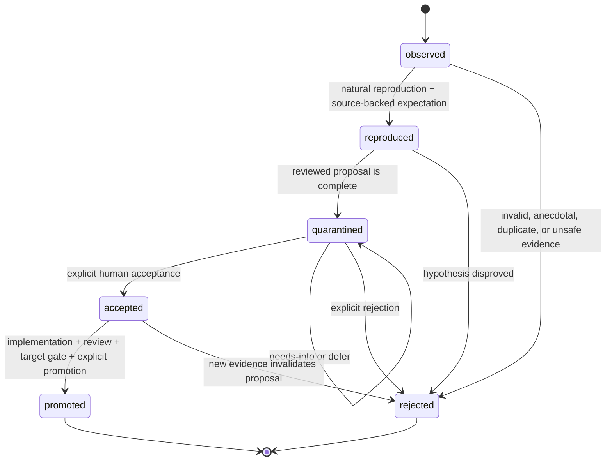

# Maintainer Improvement Loop

Target Reader: Groundwork maintainer reviewing observed, reproduced, or repeated fixture/runtime failures.
Reader Action Needed: Decide whether the signal should be reproduced, rejected, quarantined, accepted for ordinary implementation, or explicitly promoted after its target gate.
Decision Supported: Controlled self-evolution without automatic repository mutation.
Artifact Type: canonical Maintainer Lab improvement protocol.
Source of Truth: this document, `evals/patch_suggestions.py`, `evals/report.py`, `docs/router-observability-harness.md`, `docs/nightly-harness.md`, and target-specific source/package gates.
Scope: Proposal format, status lifecycle, promotion criteria, rollback requirements, and human decision recording.
Out of Scope: Auto-applying patches, committing `.groundwork/harness` runtime content, mutating `main`, opening PRs, or changing production systems.
Evidence Level: Groundwork issue #16 acceptance criteria and `docs/nightly-harness.md`.
Safe to Share / Redaction Notes: Safe to share as policy; candidate evidence remains private until reviewed and redacted.

## Purpose

A maintainer improvement record turns an observe-only signal into a controlled learning decision. It is evidence for a human decision, not a runtime instruction to mutate skills or docs.

The loop is:

```text
observe-only signal
-> reproduce with source-backed expectation
-> quarantine a complete proposal
-> human decision
-> ordinary scoped implementation
-> clean review and target-specific validation
-> explicit promotion
-> observe again through a new record if regression recurs
```

Telemetry, nightly runs, and `evals/patch_suggestions.py` may create `observed` suggestions only. They must not automatically reproduce, quarantine, accept, patch, promote, revert, edit CSV, mutate a tracker, or change `main`.

## Orthogonal Axes

Keep these axes separate:

- `learning_status`: progress of one maintainer hypothesis.
- `human_decision`: explicit disposition by a maintainer; `needs-info` and `defer` do not advance status.
- `promotion_target`: the artifact or source surface being considered.
- evidence artifact promotion: moving reviewed/redacted scratch into a durable review artifact. This never advances `learning_status` by itself.
- requirement state and public route state: user-task workflow state; never reuse it for maintainer learning.

Allowed values:

```text
learning_status = observed | reproduced | quarantined | accepted | rejected | promoted
human_decision = none | accepted | rejected | needs-info | defer
promotion_target = none | scoped_issue | eval_regression | source_patch | default_suite
```



Status meanings:

| Learning Status | Meaning |
| --- | --- |
| `observed` | A telemetry/eval/nightly signal exists. A single classified non-pass is enough for an advisory scratch suggestion, not for a patch claim. |
| `reproduced` | A natural prompt or fixture reproduces the behavior and the expected behavior is backed by source, accepted contract, or explicit maintainer decision. |
| `quarantined` | Owner/fix locus, risk, rollback, target, criteria, and reviewed/redacted evidence are complete, but no change is authorized. |
| `accepted` | A human accepted the scoped remediation and target. This authorizes the ordinary implementation workflow only; it does not authorize automatic mutation. |
| `rejected` | A human rejected the proposal or evidence disproved it. Terminal for this proposal. |
| `promoted` | The named target passed ordinary implementation, clean review when material, target-specific validation, and explicit human promotion. It is not release/UAT/customer readiness. |

## Proposal Format

```text
Maintainer Improvement Proposal
- Proposal ID:
- Observation Key:
- Occurrence Count:
- Learning Status: observed / reproduced / quarantined / accepted / rejected / promoted
- Promotion Target: none / scoped_issue / eval_regression / source_patch / default_suite
- Observed Failure:
- Evidence Delta:
- Regression Evidence:
- Expected Behavior Source:
- Affected Owner / Fix Locus:
- Proposed Patch:
- Risk:
- Rollback:
- Promotion Criteria:
- Human Decision: none / accepted / rejected / needs-info / defer
- Decision Reason:
- Validation Evidence:
- Clean Review Evidence:
- Runtime / Cache Evidence:
- Next Action:
- Stop Reason:
- Auto Apply: false
```

## Field Rules

- `Proposal ID`: stable identifier for one hypothesis and bounded target.
- `Observation Key`: stable deduplication key for equivalent failure, owner, and fix locus.
- `Occurrence Count`: number of equivalent observations grouped under the key; generated artifacts start at artifact-local `1`, and only reviewed deduplication may increment the cross-run count. Count alone is not evidence delta.
- `Observed Failure`: name the fixture row, runtime prompt, command, or baseline where the failure occurred.
- `Evidence Delta`: name the new observation since the previous occurrence; `none` stops another attempt.
- `Regression Evidence`: cite the prompt id, expected behavior, forbidden behavior, actual behavior, and relevant command or runtime observation.
- `Expected Behavior Source`: cite the accepted contract, source, fixture oracle, or maintainer decision that makes the reproduction judgeable.
- `Affected Owner / Fix Locus`: name one primary route, shared contract, checker, or maintainer layer.
- `Proposed Patch`: describe the smallest skill/doc/eval change. Do not include an unreviewed broad rewrite.
- `Risk`: state how the patch could make skill selection, artifact writing, safety gates, or output shape worse.
- `Rollback`: state the file-level revert or removal path.
- `Promotion Criteria`: define what must pass before the proposal can become a normal issue or patch.
- `Human Decision`: use only `none`, `accepted`, `rejected`, `needs-info`, or `defer`; `quarantined` is a learning status, not a decision.
- `Validation Evidence`: name source/unit/CSV/package checks appropriate to the target.
- `Clean Review Evidence`: material public/shared/runtime/source patches require a fresh read-only reviewer of the latest diff.
- `Runtime / Cache Evidence`: required only for runtime/cache/default-suite claims and must name the installed root and refresh/equivalence boundary.
- `Auto Apply`: always `false` for harness/generated proposals.

## Transition And Iteration Rules

- `observed -> reproduced` requires a natural reproduction and source-backed expectation; output resemblance or a single anecdote is insufficient.
- `reproduced -> quarantined` requires complete owner, scope, risk, rollback, target, criteria, and redaction review.
- `quarantined -> accepted/rejected` requires an explicit human decision. `needs-info` or `defer` leaves status `quarantined` and updates next action/stop reason only.
- `accepted -> promoted` requires ordinary implementation, focused self-check, fresh clean review when material, the promotion-target gate, and explicit promotion.
- A material change to hypothesis, owner, source truth, or patch scope starts a new `proposal_id`; link it with `supersedes` or `regression_of` instead of silently broadening the old record.
- Repeated equivalent failure with no evidence delta increments occurrence count only. Do not create duplicate proposals or rerun the same remediation.
- `promoted` and `rejected` are terminal for that proposal. A post-promotion recurrence starts a new `observed` record.
- Rollback uses an ordinary explicitly authorized implementation/Git path; the harness never auto-reverts.

## Promotion Target Gates

| Target | Minimum Gate |
| --- | --- |
| `scoped_issue` | reproduced failure, source-backed expectation, owner, bounded scope, AC/verification expectation, and human acceptance |
| `eval_regression` | named suite/row, source-backed expected/forbidden behavior, deterministic checker for stable material behavior or explicit exploratory label, and CSV/schema/unit checks |
| `source_patch` | accepted scope, ordinary `implement`, targeted self-check, fresh clean review for material skill/shared/runtime changes, and runtime package boundary when packaged paths change |
| `default_suite` | full targeted gate, installed cache/source alignment, no forbidden route/invalid preemption/unclassified blocking failure, and a separate explicit promotion record |

Release, UAT, customer readiness, and marketplace publication are not promotion targets in this loop; they require their own evidence and approval contracts.

## Storage Boundary

- Runtime/generated observations and learning drafts belong under ignored `.groundwork/harness/` by default.
- Do not commit `.groundwork/harness` learning contents unless the user explicitly approves a specific policy or report file.
- Durable policy belongs in `docs/`.
- Eval-backed accepted changes should land as ordinary scoped commits against `skills/`, `docs/`, or `evals/`.

## Rejection Criteria

Reject or keep quarantined when:

- the evidence is anecdotal or not reproducible
- the patch would broaden public skill surface without an issue
- the patch changes production systems, remote trackers, shared global skills, or runtime directories
- the patch depends on a tool or API not available in the target environment
- the patch duplicates an existing PRD, plan, or source artifact

Rejected evidence stays evidence-scoped; do not use rejection or promotion status as runtime, release, UAT, customer, installed-cache, or clean-review proof.
