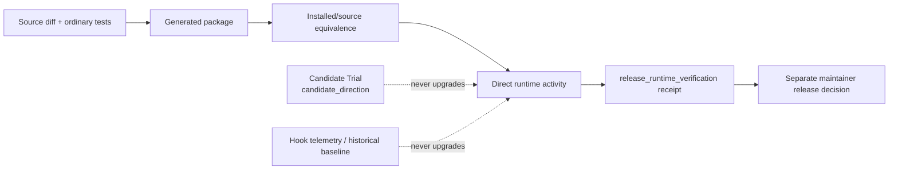

# Release Evidence Claim Boundary

Target Reader: Groundwork maintainers and reviewers making runtime, cache, release, UAT, marketplace, installed-plugin, or cache-refresh claims.
Reader Action Needed: Bind each claim to the shared evidence object and leave it `unverified` when direct claim-specific evidence is missing.
Decision Supported: Whether available evidence supports the named layer without being promoted from a weaker source/package/Candidate layer.
Artifact Type: canonical maintainer evidence policy.
Source of Truth: `skills/_shared/RELEASE-EVIDENCE-CLAIM.md`, `skills/_shared/EVIDENCE-BOUNDARY.md`, `skills/_shared/RUNTIME-CAPABILITY.md`, and `docs/prd-plugin-candidate-trial-migration-v1.md`.
Scope: Current post-M3 evidence classes, installed/source binding, direct runtime receipts, Candidate/release separation, and UAT/release escalation.
Out of Scope: Executing a runtime check, choosing a release process, approving UAT, publishing a marketplace package, or proving customer readiness.
Evidence Level: Current source contract only; no installed package, runtime, release, or UAT activity is claimed here.
Safe to Share / Redaction Notes: Safe to share as-is; redact private paths, credentials, customer data, private URLs, and raw logs from real receipts.

Groundwork uses claim-scoped evidence. A stronger label needs evidence produced at that layer; weaker artifacts do not add up into a stronger claim.



## Evidence Layers

| Layer | What it can establish | What it cannot establish alone |
| --- | --- | --- |
| Source | The inspected diff and ordinary deterministic checks | Generated package, installed cache, runtime behavior, release, or UAT |
| Generated package | Package shape, inventory, hashes, and source-side boundaries | Which package is installed or executed |
| Installed/source equivalence | A complete independent installed root matches the named source/package root | Runtime behavior or release readiness |
| Candidate direction | A bounded Baseline/Candidate comparison informed one human proposal decision | Runtime/release/UAT/customer readiness |
| Direct runtime | Named activity executed against a bound installed package and environment | Maintainer release approval or UAT unless those were separately performed |
| Release/UAT | Claim-specific canonical decision and evidence | Broader customer readiness outside the recorded scope |

## Candidate / Release Firewall

Candidate Trial receipts are fixed at:

```yaml
evidence_class: candidate_direction
```

They exist only to help a human choose whether to reject, defer, or promote a Candidate proposal. The following are still insufficient for a runtime or release claim:

- a Candidate materially outperforming Baseline;
- a human promotion decision;
- matching source and installed package hashes without direct execution;
- a source/package/CI pass;
- hook telemetry, output shape, route candidates, local scores, or historical baselines;
- saying the Candidate and release scopes are the same.

Groundwork runtime behavior can be marked verified only from a separately authorized direct receipt with:

```yaml
evidence_class: release_runtime_verification
```

The Candidate Trial runner is not a release phase. There is no repo-owned default model suite, compatibility wrapper, score, report, or old Eval runner that can manufacture this receipt.

## Required Direct Receipt Binding

Use the exact `release_evidence_claim` object in `skills/_shared/RELEASE-EVIDENCE-CLAIM.md`. A verified Groundwork runtime/cache/marketplace/cache-refresh behavior claim binds all of the following:

1. explicit authorization for the direct activity;
2. released package digest;
3. task or fixture hash;
4. original acceptance or invariant source hash for expected behavior;
5. complete installed/source equivalence between independent roots;
6. installed plugin root and source root;
7. runtime/environment identity, including launcher and relevant non-secret controls;
8. direct outcome and targeted/full scope;
9. receipt validity and limitations;
10. named completed commands or trials.

If a required binding is missing, contradictory, stale, aliased, partial, or not directly observed, use:

```yaml
evidence_status: unverified
```

and name the exact limitation. Do not substitute another model's judgment, prose reconstruction, a dry run, a no-op refresh, or a historical report.

## Release And UAT Are Additional Decisions

A valid `release_runtime_verification` receipt supports only its named runtime claim. A generic release claim still needs a separate maintainer release decision. A UAT claim still needs its claim-specific canonical UAT evidence and, when the system can change, the conditional UAT Evidence Window from the shared contract.

Non-plugin UAT can set plugin/cache fields to `not_applicable`, but it still needs a concrete source identity, direct trial, scope, result, limitations, and `evidence_class: claim_specific_direct_evidence`.

Codex App Handoff packages, clean-review packages, deployment plans, and final-response wording do not become direct evidence merely because they cite this contract.

## Maintainer Review Checklist

- Is the claim type and exact scope explicit?
- Is the evidence class correct, and is `candidate_direction` rejected for runtime/release/UAT?
- Does verified Groundwork runtime behavior have an independently authorized `release_runtime_verification` receipt?
- Are package, task/fixture, expectation source, installed/source, runtime/environment, outcome, validity, scope, and limitations all bound?
- Does each cited activity have a completed terminal result rather than a command-shaped sentence?
- Are release and UAT decisions kept separate from runtime execution?
- If any answer is no, is the claim explicitly `unverified` with the missing evidence named?

## Examples

Source and package checks only:

```yaml
release_evidence_claim:
  claim_type: runtime
  claim: "The generated package behaves correctly in the installed runtime."
  evidence_status: unverified
  evidence_class: release_runtime_verification
  installed_plugin_root: "unverified"
  source_root: "/reviewed/source"
  cache_or_source_refresh:
    method: not_run
    evidence: ""
  run_scope: not_run
  commands_or_trials: []
  receipt_binding:
    authorization: "not_run"
    released_package_digest: "sha256:source-package-only"
    task_or_fixture_hash: "unverified"
    expectation_source_hash: "unverified"
    installed_source_equivalence: "not_run"
    runtime_environment_identity: "unverified"
    direct_outcome: "not_run"
    validity: "unverified"
    scope: "not_run"
  limitations:
    - "No separately authorized direct runtime activity was performed."
```

Candidate evidence only:

```text
Candidate receipt evidence_class=candidate_direction.
The proposal decision may use it; release_evidence_claim remains unverified.
```

Verified runtime is allowed only after inspecting a separate receipt whose direct bindings match the claim. Even then, report release and UAT as separate decisions rather than silently upgrading them.
