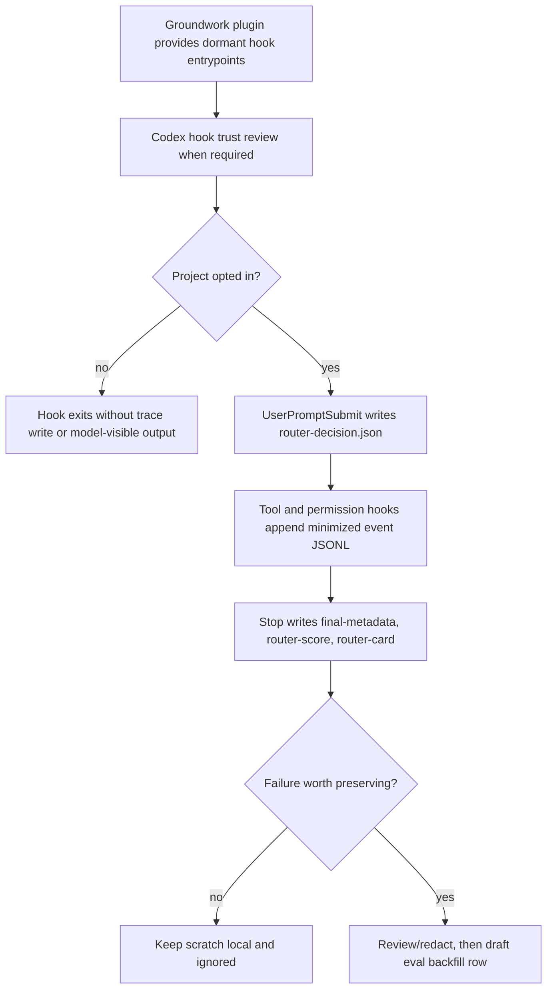

# Router Observability Harness

Target Reader: Groundwork maintainers, Codex hook reviewers, eval authors, and reviewers deciding whether router observability evidence is sufficient for local improvement work.

Reader Action Needed: Use this document to install, trust, opt in, disable, inspect, and safely promote Router Observability v0 hook artifacts.

Decision Supported: Whether a local project should run observe-only Groundwork router tracing, whether a score can become an eval backfill candidate, and where selector/runtime claims must stop.

Artifact Type: maintainer harness guide.

Source of Truth: `docs/prd-router-observability-and-self-improvement.md`, `docs/eval-trace-artifacts.md`, `skills/_shared/RUNTIME-CAPABILITY.md`, `skills/_shared/COGNITIVE-BUDGET.md`, `hooks/hooks.json`, and `scripts/codex-hooks/`.

Scope: Plugin-bundled dormant hook entrypoints, project-local opt-in, trace scratch layout, observe-only and guided-hint modes, raw-capture boundary, dispatch execution profile observability, score backfill, report integration, and disable paths.

Out of Scope: Marketplace release packaging, runtime adapter execution, automatic skill mutation, automatic PR/issue/tracker writes, automatic model or reasoning selector mutation, Automation creation, CI gate creation, UAT/customer/release readiness, installed-plugin cache refresh evidence, and general-user rollout.

Evidence Level: Source implementation and maintainer operating guide only. Hook artifacts are local review evidence; they are not runtime, cache-refresh, release, UAT, marketplace, or customer-readiness evidence.

Safe to Share / Redaction Notes: Safe to share as a guide. It contains no raw traces, prompts, secrets, credentials, cookies, PII, browser logs, private payloads, or production data.

## Harness Flow



## Hook Packaging

The repository ships dormant hook definitions at [`hooks/hooks.json`](../hooks/hooks.json). The command entrypoints live under [`scripts/codex-hooks/`](../scripts/codex-hooks/).

Plugin install or update only makes these hook definitions available for review. It does not mean tracking has started, and it does not create marketplace release evidence. The maintainer still needs any Codex-required hook trust review for the current installed plugin version.

`SessionStart` is intentionally deferred. v0 does not need session-level metadata to prove no-op behavior, route decision capture, tool event capture, or Stop-time scoring.

## Project Opt-In

Hooks no-op unless the current project has opt-in config:

```json
{
  "enabled": true,
  "mode": "observe_only",
  "raw_capture": false,
  "snippet_capture": false
}
```

Default local path:

```text
.groundwork/harness/router-observability/config.json
```

This path is ignored by default. Do not commit `.groundwork/harness` unless a maintainer explicitly creates a reviewed, redacted promotion path.

Environment fallback for local debugging:

```text
GROUNDWORK_ROUTER_OBSERVABILITY=1
GROUNDWORK_ROUTER_OBSERVABILITY_MODE=observe_only
```

Disable for one process:

```text
GROUNDWORK_ROUTER_OBSERVABILITY_DISABLED=1
```

## Modes

`observe_only` is the default v0 mode. It writes local scratch artifacts for opted-in projects only. It does not inject route hints, block prompts, rewrite tool calls, request Stop continuation, spawn subagents, create worktrees, create PRs, commit, push, or mutate trackers.

`guided_hint_trial` is explicit. It may emit compact `additionalContext`, and every score from this mode is marked `guided_hint_excluded`; it must not count toward passive baseline metrics.

## Scratch Layout

Opted-in projects write per-turn scratch under:

```text
.groundwork/harness/router-observability/<session-id>/<turn-id>/
  prompt-metadata.json
  prompt.raw.json                 # optional, raw_capture only
  router-decision.json
  dispatch-decision.json          # optional, dispatch involved
  tool-events.jsonl
  permission-events.jsonl
  final-metadata.json
  final.raw.txt                   # optional, raw_capture only
  router-score.json
  router-card.md
```

`prompt-metadata.json` and `final-metadata.json` are deterministic minimized metadata, not LLM summaries. By default they use hashes, lengths, capture-status fields, and source-strength fields instead of full content. Short redacted snippets are disabled by default and require explicit `snippet_capture=true`; raw prompt/final capture remains a separate `raw_capture=true` opt-in.

## Dispatch And Selector Boundary

When dispatch is selected or mentioned, `dispatch-decision.json` records a heuristic dispatch candidate and execution profile recommendation fields:

```text
decision_source
actual_dispatch_output_observed
score_eligibility
model_profile
reasoning_effort
cost_latency_bias
selector_enforcement
evidence_layer
execution_claim
```

These fields describe dispatch intent unless a runtime adapter or tool reports selector application for the specific run. v0 hook output must keep `actual_dispatch_output_observed=false` and `score_eligibility=insufficient_evidence` for the heuristic candidate. `tool_enforced` must not be claimed from a prompt, dispatch package, routing profile, model-menu seed, or hook score alone.

## Backfill

Reviewed router scores can draft eval rows without mutating CSV:

```bash
python3 evals/router_observability/backfill_row.py --score .groundwork/harness/router-observability/<session>/<turn>/router-score.json
```

Use markdown output for review:

```bash
python3 evals/router_observability/backfill_row.py --score <router-score.json> --format markdown
```

The command copies no raw prompt or raw final text. It produces a redacted scenario placeholder and requires human review before any CSV edit.

## Reports

`evals/report.py` reads promoted or assembled `router-score.json` files under a report run directory and adds a Router Observability section with:

- score eligibility counts;
- execution profile verdict counts;
- selector enforcement counts;
- per-score expected route, actual route, and overall verdict.

Report output preserves the existing evidence boundary: local/redacted artifacts are not runtime, release, UAT, cache-refresh, or customer-readiness evidence unless separate evidence is named.

## Promotion Boundary

Keep live scratch local unless another reviewer or future issue needs durable evidence. Promote only redacted artifacts under:

```text
artifacts/evals/<run-id>/
```

Do not promote secrets, credentials, cookies, PII, browser logs, private payloads, raw command output, raw prompts, raw final text, or unreviewed private URLs.
