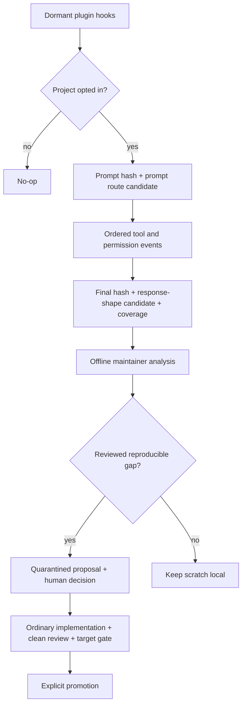

# Router Telemetry Harness

Target Reader: Groundwork maintainers, Codex hook reviewers, and eval authors using local traces to improve routing and output contracts.

Reader Action Needed: Decide whether to opt a project into observe-only telemetry, inspect its minimized artifacts, and promote only reviewed evidence into offline eval work.

Decision Supported: Whether a local trace is safe and sufficient for a maintainer investigation; never whether a route, runtime, release, UAT, or customer claim passed.

Artifact Type: canonical maintainer harness guide.

Source of Truth: `hooks/hooks.json`, `scripts/codex-hooks/groundwork_router_telemetry.py`, `scripts/codex-hooks/groundwork_route_detection.py`, `scripts/codex-hooks/groundwork_route_registry.json`, `evals/verdict_model.py`, `evals/patch_suggestions.py`, and `docs/quarantined-learnings.md`.

Scope: dormant plugin-bundled hooks, project opt-in, hash/redaction policy, prompt-route candidates, response-shape candidates, ordered tool/permission events, coverage diagnostics, and offline promotion.

Out of Scope: prompt injection, guided modes, live scoring, model/profile inference, router cards, authoritative skill-load claims, automatic eval mutation, automatic dispatch/execution, release/UAT/customer readiness, and cache equivalence.

Evidence Level: source implementation and local telemetry contract. Trace artifacts are improvement evidence only.

Safe to Share / Redaction Notes: The guide is safe to share. Trace directories are private scratch until reviewed and redacted; do not promote secrets, PII, private payloads, raw prompts, or raw final responses.

## Architecture



The runtime and Maintainer Lab have separate responsibilities:

| Layer | Responsibilities | Must Not Do |
| --- | --- | --- |
| Runtime telemetry | Opt-in detection, hashing, redaction, event ordering, coverage, prompt-route candidate, response-shape candidate. | Inject prompts, score pass/fail, infer execution profile, generate router cards, or call response shape an actual route. |
| Maintainer Lab | Replay, scoring, behavior checks, output UX checks, reviewed eval backfill, trend reporting. | Upgrade telemetry into runtime/release/UAT truth without stronger evidence. |

## Opt-In

Create the ignored project-local file:

```json
{
  "enabled": true,
  "mode": "observe_only",
  "raw_capture": false,
  "snippet_capture": false
}
```

Path:

```text
.groundwork/harness/router-observability/config.json
```

For one local process, `GROUNDWORK_ROUTER_OBSERVABILITY=1` force-enables the same observe-only behavior. Historical values such as `thin_prompt_trial` or `guided_hint_trial` may be preserved as `requested_mode` for diagnosis, but the runtime always records `decision_mode=observe_only` and emits no `additionalContext`.

Hook trust remains a separate Codex runtime boundary. Availability or local source validity does not prove an installed hook was trusted or executed.

## Recorded Signals

Prompt stage records:

- prompt hash and length;
- optional redacted snippet;
- `prompt_route_candidate` from the deterministic route-only classifier; it does not infer requirement state, source truth, risk, lifecycle state, or actual skill loading;
- classifier source and explicit candidate-only limitation.

Tool and permission stages record:

- event identity and stable ordering fields;
- tool/command class;
- input and response hashes/lengths;
- supported/unsupported coverage status;
- risk and evidence markers.

Stop stage records:

- final hash and length;
- optional redacted snippet;
- `response_shape_candidate`;
- `response_shape_source=response_shape_heuristic`;
- `authoritative_skill_load_trace=unavailable` and `skill_hits=[]` until the host supplies stronger evidence;
- ordered event coverage and malformed-line counts.

These are three distinct concepts:

```text
prompt_route_candidate != authoritative_skill_load_trace != response_shape_candidate
```

When the host does not provide a native `turn_id` or request-scoped id, `UserPromptSubmit` creates a unique fallback turn id and later tool, permission, and stop events reuse the session's active fallback id. A later prompt advances the active id without overwriting the earlier turn directory. Event-local ids are not promoted into turn identity.

No hit rate may treat them as interchangeable.

## Scratch Layout

```text
.groundwork/harness/router-observability/<session-id>/<turn-id>/
  prompt-metadata.json
  router-decision.json
  tool-events.jsonl              # when tool hooks fire
  permission-events.jsonl        # when permission hooks fire
  final-metadata.json
  coverage.json
  prompt.raw.json                # optional raw_capture
  final.raw.txt                  # optional raw_capture
  final.raw.meta.json            # optional raw_capture
```

Runtime hooks do not write `dispatch-decision.json`, `router-score.json`, or `router-card.md`.

## Privacy

`enabled`, `snippet_capture`, and `raw_capture` must use JSON booleans; string values such as `"false"` make the project config invalid and keep hooks disabled unless the process-level force-enable variable is explicitly set. The project config file and every path component below the project root must not be symlinks; a symlinked config path is invalid, and process-level force-enable ignores its capture options. `snippet_capture` and `raw_capture` default to `false`. Raw capture, when explicitly enabled, is always redacted by runtime hooks. Unredacted semantic reproduction is not a runtime-hook capability; it requires a separately approved maintainer-only workflow with its own retention and deletion controls.

Hashes reduce exposure but do not make an artifact public. Keep `.groundwork/harness/` ignored and local.

## Offline Improvement Loop

Use `docs/quarantined-learnings.md` as the canonical learning-state and promotion protocol:

1. Record telemetry/eval output as `learning_status=observed`, `promotion_target=none`, and `human_decision=none` only. Inspect candidate fields and coverage diagnostics.
2. Reproduce the prompt with a natural eval case and a source-backed expected behavior; do not copy secrets or private raw content. Advance to `reproduced` only after that review.
3. Obtain authoritative skill-load evidence when the host exposes it; otherwise evaluate behavior and output UX without claiming routing accuracy.
4. Use `evals/verdict_model.py` only in the Maintainer Lab to create reviewed scores or cards.
5. Quarantine a proposal only when owner/fix locus, evidence delta, risk, rollback, target, and promotion criteria are complete. Artifact redaction/promotion does not advance learning status.
6. Require explicit human acceptance before ordinary scoped implementation. Material patches require focused self-check and fresh read-only clean review; runtime-packaged changes require the package boundary and any claimed runtime/cache gate.
7. Promote only the named target after its specific gate and explicit human decision. A post-promotion recurrence starts a new `observed` record.

No evidence delta means no automatic rerun or duplicate proposal. The loop may stop at `rejected`, remain `quarantined` for `needs-info/defer`, or pause at `accepted` while implementation/review/validation evidence is missing.

## Disable And Failure Behavior

Remove/disable the project config and unset `GROUNDWORK_ROUTER_OBSERVABILITY` to stop capture. Hook entrypoints return success on missing or partial package files and do not interrupt normal Codex use. Set `GROUNDWORK_ROUTER_OBSERVABILITY_DEBUG=1` only for local stderr diagnostics.

## Evidence Boundary

Telemetry does not prove:

- the host loaded a Groundwork skill;
- the response followed that skill causally;
- selector/model/profile enforcement;
- installed-cache/source equivalence;
- hook trust;
- runtime, release, UAT, marketplace, or customer readiness.
