# Runtime Dispatch Workflow

Target Reader: Groundwork coordinators, dispatch reviewers, and runtime adapter authors.
Reader Action Needed: Route accepted work through the canonical Dispatch Package base, apply an adapter delta only when needed, and keep execution and closeout claims evidence-bound.
Decision Supported: Whether a ready task belongs in `dispatch`, which route and runtime package are admissible, and how returned evidence advances review or lifecycle state.
Artifact Type: maintainer workflow.
Source of Truth: `skills/dispatch/DISPATCH-PACKAGE.md`, `skills/dispatch/DISPATCH-PACKAGE-DETAILS.md`, `skills/dispatch/RESULT-PACKAGE.md`, `skills/dispatch/RUNTIME-ADAPTERS.md`, and adapter contracts under `skills/dispatch/adapters/`.
Scope: Current package-only dispatch ownership, base/delta schema, route policy, dependency barriers, returned-result intake, review, merge-back, archive, and cleanup boundaries.
Out of Scope: Raw requirement shaping, readiness decisions, automatic runtime execution, Codex App thread creation by Groundwork, remote writes, release approval, UAT approval, and customer readiness.
Evidence Level: Current source-validation workflow contract. It does not prove installed-plugin behavior, cache refresh, runtime execution, release readiness, UAT readiness, or customer readiness.
Safe to Share / Redaction Notes: Safe to share as-is; generated packages must still redact secrets, credentials, PII, private logs, and production payloads.

## Ownership Chain

```mermaid
flowchart LR
  A["to-prd<br/>accepted source"] --> B["to-issues<br/>vertical task slices"]
  B --> C["triage<br/>readiness and blockers"]
  C --> D["dispatch<br/>route and package owner"]
  D --> E["runtime adapter<br/>optional execution owner"]
  E --> F["Result Package<br/>returned evidence"]
  F --> G["coordinator intake"]
  G --> H["fresh review or remediation"]
  H --> I["merge-back / discard / retain"]
  I --> J["verify<br/>claim-scoped evidence"]
  J --> K["triage<br/>closeout state"]
```



The stages have one owner each:

1. `to-prd` shapes raw or ambiguous intent into accepted source truth.
2. `to-issues` produces vertical task slices and acceptance criteria. It does not choose runtime, model, worktree, isolation, or parallelization.
3. `triage` owns readiness and blockers. Ready agent work leaves `Preferred Runtime: dispatch_may_choose` when dispatch is in scope.
4. `dispatch` is the sole post-readiness runtime/package route owner; it owns route selection, conflict preflight, runtime choice, and package generation.
5. A runtime adapter may execute only when capability and approval are present. Package generation alone is not execution.
6. Coordinator intake checks package completeness and obvious blockers. It is not deep review or readiness approval.
7. Fresh review, merge-back, archive, and branch cleanup each require their own evidence and state transition.

> [!IMPORTANT]
> Dispatch is package-only by default. It must not claim that it spawned a subagent, created a thread or worktree, ran validation, applied selectors, merged changes, archived a thread, cleaned a branch, refreshed a cache, or changed a remote system unless an execution-capable adapter returns evidence for that action.

## Canonical Dispatch Package

`skills/dispatch/DISPATCH-PACKAGE-DETAILS.md` owns the full base schema. A task entry contains the route, source, policy, handoff, closeout, verification, approval, runtime-evidence, isolation, parallelization, dependency, Goal Contract, Goal Mode, execution-profile, and runtime-package fields.

The most important ownership rule is:

```yaml
tasks:
  - task_id: ""
    route_decision: {}
    source_package: {}
    policy: {}
    handoff_expected: {}
    closeout_expected: {}
    verification_expectation: {}
    approval_requirements: {}
    runtime_evidence: {}
    isolation: {}
    parallelization: {}
    dependency_barrier: {}
    goal_contract: {}
    goal_mode: {}
    execution_profile: {}
    runtime_package: {}
    adapter_extension: {}
```

These task-level fields are the single canonical base. An adapter may constrain base values and add only runtime-specific data under `adapter_extension`; it must not wrap, duplicate, rename, or override base fields.

For `codex_app_managed_worktree_thread`, load `skills/dispatch/adapters/codex_app_managed_worktree_thread/DISPATCH-PACKAGE-CONTRACT.md`. Its delta contains thread/worktree initialization and compatibility evidence only. It does not own route policy, source truth, verification, approval, Goal Contract, or closeout semantics.

## Route Policy

Choose the lightest safe topology before selecting a runtime.

| Route | Use when | Required boundary |
| --- | --- | --- |
| `local_direct` | Small, accepted, low-risk work can run in the current workspace. | Workspace and risk inputs are known; no isolation or independent-review claim. |
| `local_with_artifact` | A durable PRD, issue map, plan, verification report, or handoff is needed without isolated execution. | Artifact generation does not imply runtime execution. |
| `worktree_isolated` | Concrete write work needs filesystem isolation because of dirty state, stale base, shared-file conflict, serial dependency, setup, rollback, or material write risk. | Name the concrete isolation input and expected touched files; do not infer worktree creation. |
| `worktree_review_only` | Returned or external work needs read-only inspection or clean review. | Reviewer cannot edit, merge, archive, or claim final readiness. |
| `automation_candidate` | A recurring monitor, reminder, wakeup, or scheduled check may be useful. | Recommendation only; `runtime_id: not_applicable` until a separately approved automation action occurs. |

Hard negatives:

- Read-only and planning-only work must not route to `worktree_isolated`.
- Hybrid work must split before a concrete write runtime is selected.
- Unknown source truth, acceptance, validation, capability, approval, or conflict state remains explicit and routes to `needs_info`, `needs_split`, `blocked`, or `human_decision`.
- Model and reasoning selectors are requests until a runtime reports enforcement evidence.

## Managed Worktree Admission

A managed-worktree task must satisfy the generic base and the adapter delta. At minimum it needs:

- `task_type: write_implementation` and `readiness: ready_for_agent`;
- `route_decision.route: worktree_isolated` with a concrete isolation reason;
- `runtime_id: codex_app_managed_worktree_thread`;
- a self-contained source package and complete Goal Contract;
- `isolation.context: thread`, `filesystem: codex_managed_worktree`, and `diff_surface: required`;
- verification expectations and `runtime_package.expected_output: review_package`;
- both Goal Contract and rendered child-prompt lint evidence;
- explicit execution approval and available Codex App capability before child-thread creation.

`pendingWorktreeId` is pending initialization, not success. The adapter must resolve it to both a child thread identifier and worktree path, or return `blocked`, `needs_remediation`, or `human_decision`. The parent must not implement the same task in parallel, and a manual worktree fallback requires explicit approval because it changes the requested topology.

## Dependency And Parallelism

`runtime_policy.max_parallel_units` is the package-wide ceiling. `tasks[].parallelization.max_parallel_group_size` is a task/conflict-group ceiling. Both apply.

Use `dependency_barrier` whenever prior child work, shared files, generated artifacts, schemas, fixtures, or merge order can affect a write task. A dependent write remains blocked until required result, review, merge-back, verification, and base-refresh evidence is present. Refresh the source package and Goal Contract against the post-merge base when source truth changed.

Read-only preparation may run before the barrier only when it cannot mutate files and does not treat unmerged child work as source truth.

## Result Package And Closeout

`skills/dispatch/RESULT-PACKAGE.md` owns the return envelope. `outcome` is the only summary field:

- `ready_for_review`
- `needs_remediation`
- `blocked`
- `human_decision`
- `no_execution_needed`

Legacy `status` and `no_worktree_needed` are intake-only compatibility values. New packages must not emit them.

The following axes are orthogonal and advance only with their own evidence:

| Axis | Meaning |
| --- | --- |
| `runtime_lifecycle` | Thread or runtime execution state. |
| `review` | Coordinator intake, fresh clean review, or other named review evidence. |
| `merge_back` | Merge source, pathspec, application, and validation evidence. |
| `archive` | Archive, retain, or blocked decision with its own prerequisites. |
| `branch_cleanup` | Branch identity, approval, deletion/retention, and cleanup evidence. |

Runtime completion does not imply review pass. Review pass does not imply merge. Merge or discard does not imply archive. Archive does not imply branch cleanup.

Clean review must use a fresh, self-contained read-only package when triggered by materiality, risk, multiple packages, schema/contract changes, missing evidence, or explicit request. If the reviewer edits, that reviewer becomes an implementer and the review authority is spent; material remediation makes earlier review stale.

The generic Result Package owns `review.reviewed_material_change_id`. A clean-review pass may support closeout only when that non-empty id equals `review_loop.latest_material_change_id`; adapters consume this freshness evidence without redefining it in their deltas.

## Evidence Boundaries

Runtime, cache, marketplace, release, UAT, and customer-readiness claims require claim-specific evidence. A `verification_expectation.release_evidence_claim` records the installed plugin root, source root, cache refresh or source-equivalence method, run scope, commands or trials, and limitations when such a claim is in scope.

Package/schema completeness, local source tests, generated marketplace checks, fixture passes, PRD acceptance, issue-map completion, or clean review alone do not prove installed runtime, release, UAT, or customer readiness.

Remote writes, destructive actions, branch deletion, commit, push, PR creation, deployment, tracker mutation, and production data changes require their own explicit approval and returned evidence.

## Validation Pointers

Use the narrowest relevant checks first:

- `evals/prompts/dispatch.csv` for base route and package behavior;
- `evals/prompts/dispatch-managed-worktree-lifecycle.csv` for adapter and closeout boundaries;
- `evals/prompts/serial-dispatch-barrier.csv` for dependent-write barriers;
- `evals/prompts/clean-review-fanout.csv` for fresh review and coordinator-intake boundaries;
- `evals/test_progressive_disclosure.py` for base/delta ownership and Result Package vocabulary;
- `scripts/check_runtime_package_boundary.py` for packaged reference integrity and complexity budgets.

These are source and generated-package checks unless the run separately names installed-plugin/cache equivalence and actual runtime evidence.
