# Runtime Dispatch Workflow

Target Reader: Groundwork coordinators, dispatch reviewers, and runtime adapter authors.
Reader Action Needed: Use this workflow to move accepted work from PRD slicing through runtime routing and back into verification or lifecycle triage.
Decision Supported: Whether a task should route through `dispatch`, which runtime package shape is valid, and how runtime results return to Groundwork.
Scope: End-to-end `to-prd -> to-issues -> triage -> dispatch -> runtime adapter -> coordinator intake -> clean review -> merge-back/discard/block -> verify -> triage/closeout` workflow for Phase 1 dispatch.
Out of Scope: Automatic subagent spawning, Codex App thread tool execution by Groundwork dispatch, remote writes, runtime execution implementation, tracker APIs, and README exposure.
Evidence Level: Derived from `docs/prd-dispatch-runtime-router.md`, `artifacts/dispatch-runtime-router/issue-map.md`, and the dispatch contract files under `skills/dispatch/`.

## Workflow

```mermaid
flowchart LR
  A["to-prd<br/>accepted source truth"] --> B["to-issues<br/>vertical work units"]
  B --> C["triage<br/>readiness and Goal Contract"]
  C --> D["dispatch<br/>router, conflict preflight, and package generator"]
  D --> E["runtime adapter<br/>executes only if approved and supported"]
  E --> F["Result Package<br/>evidence envelope"]
  F --> G["coordinator intake<br/>no deep review pass"]
  G --> H["triage<br/>clean_review_pending / needs_remediation / blocked"]
  H --> I["clean review<br/>fresh-context package review"]
  I --> J["merge-back / discard / block<br/>coordinator decision"]
  J --> K["verify<br/>evidence sufficiency after decision"]
  K --> L["triage closeout<br/>next lifecycle state"]
  L --> M["archive decision<br/>evidence preserved"]
  M --> N["branch cleanup<br/>separate checklist"]
  J --> O["base refresh<br/>dependent writes released"]
  O --> D
```



`dispatch` is the routing boundary. It consumes accepted, ready task inputs and produces Dispatch Package v2 plus expected Result Package requirements. It does not execute the package.

## Phase 1 Boundaries

> [!IMPORTANT]
> Phase 1 dispatch is package-only. Groundwork `dispatch` must not automatically spawn subagents, must not call Codex App thread tools, and must not perform remote writes.

- No automatic subagent spawn: `codex_subagent` packages remain package-only unless an execution-capable runtime is explicitly requested, approved, and evidenced.
- No thread tool execution by Groundwork dispatch: creating managed worktree child threads, inserting child prompts, lifecycle monitoring, and selector enforcement belong to an execution-capable runtime adapter. Groundwork includes the internal adapter contract and templates under `skills/dispatch/adapters/codex_app_managed_worktree_thread/`.
- No remote writes: commits, pushes, PR creation, tracker mutation, deployment, or data writes require a separate explicit approval gate and runtime evidence.
- No execution claims from package generation: `dispatch` may state routing intent, package completeness, and expected output only.
- Internal adapter contract boundary: Groundwork co-locates the managed worktree adapter contract with dispatch, but `dispatch` remains package-only unless an execution-capable runtime is explicitly requested, approved, and evidenced.

## Inputs And Gates

1. `to-prd` establishes accepted source truth.
2. `to-issues` turns accepted source truth into vertical work units with acceptance criteria, non-goals, blockers, verification evidence, AFK/HITL classification, and runtime candidate fields.
3. `triage` decides whether the work is `ready_for_agent`, `ready_for_human`, `needs_info`, or blocked. Ready agent work may include a Goal Contract and Preferred Runtime recommendation.
4. `dispatch` makes the final runtime route. Preferred Runtime is an input signal, not an execution command.
5. Conflict preflight blocks dependent write dispatch when prerequisite merge-back, verification, or base refresh is missing.
6. Runtime adapters return a Result Package or review package. Groundwork coordinator intake records package completeness and obvious blockers; it is not deep review and does not create readiness approval.
7. `triage` records the next lifecycle state as `clean_review_pending`, `needs_remediation`, `blocked`, or another legal state from `THREAD-LIFECYCLE.md`.
8. Clean review runs from a fresh context when lifecycle, schema, fan-out, risk, or package size requires it, before merge-back or any material readiness claim.
9. Merge-back, discard, block, archive, and branch cleanup remain coordinator lifecycle decisions with separate evidence gates.
10. `verify` reviews evidence sufficiency after clean review and merge-back/discard/block decisions, or only as a lightweight evidence-boundary check before clean review when the coordinator needs to decide whether remediation is required.

## Serial Dispatch And Merge Barrier

Serial dispatch rules depend on the managed worktree merge-back protocol. In v0.3.3, that prerequisite is `skills/dispatch/adapters/codex_app_managed_worktree_thread/MERGE-BACK-PROTOCOL.md`.

Dispatch must express dependency barriers in Dispatch Package v2 before creating dependent managed worktree child threads:

```yaml
dependency_barrier:
  depends_on_task_ids: []
  blocked_until:
    result_package_status: ready_for_review | not_required
    clean_review: passed | not_required
    merge_back: completed | not_required
    verification: pass | partial_allowed | not_required
    base_refresh: completed | not_required
  required_base:
    branch: ""
    commit_after_merge: ""
  re_triage_required_after_merge: true | false
  goal_contract_refresh_required: true | false
  dispatch_allowed_now: true | false
  block_reason: ""
  release_evidence: ""
```

Dependent write tasks remain blocked until prerequisite merge-back and base refresh are complete. If the prerequisite changed source, contracts, generated artifacts, fixtures, or package schemas, the dependent task source package and Goal Contract must be regenerated or confirmed against the post-merge base before dispatch.

Read-only preparation may run before merge-back only when it cannot write files and does not treat unmerged child work as source truth. The write task stays blocked until `dispatch_allowed_now: true` has release evidence.

Low-risk independent tasks remain parallelizable when conflict preflight finds no dependency barrier, no shared conflict group, no overlapping write surface, and current source truth.

## Post-dispatch Lifecycle Return Path

Managed worktree child threads return packages; they do not close their own lifecycle. The coordinator moves the returned evidence through this path:

1. `result_package` or `review_package` returns from the runtime adapter.
2. Coordinator intake checks package shape, required identity fields, obvious blockers, and whether remediation is needed. Intake must not become deep review or readiness approval.
3. `triage` records the lifecycle state as `clean_review_pending`, `needs_remediation`, `blocked`, or another legal state from `THREAD-LIFECYCLE.md`.
4. Clean review runs from fresh context when triggered by package size, risk, schema changes, multiple returned packages, missing evidence, or explicit user request.
5. After clean review passes, the coordinator chooses `merge_pending`, `discard_pending`, `blocked`, or `human_decision`.
6. Merge-back may apply changes only from a reliable source, with explicit pathspecs, git-boundary evidence, and post-merge validation or an explicit unverified marker.
7. `verify` checks acceptance evidence after merge-back, discard, or block decisions when the result affects implementation conformance, tests, contracts, fixtures, or user-visible behavior. Before clean review, `verify` may only be a lightweight evidence-boundary check that routes to remediation; it must not be a deep review or readiness pass.
8. Final `triage` records closeout state after verification evidence is known.
9. Archive may be recommended only after merge, discard, or blocked-with-human-decision evidence is preserved.
10. Branch cleanup is a separate checklist after archive or closeout evidence. Archive does not prove `branch_cleaned`.

`review_package_returned` is an intake state, not a closeout state. It cannot imply clean review passed, merge-back completed, archive readiness, branch cleanup, commit, push, PR creation, or remote mutation.

When evidence is missing, use `needs_remediation`, `blocked`, or `human_decision`. Do not infer runtime identity, Goal Mode, merge source, branch state, clean review status, archive readiness, or branch cleanup from narrative summaries.

## Closeout Registry And Metrics

Managed worktree closeout must preserve a registry record for each child task:

- task id, runtime correlation id, branch, base ref, worktree path, artifact path, owner skill, current status, created timestamp, and last checked timestamp;
- a registry event for each status change, stored in the artifact path or an adapter-visible trace log;
- original goal, scope, stop condition, achieved/not-achieved verdict, evidence, git boundary, open risks, diff summary, and next action in the closeout package.

Same-base write closeout is serialized. When another closeout is in progress for the same base branch, when queue/lock evidence is missing, or when dependency-barrier release evidence is absent, the later closeout remains `blocked` or `human_decision`; it must not merge back, archive, or clean a branch concurrently.

The v0.3.3 closeout contract exposes metric inputs only. These fields help maintainers count `worktree_open_to_close_success_rate`, `closeout_blocked_by_git_boundary_count`, `archive_recovery_completeness`, `review_fanout_coverage`, and `unexplained_dirty_worktree_count`, but they do not prove real runtime execution without adapter/runtime evidence.

## Runtime Examples

### Write Implementation

- Task type: `write_implementation`
- Readiness: `ready_for_agent`
- Runtime: `codex_app_managed_worktree_thread`
- Required package: complete Goal Contract, source package, validation package, `isolation.filesystem = codex_managed_worktree`, and `runtime_package.expected_output = review_package`
- Result returns as: `review_package`
- Next Groundwork route: coordinator intake, then `triage` records `clean_review_pending`, `needs_remediation`, or `blocked`; clean review and merge-back/discard/block decisions precede material `verify` evidence review.

This route is for concrete write work that needs isolated filesystem state, durable diff review, and validation evidence. Groundwork dispatch may request model or reasoning preferences, but selector enforcement is evidence only when the runtime adapter confirms it.

### Read-Only Review

- Task type: `read_only_review`
- Runtime: `codex_subagent`, `main_thread_readonly`, or `clean_reviewer`
- Required package: self-contained review scope, evidence targets, constraints, expected findings schema, stop condition, and pause condition
- Result returns as: `findings_package` or `review_findings`
- Next Groundwork route: `triage` decides whether findings create a write task, require human decision, or are complete; `verify` is used only when acceptance evidence needs review.

Read-only review must not route to `codex_app_managed_worktree_thread` because no durable write diff is required.

### Hybrid Diagnosis

- Task type: `hybrid`
- Runtime: split first
- Required package: diagnosis package for the read-only portion, followed by a separate write implementation package only after the diagnosis identifies a concrete fix
- Result returns as: `diagnosis_package` first; optional later `review_package` for the split write task
- Next Groundwork route: `triage` decides whether to dispatch a write subtask, ask for human decision, or stop as blocked.

Hybrid work must not be coerced into a managed worktree package before the write subtask exists.

### High-Risk Migration

- Task type: `write_implementation`
- Runtime: `codex_app_managed_worktree_thread`
- Required package: complete Goal Contract, high reasoning request, conflict preflight, serialized merge order, validation package, rollback or stop condition, and no remote-write authorization unless separately approved
- Result returns as: `review_package`
- Next Groundwork route: coordinator intake and `triage` decide whether the result is ready for clean review, needs remediation, blocked, or requires human decision; material migration `verify` occurs only after clean review and merge-back/discard/block decisions or as a lightweight pre-review evidence-boundary check.

High-risk migration can use managed worktree isolation, but dispatch must still serialize conflicting files and keep remote writes disabled.

### Dependent Write Task

- Task type: `write_implementation`
- Runtime before barrier release: no managed worktree child thread; route remains blocked, serialized, or read-only preparation only
- Runtime after barrier release: `codex_app_managed_worktree_thread`, when the Goal Contract and source package are refreshed against the post-merge base
- Required package: `dependency_barrier` with `blocked_until`, `base_refresh`, `required_base`, `dispatch_allowed_now`, and `release_evidence`
- Next Groundwork route: dispatch may create the child thread only after conflict preflight records release evidence

This route is for tasks that depend on previous child work, merge-back, generated artifacts, shared contracts, or base-changing edits. Dependency state that is unknown or stale blocks write dispatch instead of parallelizing it.

## Result Return Path

Runtime output must be wrapped in the unified Result Package envelope:

- `review_package` from managed worktree write implementation routes to coordinator intake and lifecycle `triage` first. Clean review and merge-back, discard, or block decisions precede material `verify` evidence review.
- `findings_package` and `diagnosis_package` route to `triage` when the decision is whether to split, block, continue investigation, or create a write task.
- `review_findings` routes to `triage` for remediation decisions or to `verify` when evidence sufficiency is the question.
- `direct_result` may route to `triage` or finish when no additional evidence review is needed.

`verify` owns evidence sufficiency. `triage` owns lifecycle state and next-route decisions. Neither should treat package generation as runtime execution.
