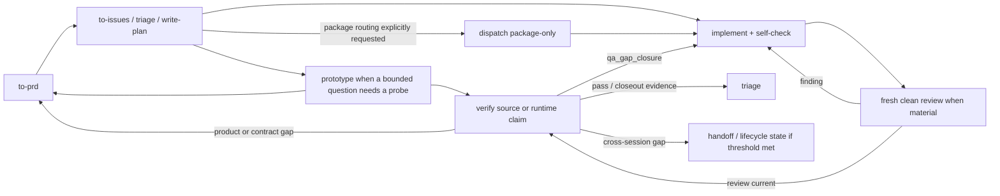

# Workflow State Machine

Target Reader: public skills, eval authors, reviewers, and maintainers needing one route-transition contract.
Reader Action Needed: validate accepted pre-state, produced state, legal next route, and stop gate.
Decision Supported: whether a transition is legal, blocked, explicitly bypassed, or recommendation-level.
Artifact Type: shared guardrail.
Source of Truth: `scripts/codex-hooks/groundwork_route_registry.json`; this document, public skill trigger contracts, and eval prompt fields must validate against it.
Scope: transitions for `to-prd`, `to-issues`, `triage`, `write-plan`, `prototype`, `implement`, `verify`, `handoff`, `dispatch`, `wiki`, plus direct/blocked behavior.
Out of Scope: runtime adapter lifecycle, tracker mutation, task CRUD, automatic state writes, release/UAT approval, or replacing skill-specific contracts.
Evidence Level: source-derived routing/eval contract; runtime behavior requires installed-plugin/cache evidence.

## Core Rule

Workflow state is a transition contract, not a transcript. A route may act only when the current requirement state satisfies its accepted pre-state gate or a named exception applies. `expected_state_transition` records expected transition action, not proof that a stronger produced state was verified.

Forward progress and feedback are different operations. A forward edge changes the owning route or requirement state. A feedback edge revisits an existing owner only through a named gate, with new evidence or a changed hypothesis, and never runs automatically. Requirement state, verification verdict, review-loop state, lifecycle state, and maintainer-learning state remain orthogonal.

Tokens:

- Requirement states: `raw`, `grilled`, `prd_draft`, `prd_accepted`, `issue_ready`, `implementation_ready`, `verified`, `blocked`.
- Expected transitions: `none`, `clarify`, `draft`, `accept`, `split`, `plan`, `implement`, `verify`, `handoff`, `block`, `close`.
- Route tokens: `direct`, `to-prd`, `to-issues`, `triage`, `write-plan`, `prototype`, `implement`, `verify`, `handoff`, `dispatch`, `wiki`.
- Prototype delta-status tokens: `changed`, `none`; either `none` forces `Next Probe or Stop: stop`.
- Spec write-back tokens: `Decision Delta Status: changed` and `Canonical Update Status: updated`.
- Risk checkpoint classification tokens: `Action Kind: data_mutation` and `Target Kind: data_store`.
- Use `blocked` as verdict/produced state/stop condition; use `block` only as `expected_state_transition`.

## Requirement States

| State | Meaning | Owner |
| --- | --- | --- |
| `raw` | ambiguous/draft/conversation-only intent without accepted source truth | `to-prd`; `direct` for tiny safe answers |
| `grilled` | clarified enough to draft, not accepted as product truth | `to-prd` or narrow `direct` |
| `prd_draft` | draft PRD/spec not accepted by owner/source | `to-prd`; `verify` consistency only |
| `prd_accepted` | accepted PRD/spec/plan or named source truth ready to slice/plan | `to-issues`, `write-plan`, `triage` |
| `issue_ready` | vertical slice has scope, ACs, blocker status, verification expectation | `triage`; `write-plan` may plan |
| `implementation_ready` | source truth, scope, ACs, verification, git topology are enough | `implement`; `dispatch` for accepted ready tasks |
| `verified` | verification/evidence covered declared scope and gaps | `verify`; consumers keep scope boundary |
| `blocked` | source truth, approval, evidence, topology, permission, or safe action missing | owning route stops; `triage` may classify |

## Skill State Contract

| Skill | accepted_pre_states | produced_states |
| --- | --- | --- |
| `to-prd` | `raw`, `grilled`, `prd_draft`, `blocked` | `grilled`, `prd_draft`, `prd_accepted`, `blocked` |
| `to-issues` | `prd_accepted`, `issue_ready` | `issue_ready`, `blocked` |
| `triage` | any | `raw`, `prd_draft`, `issue_ready`, `implementation_ready`, `verified`, `blocked` |
| `write-plan` | `prd_accepted`, `issue_ready`, `implementation_ready` | `implementation_ready`, `blocked` |
| `prototype` | `raw`, `grilled`, `prd_draft`, `prd_accepted`, `issue_ready` | `raw`, `grilled`, `prd_draft`, `blocked` |
| `implement` | `implementation_ready` | `implementation_ready`, `blocked` |
| `verify` | `prd_draft`, `prd_accepted`, `issue_ready`, `implementation_ready`, `verified` | `implementation_ready`, `verified`, `blocked` |
| `handoff` | `prd_draft`, `prd_accepted`, `issue_ready`, `implementation_ready`, `verified`, `blocked` | same or `blocked` |
| `dispatch` | `issue_ready`, `implementation_ready`, `verified` | `issue_ready`, `implementation_ready`, `blocked` |
| `wiki` | `prd_accepted`, `issue_ready`, `implementation_ready`, `verified`, `blocked` | same or `blocked` |

## Transition Gates

| Transition | Required Gate | Stop Condition |
| --- | --- | --- |
| `raw` -> `to-prd` | user intent/source needs shaping | ask when target reader, decision, facts, or material unknowns are missing |
| `raw` -> `to-issues` | accepted PRD/spec/plan, named accepted task source, or maintainer acceptance | `require_prd_acceptance` |
| `raw` -> `implement` | explicit bypass plus source truth, clear ACs, scoped change, safe topology | `require_gate` or PRD acceptance |
| `prd_draft` -> downstream | accepted source truth or owner confirmation | `require_prd_acceptance` |
| `prd_accepted` -> `to-issues` | ACs, scope, blockers, verification expectation | artifact promotion or clarification |
| `issue_ready` -> `write-plan` | accepted slice, dependencies, stops, verification checkpoints | clarify material dependency/path unknowns |
| `issue_ready` -> `dispatch` | ready-for-agent evidence, blockers, verification expectation, package inputs | `blocked`; dispatch cannot accept raw/grilled/draft |
| `issue_ready` -> `implement` | source truth, scoped files/modules, ACs, verification, topology promote it | `require_gate`; route to `triage` if disputed |
| `implementation_ready` -> `implement` | diff/status, branch/worktree decision, touched files, ACs, verification plan | gate unsafe topology, destructive/remote/data writes, secrets/PII, customer risk |
| `implement` -> `verified` | `verify` pass or scoped `Verification Scope` report | implement self-check is not verification |
| `implementation_ready` -> `verify` | in-scope claim, out-of-scope limits, expected evidence, gap handling | block unavailable required evidence |
| `verify` -> `implementation_ready` | named `qa_gap_closure`: prior state was `implementation_ready` or `verified`; source truth and ACs are unchanged; the failure package uses one exactly matching non-placeholder `command:` or `manual:` identity for reproduction and re-QA; `Implementation Authority` is `existing_and_sufficient`; `Risk Change` is `unchanged_within_boundary`; `Scoped Next Action` is exactly `route: implement`; fix scope is bounded; a new observation or changed hypothesis exists | route missing/mismatched original-check identity or evidence to `verify` needs-info; route product/contract changes to `to-prd`; route `approval_required` or `new_or_increased` to human decision or `blocked`; route missing authority to `blocked`; stop identical retries with no evidence delta |
| `verified` -> `triage` | scope, covered/not-covered evidence, gaps, closeout criteria | block unclear scope/risk |
| `implementation_ready`/`verified` -> `dispatch` | accepted ready task or verified follow-up needing package-only routing | block runtime/clean-review overclaims |
| any -> `handoff` | state, sources, evidence, gaps, next owner, do-not-assume boundaries | block long raw copies/evidence upgrades |
| any -> `wiki` | explicit wiki maintenance, storage mode, citations, evidence layers | block synthesis promotion |
| any -> `direct` | small bounded answer, trivial edit, or ordinary audit performed in the current context without artifact/git/verification/remote/durable-state impact | route when readiness/source-truth claims or explicit route/package/fan-out/delegation requests appear |

`feedback_transitions` in the registry machine-registers `qa_gap_closure`, remediation re-verification, source/acceptance reopening, and verified closeout. `qa_gap_closure` preserves or reasserts `implementation_ready`; it does not turn a failed verdict into verified evidence. The initial route remains `verify`, and the next owner runs only after an explicit continuation or separately authorized action.

## Guided R&D Delivery Loop

Groundwork supports a non-executing delivery loop across the existing public routes. Each owner completes one bounded decision, returns evidence and gaps, and recommends a next route. The recommendation does not invoke the next skill, dispatch a runtime, mutate a tracker, or write lifecycle state by itself.

The optional `dispatch` node below is the existing package-only skill: it selects a downstream owner/package when explicitly requested and never represents runtime execution.

| Feedback | Re-entry Gate | Success Signal | Stop / Pause |
| --- | --- | --- | --- |
| spec convergence within `to-prd` | one material unanswered decision; answer changes route, AC, contract, artifact, or evidence boundary | next route's material decisions are resolved or explicitly gated | no decision delta, repo evidence can answer, or human authority is required |
| prototype learning within `prototype` | a falsifiable hypothesis and a minimum probe | observation changes the decision or bounds the remaining gap | no evidence delta, source-truth proof is required, or the probe would become production work |
| clean review -> `implement` | fresh read-only finding against current material diff | cited finding closed and original/narrow check rerun | reviewer edited, old review became stale, or a new independent reviewer is unavailable |
| `verify` -> `implement` | `qa_gap_closure` | original failure no longer reproduces plus focused regression evidence when feasible | unchanged failure with no new evidence, changed product/contract, missing authority, or unsafe scope |
| `verify` -> `to-prd` | verification exposes a product, acceptance, or contract decision rather than an implementation defect | accepted source truth is revised and downstream scope can be re-established | owner decision is missing or the proposed change exceeds authority |
| `verify` -> `triage` | pass/partial/blocked evidence needs closeout, severity, or ownership classification | closeout or explicit next owner is justified by current evidence | verification scope is unclear or stronger readiness evidence is still missing |
| ready package -> `dispatch` | the user or accepted task explicitly requests package/runtime-owner routing | a bounded Dispatch Package names the downstream owner without executing it | package routing was not requested, readiness is missing, or execution would be implied |

Bounded loop outputs use finite control tokens rather than prose that implies continuation. Prototype checkpoints classify both `Evidence Delta Status` and `Decision Delta Status` as `changed` or `none`; either `none` forces `Next Probe or Stop: stop`. A `propose_probe` state requires both statuses to be `changed` and exactly one `Proposed Probe`; a `stop` state requires exactly one `Stop Reason`. Spec checkpoints require the fixed write-back assertions `Decision Delta Status: changed` and `Canonical Update Status: updated`, then use `Next Route or Question: route` with exactly one public `Next Route`, `question` with exactly one `Question` plus `Impact / Next route`, or `stop` with exactly one `Stop Reason`. Companion fields are mutually exclusive, and every proposed continuation still requires a separately authorized next action.

Checkpoint timing follows risk: prepare safe, reversible evidence before asking when that reduces user work, but never push approval past destructive, remote, data, production, shared-skill, source-acceptance, or customer-visible action. A data-write `Risky Action Checkpoint` is exactly one heading plus eleven structured fields, including fixed `Action Kind: data_mutation`, `Target Kind: data_store`, `Approval Status: pending`, `Action State: blocked`, and `Checkpoint Position: before_action`; it contains no extra prose, timing words, or execution claims. Other checkpoint briefs name the decision, evidence delta, recommendation, risk, and next route without dumping raw logs or drafts.

The loop exits at one of four boundaries: the scoped claim is verified; the next owner and evidence gap are explicit; a human decision is required; or work is blocked with the missing evidence/authority named. Turn count, repeated self-check, output resemblance, and lifecycle-file existence are not completion evidence.

## Next Route Negatives

- `to-prd` output that remains `raw`, `grilled`, or `prd_draft` must not route to `implement` or `dispatch`.
- `to-issues` slices missing scope, ACs, blockers, or verification expectation must not route to implementation/dispatch.
- `implement` must not produce verified state; use `verify`.
- `verify` may produce `implementation_ready` only through the named `qa_gap_closure` gate; it must not use that state to hide a failed verdict or a product/contract gap.
- `dispatch` accepts only accepted ready tasks or verified follow-up packages and must not claim runtime execution.
- `prototype`, `handoff`, and `wiki` may preserve/explain state but must not upgrade mock observations, summaries, or synthesis into source truth, clean review, verification, runtime, release, or UAT evidence.

## Eval Usage

| Scenario | expected_state_transition |
| --- | --- |
| No promotion | `none` |
| Clarification/grilling | `clarify` |
| PRD/spec draft | `draft` |
| Acceptance recognized | `accept` |
| Accepted source split | `split` |
| Implementation plan | `plan` |
| Code/doc implementation route | `implement` |
| Verification route | `verify` |
| Continuation package | `handoff` |
| Gate blocks progress | `block` |
| Closeout/no further action | `close` |
